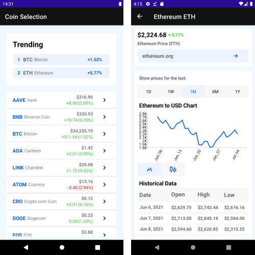
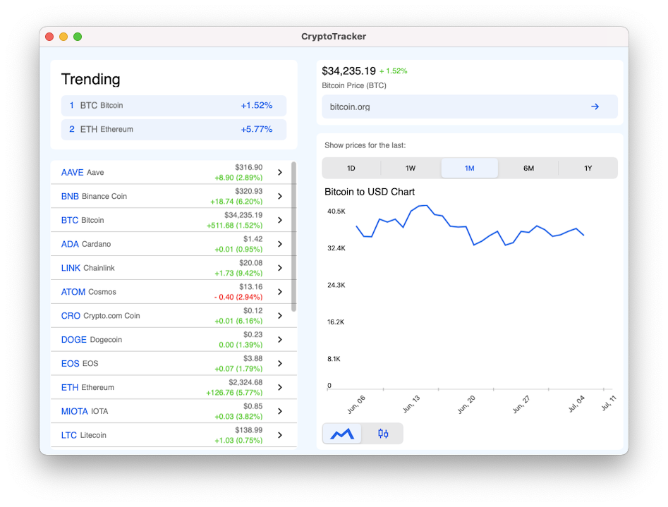
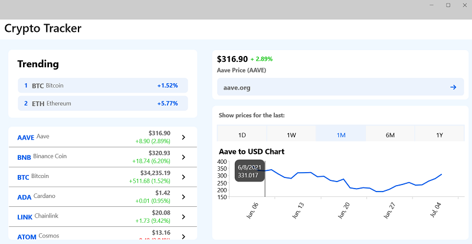

# Crypto Tracker Application

Crypto Tracker demo is a real-case crypto application that shows changes in cryptocurrency prices, built with the Telerik UI for .NET MAUI controls. In this demo, you can see in action many of the .NET MAUI controls in the library, including the CollectionView, Charts and TabView.

You can start using the Crypto Tracker application in the following ways:

You can access the SDKBrowser application in the following ways:

* If you have already installed Telerik UI for .NET MAUI, navigate to the **/[installation-path]/Telerik UI for .NET MAUI [version]/Examples/CryptoTracker** folder and open the `CryptoTracker.sln` file;

* Explore the CryptoTracker code directly in the [MAUI Samples Application repository on GitHub](https://github.com/telerik/maui-samples/tree/main/Samples/CryptoTracker) and run it on all platforms.

>important If you don't have a Telerik UI for .NET MAUI installation, check the [Download Telerik UI for .NET MAUI](#step-2-download-your-license-key-file) and [Install Telerik UI for .NET MAUI](#step-3-create-a-new-maui-project).

<TabStrip>
<TabStripTab title="Run on Android">

1. On Windows or MacOS open the terminal inside the CryptoTracker folder.

2. Run the following command to build and run the app on Android:

```bash
dotnet build -t:Run -f net10.0-android
```

Here is how the CryptoTracker application looks on Android.



</TabStripTab>
<TabStripTab title="Run on iOS">

>important
> Review the [macOS Install .NET MAUI GitHub wiki page](https://github.com/dotnet/maui/wiki/macOS-Install) before you run the sample on macOS.

1. On MacOS open the terminal inside the CryptoTracker folder.

2. Run the following command to build and run the app on iOS:

```bash
dotnet build -t:Run -f net9.0-ios -p:_DeviceName=:v2:udid=02C556DA-64B8-440B-8F06-F8C56BB7CC22
```

In this example, the device ID is `02C556DA-64B8-440B-8F06-F8C56BB7CC22`.

To find the device ID in Xcode:

1. Open Xcode.
2. Select **Window** > **Devices**.
3. Select the connected device.
4. Copy the identifier, or UDID, from **Device Information**.

Here is how the CryptoTracker application looks on iOS.


</TabStripTab>
<TabStripTab title="Run on MacCatalyst">

>important
> Review the [macOS Install .NET MAUI GitHub wiki page](https://github.com/dotnet/maui/wiki/macOS-Install) before you run the sample on macOS.

1. On MacOS open the terminal inside the CryptoTracker folder.

2. Run the following command:

```bash
dotnet build -t:Run -f net10.0-maccatalyst
```

Here is how the CryptoTracker application looks on MacCatalyst.



</TabStripTab>
<TabStripTab title="Run on Windows">

1. Open `CryptoTracker.sln` in Visual Studio 2022/2026 on Windows.

1. Wait for the project packages to restore.

1. Select the Windows target framework for the project.

   

1. Run the app:

Here is how the CryptoTracker application looks on Windows.



</TabStripTab>
</TabStrip>

>tip Check the [.NET MAUI Examples Apps]() topic which lists all the sample applications built with Telerik UI for .NET MAUI.

## See Also

- [Controls Samples App]()
- [SDKBrowser App]()
- [CRM App]()
- [Progress Agentic RAG Demo App]()