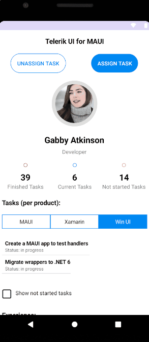
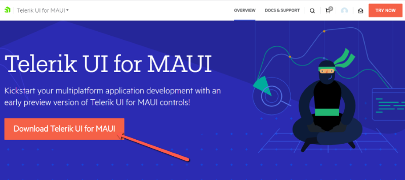
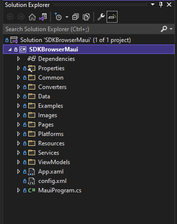
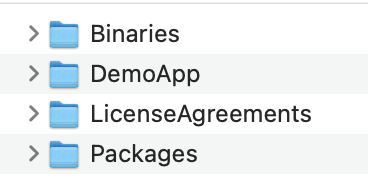
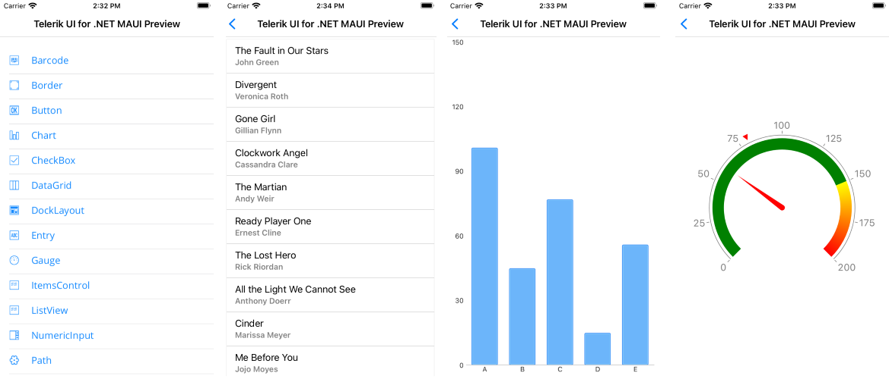
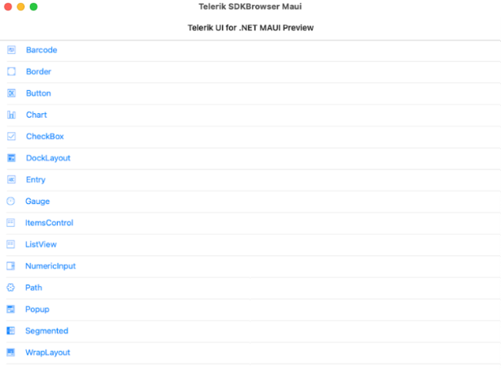
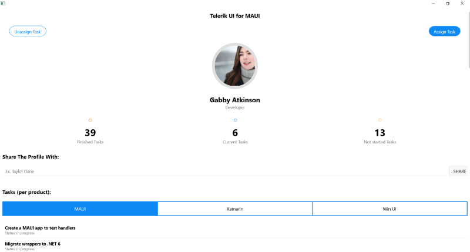

# SDKBrowser Application

The Telerik UI for .NET MAUI SDKBrowser is a demo application, which demonstrates the available library controls.  

To start using the SDKBrowser application, you have to first download it and then install and run it on the desired platform, or mobile device or emulator.

## Download the SDKBrowser Demo App

1. Log into your [Telerik account](https://www.telerik.com/account/).

1. Go to the [Telerik UI for .NET MAUI product page](https://www.telerik.com/maui-ui).

1. Click the **Download Telerik UI for .NET MAUI** button.

  

1. The download starts automatically.

  

## Install and Run SDKBrowser on Windows

1. Inside the command prompt, run the `maui-check` command, which is required for using Telerik UI for .NET MAUI controls, and for building and running `SDKBrowserMaui.sln`.

1. Run the `Telerik_UI_for_Maui_[version]_Preview.msi` file and follow the instructions. The file automatically installs Telerik UI for .NET MAUI on your PC.

    On a 32-bit machine, the wizard will suggest to install the UI for .NET MAUI controls in `C:\Program Files\Progress\`. On a 64-bit machine, the wizard will suggest to install the UI for .NET MAUI controls in `C:\Program Files (x86)\Progress\`.

    Try to specify a shorter path for the installation folder&mdash;for example, `C:\T\`, `D:\T\`, and so on. If the path is too long, you will run into the following error: `Error occurred while restoring NuGet packages: The specified path, file name, or both are too long. The fully qualified file name must be less than 260 characters, and the directory name must be less than 248 characters.`

1. The **SDKBrowser** folder is located inside the installation folder and you can now use the following subdirectories:

    * **Binaries**&mdash;Contains the needed dlls for Android, iOS, and WinUI.
    * **Examples**&mdash;Contains the SDK application with the Telerik UI for .NET MAUI controls.
    * **LicenseAgreements**&mdash;Provides the product End-User Licensce Agreement (EULA).
    * **Packages**&mdash;Contains the `Telerik_UI_for_Maui_[version]_Preview.nupkg` file.

    

1. Run the `SDKBrowserMaui.sln` on Windows with Visual Studio.

    4.1 Open the SDKBrowser folder in Visual Studio 2022 Preview.

        

    4.2 Wait the project to restore.

    4.3 Select the target framework of the project.

        

    4.4 Select the emulator or device on which you want to run the application.

## Install and Run SDKBrowser on macOS

1. Inside the terminal, run the `maui-check` command, which is required for using Telerik UI for .NET MAUI controls, and for building and running `SDKBrowserMaui.sln`.

1. Run the `Telerik_UI_for_Maui_[version]_Preview.pkg` file, which automatically installs Telerik UI for .NET MAUI on your Mac.

1. The **SDKBrowserMaui** folder is located inside the installation folder and you can now use the following subdirectories:

    * **Binaries**&mdash;Contains the needed dlls for Android, iOS, and WinUI.
    * **Examples**&mdash;Contains the SDK application with the Telerik UI for .NET MAUI controls.
    * **LicenseAgreements**&mdash;Provides the product End-User Licensce Agreement (EULA).
    * **Packages**&mdash;Contains the `Telerik_UI_for_Maui_[version]_Preview.nupkg` file.

    

1. Run the `SDKBrowserMaui.sln` file by using Visual Studio for Mac.

    * To run the SDKBrowser application on iPhone, follow the demonstrated approach.

    

    * To run the SDKBrowser application on MacOS, follow the demonstrated approach.

    

## Run SDKBrowser on Android

The following screenshot demonstrates how to run the SDKBrowser application on Android.

## Run SDKBrowser on WinUI

1. Install the [Single-Project MSIX Packaging Tool for VS 2022 Preview](https://marketplace.visualstudio.com/items?itemName=ProjectReunion.MicrosoftSingleProjectMSIXPackagingToolsDev17) to build and run the application.

    

1. Run the `SDKBrowserMaui` file.

    
