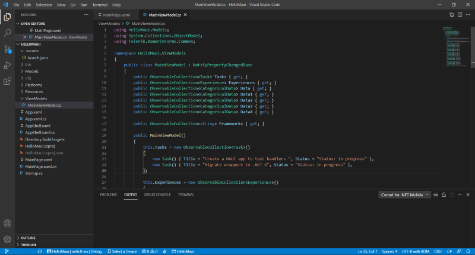
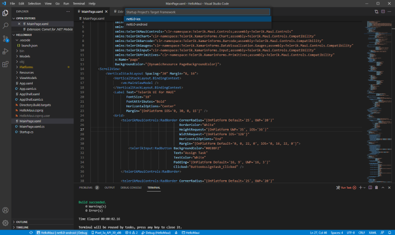
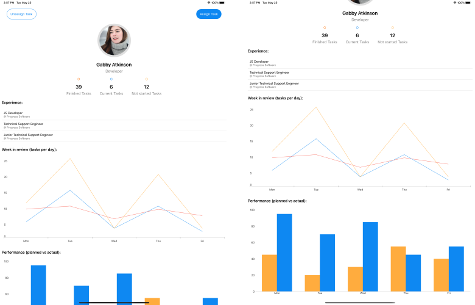

#  Telerik UI for MAUI SDKBrowser Application

## SDKBrowser location:

**1. Log into your [Telerik account](https://www.telerik.com/account/).**

**2. Go to [Telerik UI for MAUI product page](https://www.telerik.com/maui-ui)**

**3. Click Download Telerik UI for MAUI button:**

**4. The download starts automatically**

**Installation for Windows**

>important Run `maui-check` inside command prompt. This command is required for using Telerik UI for MAUI controls and build and run the `SDKBrowserMaui.sln`.

* Telerik_UI_for_Maui_[version]_Preview.msi - runnable msi file used for automatic installation (for use on PC). Run the MSI file and follow the instructions. On a 32bit machine the wizard will install the UI for MAUI component in the following folder unless you specify otherwise: C:\Program Files\Progress\ or C:\Program Files (x86)\Progress\ for a 64bit machine.

The SDKBrowser folder is inside the installation folder. The Installation folder has the following subdirectories:

* Binaries - Contains the needed dlls for Android, iOS and WinUI
* **SDKBrowser** - SDKBrowser app with Telerik UI for .NET MAUI controls
* LicenseAgreements - provides the product EULA.
* Packages - Telerik_UI_for_Maui_[version]_Preview.nupkg file

**Installation for macOS**

>important Run `maui-check` inside the terminal. This command is required for using Telerik UI for MAUI controls and build and run the `SDKBrowserMaui.sln`.

* Telerik_UI_for_Maui_[version]_Preview.pkg - runnable pkg file used for automatic installation (for Mac).

The SDKBrowserMaui folder is inside the installation folder. The installation folder has the following subdirectories:

* Binaries - Contains the needed dlls for Android, iOS and WinUI
* **SDKBrowser** - SDKBrowserMaui App with Telerik UI for .NET MAUI controls
* LicenseAgreements - provides the product EULA.
* Packages - Telerik_UI_for_Maui_[version]_Preview.nupkg file

## Run SDKBrowserMaui.sln using Visual Studio for Windows

* Open the SDKBrowser folder in Visual Studio 2022 Preview

* Wait the project to restore

* Select Project's Target Framework

* Select the emulator/device you want to run the app

### Telerik SDKBrowser MAUI app on Android

## Run SDKBrowser app on WinUI

>important If you want to build and run the app on WinUI you must install the [Single-Project MSIX Packaging Tool for VS 2022 Preview](https://marketplace.visualstudio.com/items?itemName=ProjectReunion.MicrosoftSingleProjectMSIXPackagingToolsDev17)

* Run the SDKBrowserMaui on WinUI

### Telerik SDKBrowser MAUI app app on WinUI

## Run SDKBrowserMaui.sln using Visual Studio for Mac

### Telerik SDKBrowser MAUI app on iPhone

### Telerik SDKBrowser MAUI app on MacOS

## See Also

* [Border]()
* [Button]()
* [Chart]()
* [ItemsControl]()
