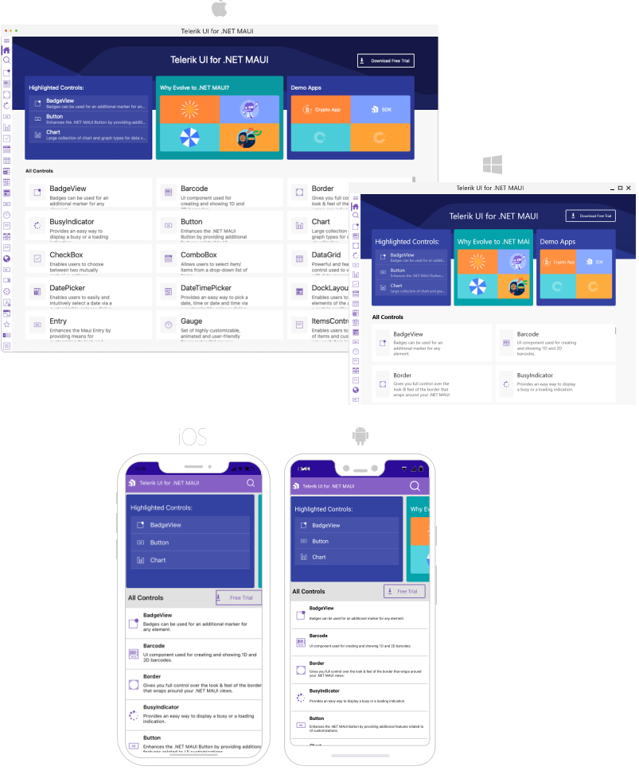

# .NET MAUI Examples, Demos, and Sample Apps Overview

The Telerik .NET MAUI library has a few fully-featured [demo applications](https://www.telerik.com/maui-ui/demo-apps/controls) demonstrating our [.NET MAUI](https://www.telerik.com/maui-ui)) controls. You can review the source code of each app and get familiar with the way various Telerik .NET MAUI controls are utilized.

* [Controls Samples App](#controls-samples-app)
* [SDKBrowser App](#sdkbrowser-app)
* [Crypto Tracker App](#crypto-tracker-app)

> With **Telerik .NET MAUI 6.5.0** version we have added a support for .NET 8.0. You can easily switch the .NET version to .NET 7.0 or .NET 8.0 to build the apps. 
> Inside the Examples folder of the installation/.zip file there are `.ps1` files - `SwitchToNet7.ps1` and `SwitchToNet8.ps1`. You can use them to switch the .NET version.

## Controls Samples App

The Telerik UI for .NET MAUI Controls Samples is a highly polished application offering many scenario-specific use cases designed to show off a subset of features for each component. The app provides various .NET MAUI examples for many of the 60+ .NET MAUI controls included in the library.

For more information on it, refer to [Controls Samples App]().

## SDKBrowser App

The SDKBrowser is a set of .NET MAUI examples that explain how to use the features of a control. Contrary to the Controls Samples application, the SDKBrowser shows the components in their pure form without adding extra styling and polishing. It's the go-to source for "how do I use X in Y control". Most of the code snippets available in the documentation are directly generated from the examples in the SDKBrowser (you can see special comments in the code for this).

For more information on it, refer to [SDKBrowser App]().

## Crypto Tracker App 

Crypto Tracker demo is a real-case crypto application that shows changes in cryptocurrency prices, offering practical .NET MAUI examples built with the Telerik UI for .NET MAUI controls. In this demo, you can see in action many of the .NET MAUI controls in the library, including the ListView, Charts and TabView.

For more information on it, refer to [Crypro Tracker App]().