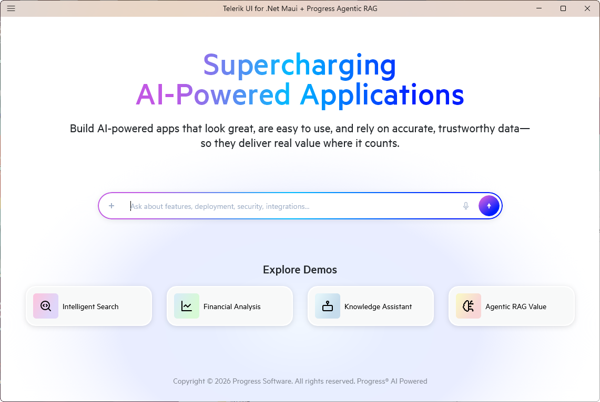
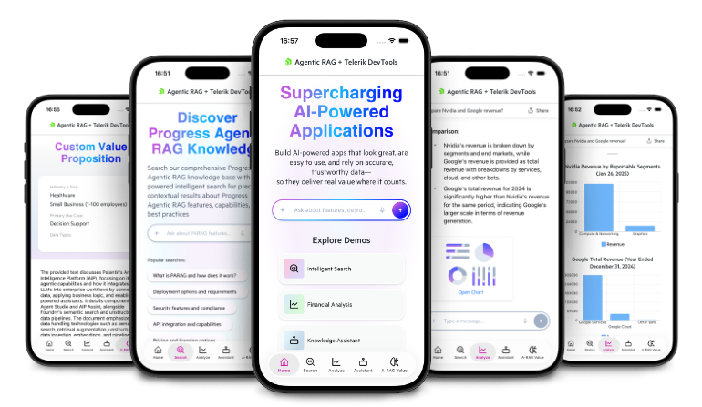

# Progress Agentic RAG Demo App with Telerik UI for .NET MAUI

The **Telerik UI for .NET MAUI Progress Agentic RAG Demo App** integrates [Progress Agentic RAG](https://www.progress.com/agentic-rag) with Telerik UI for .NET MAUI controls to demonstrate agentic workflows, grounded chat, and retrieval-augmented generation across mobile and desktop. The app connects to multiple Nuclia Knowledge Boxes for domain-specific scenarios (general, charts/financial data, and documentation), showcases semantic search and citations, and uses Telerik UI components for rich visualizations and interactions.

For full overview, features, setup, and usage, see the GitHub page: <a href="https://github.com/telerik/telerik-maui-progress-rag-demo" target="_blank">Progress Agentic RAG + Telerik UI for .NET MAUI Demo</a>.

This is how the app looks on desktop:



And how the app looks on mobile:



## Prerequisites

Before running this project, ensure you have:

1. **.NET 9.0 SDK**—[Download here](https://dotnet.microsoft.com/download/dotnet/9.0).

2. **Platform-specific requirements:**
   - **Android:** Android SDK (API level 21 or higher).
   - **iOS/macOS:** macOS with Xcode 15.0 or later.
   - **Windows:** Windows 10 SDK (10.0.17763.0 or higher).

3. **Telerik UI for .NET MAUI license or trial**
   - Visit [Telerik UI for .NET MAUI](https://www.telerik.com/maui-ui) to obtain a license.
   - You can start with a [free trial](https://www.telerik.com/download-trial-file/v2-b/maui). The trial provides full access to all components for 30 days.

4. **Progress Agentic RAG account**
   - Sign up at [Progress Agentic RAG](https://www.progress.com/agentic-rag).
   - Create Knowledge Boxes and obtain API keys.

## Getting Started

To run the Telerik UI for .NET MAUI Progress Agentic RAG Demo App, follow these steps:

### 1. Clone the Repository

Execute the following command in your terminal to clone the demo app repository:

```bash
git clone https://github.com/telerik/maui-progress-rag-demo.git
```

Then navigate to the project directory:

```bash
cd maui-progress-rag-demo
```

### 2. Configure Telerik UI for .NET MAUI control Using the NuGet Package Sources

The Telerik packages require the Telerik NuGet feed. Add it to your NuGet configuration:

```bash
dotnet nuget add source "https://nuget.telerik.com/v3/index.json" \
  --name "TelerikNuGet" \
  --username "<your-telerik-email>" \
  --password "<your-telerik-password>"
```

> note Replace `<your-telerik-email>` and `<your-telerik-password>` with your Telerik account credentials.

### 3. Configure Progress Agentic RAG

Update the `maui-progress-rag-demo/appsettings.json` file with your Progress Agentic RAG credentials:

```json
{
  "NucliaDb": {
    "ZoneId": "europe-1",
    "KnowledgeBoxId": "<your-knowledge-box-id>",
    "ApiKey": "<your-api-key>"
  },
  "NucliaDbCharts": {
    "ZoneId": "aws-eu-central-1-1",
    "KnowledgeBoxId": "<your-charts-knowledge-box-id>",
    "ApiKey": "<your-charts-api-key>"
  },
  "NucliaDbVerse": {
    "ZoneId": "aws-us-east-2-1",
    "KnowledgeBoxId": "<your-verse-knowledge-box-id>",
    "ApiKey": "<your-verse-api-key>"
  }
}
```

> security For production deployments, use environment variables or secure storage instead of storing credentials in configuration files.

### 4. Restore Dependencies

Navigate to the project directory by running the following command:

```bash
cd maui-progress-rag-demo
```

Then restore the NuGet packages:

```bash
dotnet restore
```

### 5. Run the Application

Use the following commands to run the application on your desired platform:

| Platform | Command |
| -------- | ------- |
| Android | `dotnet build -t:Run -f net9.0-android` |
| Windows | `dotnet build -t:Run -f net9.0-windows10.0.19041.0` |
| iOS (requires macOS) | `dotnet build -t:Run -f net9.0-ios` |
| MacCatalyst (requires macOS) | `dotnet build -t:Run -f net9.0-maccatalyst` |

Another approach is to open the `maui-progress-rag-demo.slnx` in Visual Studio and select your target platform from the dropdown (Android or Windows).

To run the app on iOS or MacCatalyst you can use Visual Studio Code for macOS.

## Configuration

Configure the app to use Progress Agentic RAG with the environment variables below.

### Environment Variables

For production deployments, configure the following environment variables:

| Variable | Description |
|----------|-------------|
| `NucliaDb__ZoneId` | Zone ID for the default Knowledge Box |
| `NucliaDb__KnowledgeBoxId` | Knowledge Box ID for general queries |
| `NucliaDb__ApiKey` | API key for the default Knowledge Box |
| `NucliaDbCharts__ZoneId` | Zone ID for the charts Knowledge Box |
| `NucliaDbCharts__KnowledgeBoxId` | Knowledge Box ID for financial data |
| `NucliaDbCharts__ApiKey` | API key for the charts Knowledge Box |
| `NucliaDbVerse__ZoneId` | Zone ID for the verse Knowledge Box |
| `NucliaDbVerse__KnowledgeBoxId` | Knowledge Box ID for documentation |
| `NucliaDbVerse__ApiKey` | API key for the verse Knowledge Box |

For more details about the application structure and configuration, refer to the README file in the GitHub repo: <a href="https://github.com/telerik/maui-progress-rag-demo#readme" target="_blank">maui-progress-rag-demo</a>.

## See Also

- [SDKBrowser App]()
- [Crypto Tracker App]()
