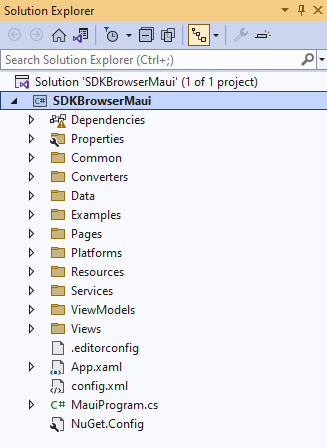
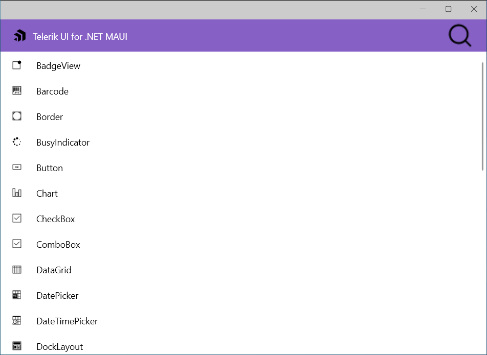
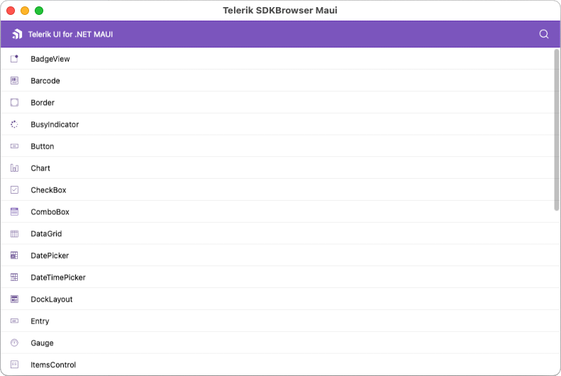

# SDKBrowser Application

The Telerik UI for .NET MAUI SDKBrowser is a set of examples that explain how to use the features of a control. The SDKBrowser shows the components in their pure form without adding extra styling and polishing. It's the go-to source for "how do I use X in Y control". Most of the code snippets available in the documentation are directly generated from the examples in the SDKBrowser (you can see special comments in the code for this).

You can access the SDKBrowser application in the following ways:

* If you have already installed Telerik UI for .NET MAUI, navigate to the **/[installation-path]/Telerik UI for .NET MAUI [version]/Examples/SdkBrowser** folder and open the `SdkBrowserMaui.sln` file;
* You can explore the code directly in the [.NET MAUI Sample Applications Repository on GitHub](https://github.com/telerik/maui-samples/tree/main/Samples/SdkBrowser);

## Run SDKBrowser on Windows

1. Open the `SDKBrowserMaui.sln` on Windows with Visual Studio 2022.

   

1. Wait for the project to restore.

1. Select the target framework of the project.

  

1. Select the emulator or device on which you want to run the application.

 * SDKBrowser application on WinUI.

  
		
## Install and Run SDKBrowser on macOS

>important Review the [macOS Install .NET MAUI GitHub Wiki page](https://github.com/dotnet/maui/wiki/macOS-Install) for more information how to get started on macOS. 

1. Open Terminal inside the SdkBrowser app folder.

1. Run on macOS using the following command:

 `dotnet build -t:Run -f net9.0-maccatalyst`

1. Run on iOS using the following command:

 `dotnet build -t:Run -f net9.0-ios`&mdash;This command starts a default simulator. To run the application on specific device, you need to provide the device ID. For example: `dotnet build -t:Run -f net9.0-ios -p:_DeviceName=:v2:udid=02C556DA-64B8-440B-8F06-F8C56BB7CC22` where the device ID is `02C556DA-64B8-440B-8F06-F8C56BB7CC22`. 

 To find the ID: 
  1. Open Xcode, 
  2. Click Devices from the Window menu. 
  3. Select Connected device. 
  4. Under Device Information, you will get an identifier, or UDID, of the device. 
 
 * SDKBrowser application on MacCatalyst.

  

 * SDKBrowser application on Android and iOS.

  

>tip Check the [.NET MAUI Examples Apps]() topic which lists all the sample applications built with Telerik UI for .NET MAUI.

## See Also

- [Controls Samples App]()
- [Crypto Tracker App]()
