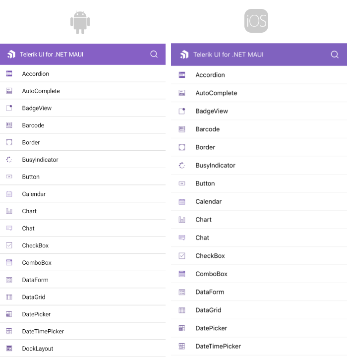
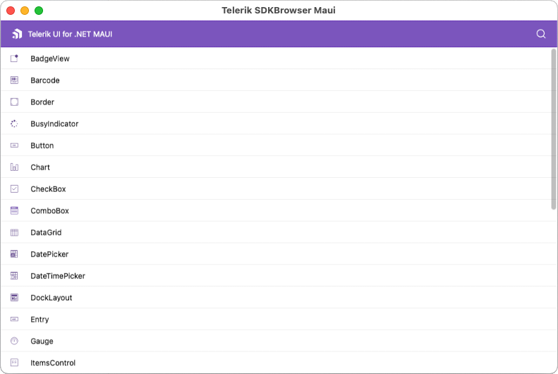
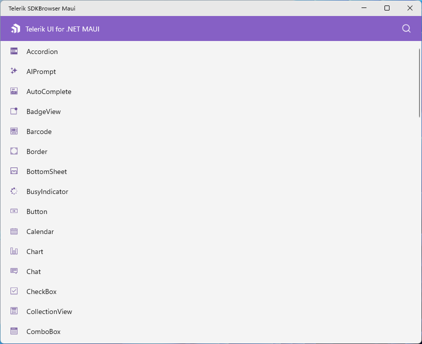

# SDKBrowser Application

The Telerik UI for .NET MAUI SDKBrowser is a set of .NET MAUI samples in C# and XAML that explain how to use the features of a control. The SDKBrowser shows the components in their pure form without adding extra styling and polishing. It's the go-to source for "how do I use X in Y control". Most of the code snippets available in the documentation are directly generated from the examples in the SDKBrowser (you can see special comments in the code for this).

You can access the SDKBrowser application in the following ways:

* If you have already installed Telerik UI for .NET MAUI, navigate to the **/[installation-path]/Telerik UI for .NET MAUI [version]/Examples/SdkBrowser** folder and open the `SdkBrowserMaui.sln` file;
2. Browse the sample source in the [Telerik .NET MAUI Samples repository on GitHub](https://github.com/telerik/maui-samples/tree/main/Samples) and run it on all platforms.

<TabStrip>
<TabStripTab title="Run on Android">

1. On Windows or MacOS open the terminal inside the SdkBrowser folder.

2. Run the following command to build and run the app on Android:

```bash
dotnet build -t:Run -f net10.0-android
```

Here is how the SDKBrowser application looks on Android.



</TabStripTab>
<TabStripTab title="Run on iOS">

>important
> Review the [macOS Install .NET MAUI GitHub wiki page](https://github.com/dotnet/maui/wiki/macOS-Install) before you run the sample on macOS.

1. On MacOS open the terminal inside the SdkBrowser folder.

2. Run the following command to build and run the app on iOS:

```bash
dotnet build -t:Run -f net9.0-ios -p:_DeviceName=:v2:udid=02C556DA-64B8-440B-8F06-F8C56BB7CC22
```

In this example, the device ID is `02C556DA-64B8-440B-8F06-F8C56BB7CC22`.

To find the device ID in Xcode:

1. Open Xcode.
2. Select **Window** > **Devices**.
3. Select the connected device.
4. Copy the identifier, or UDID, from **Device Information**.

</TabStripTab>
<TabStripTab title="Run on MacCatalyst">

>important
> Review the [macOS Install .NET MAUI GitHub wiki page](https://github.com/dotnet/maui/wiki/macOS-Install) before you run the sample on macOS.

1. On MacOS open the terminal inside the SdkBrowser folder.

2. Run the following command:

```bash
dotnet build -t:Run -f net10.0-maccatalyst
```

Here is how the SDKBrowser application looks on MacCatalyst.



</TabStripTab>
<TabStripTab title="Run on Windows">

1. Open `SDKBrowserMaui.sln` in Visual Studio 2022/2026 on Windows.

1. Wait for the project packages to restore.

1. Select the Windows target framework for the project.

   

1. Run the app:

Here is how the SDKBrowser application looks on Windows.



</TabStripTab>
</TabStrip>

>tip Check the [.NET MAUI Examples Apps]() topic which lists all the sample applications built with Telerik UI for .NET MAUI.

## See Also

- [Controls Samples App]()
- [Crypto Tracker App]()
- [CRM App]()
