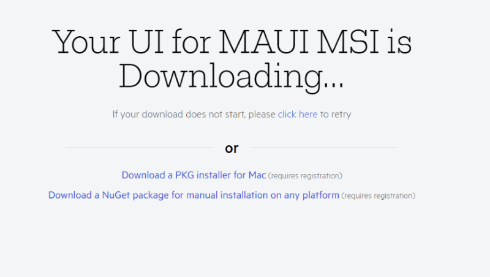
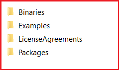

# Getting Started with Telerik UI for .NET MAUI

This guide provides the information you need to start using the Telerik UI for .NET MAUI suite&mdash;it includes instructions about the available download and installation approaches as well as the required handlers and renderers you have to register.

## Step 1: Set Up Your .NET MAUI Application

Before you start with the installation of Telerik UI for .NET MAUI, make sure you have a running .NET MAUI application. For more information on the required steps and system requirements, refer to the [Microsoft .NET MAUI official documentation](https://docs.microsoft.com/en-us/dotnet/maui/get-started/installation).

## Step 2: Download Telerik UI for .NET MAUI

Telerik UI for .NET MAUI provides the following approaches to download the library:

* [Using the Telerik UI for .NET MAUI Product Page](#from-the-product-page)
* [Downloading with your Telerik account](#with-your-telerik-account)

### Using the Product Page

To download Telerik UI for .NET MAUI from its product page:

1. Log into your [Telerik Account](https://www.telerik.com/account/).

1. Go to the [Telerik UI for .NET MAUI controls overview page](https://www.telerik.com/maui-ui).

1. Click the **Download Telerik UI for .NET MAUI** button.

  

1. As a result, the download starts automatically.

  

### Using Your Telerik Account

To download Telerik UI for .NET MAUI from your Telerik account:

1. Log into your [Telerik Account](https://www.telerik.com/account/).

1. Click the __Downloads__ tab.

  

1. Search for MAUI and select the __Telerik UI for .NET MAUI__ product title.

  

1. On the next page, download the `.msi` and `.pkg` automatic installation files, and the Telerik .NET MAUI NuGet Package.

  

## Step 3: Install Telerik UI for .NET MAUI

Telerik UI for .NET MAUI provides the following installation options:

* [Installing on Windows](#installing-on-windows)
* [Installing on MacOS](#installing-on-macos)
* [Installing with NuGet]()

### Installing on Windows

To install Telerik UI for .NET MAUI on Windows:

1. Run the `Telerik_UI_for_dot_NET_Maui_[version]_[license].msi` file and follow the instructions. The file automatically installs Telerik UI for .NET MAUI on your PC.

    On a 32-bit machine, the wizard will suggest to install the UI for .NET MAUI controls in `C:\Program Files\Progress\`. On a 64-bit machine, the wizard will suggest to install the UI for .NET MAUI controls in `C:\Program Files (x86)\Progress\`.

1. Use the subdirectory of the installation folder you need:

    * `Binaries`&mdash;Contains the `Net6` and `Net7` folders. Each folder contains the needed assemblies for Android, iOS, MacCatalyst, and WinUI.
    * `Examples`&mdash;Contains the sample applications demonstrating the Telerik UI for .NET MAUI controls. For more details, go to the [Sample Applications]() section.
    * `LicenseAgreements`&mdash;Provides the product End-User License Agreement (EULA).
    * `Packages`&mdash;Contains the `Telerik.UI.for.Maui.[version].nupkg` file as well as the Document Processing NuGet packages.
	* `VSExtensions`&mdash;Contains the Visual Studio Extension for Visual Studio 2022.

    

### Installing on macOS

To install Telerik UI for .NET MAUI on MacOS:

1. Run the `Telerik_UI_for_dot_NET_Maui_[version].pkg` file and follow the instructions.

	The file automatically installs Telerik UI for .NET MAUI on your Mac.

1. Use the subdirectory of the installation folder you need:

    * `Binaries`&mdash;Contains the `Net6` and `Net7` folders. Each folder contains the needed assemblies for Android, iOS, MacCatalyst, and WinUI.
    * `Examples`&mdash;Contains the sample applications demonstrating the Telerik UI for .NET MAUI controls. For more details, go to the [Sample Applications]() section.
    * `LicenseAgreements`&mdash;Provides the product End-User License Agreement (EULA).
    * `Packages`&mdash;Contains the `Telerik.UI.for.Maui.[version].nupkg` file as well as the Document Processing NuGet packages.
	* `VSExtensions`&mdash;Contains the Project Wizard for Visual Studio for Mac.

	


### Installing with NuGet

For the step-by-step guide on how to install Telerik UI for .NET MAUI with NuGet, refer to the article on [getting up and running with the controls by using the Telerik NuGet Server and Visual Studio for Windows]().

## Step 4: Register Required Handlers

To visualize the Telerik UI for .NET MAUI controls, you have to register the required handlers by calling the `Telerik.Maui.Controls.Compatibility.UseTelerik` extension method inside the `Configure` method of the `MauiProgram.cs` file of your project.

1. Add the needed `using` settings inside the `MauiProgram.cs` file.

 ```C#
using Telerik.Maui.Controls.Compatibility;
 ```

1. Call the `UseTelerik()` method inside the `MauiProgram.cs` file.

 ```C#
public static class MauiProgram
{
	public static MauiApp CreateMauiApp()
	{
		var builder = MauiApp.CreateBuilder();
		builder
			.UseTelerik()
			.UseMauiApp<App>()
			.ConfigureFonts(fonts =>
			{
				fonts.AddFont("OpenSans-Regular.ttf", "OpenSansRegular");
			});

		return builder.Build();
	}
}
 ```


## See Also

* [Installing Telerik UI for .NET MAUI with the Telerik NuGet Server]()
* [Telerik UI for .NET MAUI Sample Applications]()
