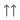
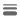
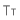
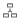
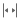
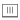
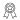
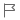

# Telerik UI for .NET MAUI Examples Icons

You can choose any of the available Telerik font icons: 

| Icon | Name | XAML | Code |
| ---- | ---- | ---- | ---- |
|  | sort descent | __\&#xe800;__ | __\ue800__ |
|  | star-empty | __\&#xe801;__ | __\ue801__ |
|  | filter | __\&#xe802;__ | __\ue802__ |
|  | sort ascent | __\&#xe803;__ | __\ue803__ |
|  | group | __\&#xe804;__ | __\ue804__ |
|  | star | __\&#xe805;__ | __\ue805__ |
|  | right-dir | __\&#xe806;__ | __\ue806__ |
|  | dots vert | __\&#xe807;__ | __\ue807__ |
|  | menu | __\&#xf008;__ | __\uf008__ |
|  | check | __\&#xe876;__ | __\ue876__ |
|  | cancel | __\&#xe877;__ | __\ue877__ |
|  | dot | __\&#xe80b;__ | __\ue80b__ |
|  | dot-3 | __\&#xe80c;__ | __\ue80c__ |
|  | down-dir | __\&#xe80d;__ | __\ue80d__ |
|  | chevron left | __\&#xe80e;__ | __\ue80e__ |
|  | configure | __\&#xe80f;__ | __\ue80f__ |
|  | search | __\&#xe810;__ | __\ue810__ |
|  | up-dir | __\&#xe811;__ | __\ue811__ |
|  | pattern | __\&#xe812;__ | __\ue812__ |
|  | add | __\&#xe813;__ | __\ue813__ |
|  | right-dir-outlines | __\&#xe814;__ | __\ue814__ |
|  | info | __\&#xe815;__ | __\ue815__ |
|  | down-dir-outlines | __\&#xe816;__ | __\ue816__ |
|   | bin-solid | __\&#xe817;__ | __\ue817__ |
|  | edit | __\&#xe818;__ | __\ue818__ |
|  | copy | __\&#xe819;__ | __\ue819__ |
|  | arrow-up | __\&#xe81a;__ | __\ue81a__ |
|  | airplane | __\&#xe81c;__ | __\ue81c__ |
|  | pdf | __\&#xe81d;__ | __\ue81d__ |
|  | encoding | __\&#xe81e;__ | __\ue81e__ |
|  | length | __\&#xe81f;__ | __\ue81f__ |
|  | arrow-right | __\&#xe820;__ | __\ue820__ |
|  | contacts | __\&#xe821;__ | __\ue821__ |
|  | cog-outlines | __\&#xe822;__ | __\ue822__ |
|  | type | __\&#xe823;__ | __\ue823__ |
|  | location | __\&#xe83d;__ | __\ue83d__ |
|  | link | __\&#xe83e;__ | __\ue83e__ |
|  | archive | __\&#xe826;__ | __\ue826__ |
|  | bin | __\&#xe827;__ | __\ue827__ |
|  | draft | __\&#xe828;__ | __\ue828__ |
|  | folder-open | __\&#xe829;__ | __\ue829__ |
|  | folder | __\&#xe82a;__ | __\ue82a__ |
|  | group | __\&#xe82b;__ | __\ue82b__ |
|  | item | __\&#xe82c;__ | __\ue82c__ |
|  | sent | __\&#xe82d;__ | __\ue82d__ |
|  | spam | __\&#xe82e;__ | __\ue82e__ |
|  | warning | __\&#xe82f;__ | __\ue82f__ |
|  | lock | __\&#xe830;__ | __\ue830__ |
|  | thickness | __\&#xe831;__ | __\ue831__ |
|  | car | __\&#xe832;__ | __\ue832__ |
|  | shopping-bag | __\&#xe833;__ | __\ue833__ |
|  | coffee-cup | __\&#xe834;__ | __\ue834__ |
|  | get-money | __\&#xe835;__ | __\ue835__ |
|  | shopping-user | __\&#xe836;__ | __\ue836__ |
|  | group users | __\&#xe837;__ | __\ue837__ |
|  | dashboard | __\&#xe838;__ | __\ue838__ |
|  | first | __\&#xe839;__ | __\ue839__ |
|  | cake | __\&#xe83a;__ | __\ue83a__ |
|  | chat | __\&#xe83b;__ | __\ue83b__ |
|  | book | __\&#xe83c;__ | __\ue83c__ |
|  | assets | __\&#xe846;__ | __\ue846__ |
|  | book | __\&#xe847;__ | __\ue847__ |
|  | cancel | __\&#xe851;__ | __\ue851__ |
|  | design | __\&#xe848;__ | __\ue848__ |
|  | graphics | __\&#xe849;__ | __\ue849__ |
|  | picture | __\&#xe852;__ | __\ue852__ |
|  | font-size | __\&#xe84b;__ | __\ue84b__ |
|  | template | __\&#xe84c;__ | __\ue84c__ |
|  | wireframes | __\&#xe84d;__ | __\ue84d__ |
|  | distance | __\&#xe84e;__ | __\ue84e__ |
|  | stopwatch | __\&#xe84f;__ | __\ue84f__ |
|  | play | __\&#xe850;__ | __\ue850__ |
|  | code | __\&#xe854;__ | __\ue854__ |
|  | analysis | __\&#xe855;__ | __\ue855__ |
|  | network | __\&#xe856;__ | __\ue856__ |
|  | network | __\&#xe857;__ | __\ue857__ |
|  | bar-chart | __\&#xe858;__ | __\ue858__ |
|  | sap | __\&#xe859;__ | __\ue859__ |
|  | dba | __\&#xe85a;__ | __\ue85a__ |
|  | home | __\&#xe85b;__ | __\ue85b__ |
|  | temperature | __\&#xe85c;__ | __\ue85c__ |
|  | phone | __\&#xe85d;__ | __\ue85d__ |
|  | electricity | __\&#xe85e;__ | __\ue85e__ |
|  | wifi | __\&#xe85f;__ | __\ue85f__ |
|  | distance-horizontal | __\&#xe860;__ | __\ue860__ |
|  | calendar dayview | __\&#xe861;__ | __\ue861__ |
|  | calendar multiday | __\&#xe862;__ | __\ue862__ |
|  | calendar week | __\&#xe863;__ | __\ue863__ |
|  | calendar month | __\&#xe864;__ | __\ue864__ |
|  | calendar year | __\&#xe865;__ | __\ue865__ |
|  | calendar selection single | __\&#xe866;__ | __\ue866__ |
|  | calendar selection multiple | __\&#xe867;__ | __\ue867__ |
|  | calendar selection range | __\&#xe868;__ | __\ue868__ |
|  | gallery | __\&#xe869;__ | __\ue869__ |
|  | camera | __\&#xe86a;__ | __\ue86a__ |
|  | crop free | __\&#xe86b;__ | __\ue86b__ |
|  | crop original | __\&#xe86c;__ | __\ue86c__ |
|  | crop rect | __\&#xe86d;__ | __\ue86d__ |
|  | crop circular | __\&#xe86e;__ | __\ue86e__ |
|  | badge | __\&#xe86f;__ | __\ue86f__ |
|  | notes | __\&#xe870;__ | __\ue870__ |
|  | time | __\&#xe871;__ | __\ue871__ |
|  | calendar agenda | __\&#xe872;__ | __\ue872__ |
|  | arrows | __\&#xe873;__ | __\ue873__ |
|  | video-camera | __\&#xe87;__ | __\ue874__ |
|  | check | __\&#xe878;__ | __\ue878__ |
|  | cancel | __\&#xe887;__ | __\ue887__ |
|  | text | __\&#xe853;__ | __\ue853__ |
|  | arrow-down | __\&#xe879;__ | __\ue879__ |
|  | flag | __\&#xe87a;__ | __\ue87a__ |
|  | save | __\&#xe87b;__ | __\ue87b__ |
|  | share | __\&#xe87c;__ | __\ue87c__ |
|  | menu-custom | __\&#xe87d;__ | __\ue87d__ |
|  | heart-filled | __\&#xe87e;__ | __\ue87e__ |
|  | heart-empty | __\&#xe87f;__ | __\ue87f__ |
|  | reorder | __\&#xe881;__ | __\ue881__ |
|  | arrow-box-left | __\&#xe882;__ | __\ue882__ |
|  | arrow-box-right | __\&#xe883;__ | __\ue883__ |
|  | bell | __\&#xe88a;__ | __\ue88a__ |
|  | chat | __\&#xe88b;__ | __\ue88b__ |
|  | phone | __\&#xe904;__ | __\ue887 |
|  | unpin | __\&#xe88e;__ | __\ue88e__ |
|  | pin | __\&#xe88f;__ | __\ue88f__ |
|  | excel | __\&#xe896;__ | __\ue896__ |
|  | powerpoint | __\&#xe897;__ | __\ue897__ |
|  | word | __\&#xe898;__ | __\ue898__ |
|  | pdf | __\&#xe899;__ | __\ue899__ |
|  | last | __\&#xe89a;__ | __\ue89a__ |
|  | expand | __\&#xe89b;__ | __\ue89b__ |
|  | expand 2 | __\&#xe89c;__ | __\ue89c__ |
|  | paint bucket | __\&#xe89d;__ | __\ue89d__ |
|  | mail | __\&#xe89e;__ | __\ue89e__ |
|  | promotion | __\&#xe89f;__ | __\ue89f__ |
|  | scheduled | __\&#xe8a0;__ | __\ue8a0__ |
|  | label | __\&#xe8a1;__ | __\ue8a1__ |
|  | drawer | __\&#xe8a2;__ | __\ue8a2__ |
|  | social | __\&#xe8a3;__ | __\ue8a3__ |
|  | shipping | __\&#xe8a6;__ | __\ue8a6__ |
|  | products | __\&#xe8a7;__ | __\ue8a7__ |
|  | customer | __\&#xe8a8;__ | __\ue8a8__ |
|  | export | __\&#xe8a9;__ | __\ue8a9__ |
|  | info-outlines | __\&#xe8ac;__ | __\ue8ac__ |
|  | contract | __\&#xe8dd;__ | __\ue8dd__ |
|  | enlarge | __\&#xe8de;__ | __\ue8de__ |
|  | translate | __\&#xe8df;__ | __\ue8df__ |
|  | emoji | __\&#xe900;__ | __\ue900__ |
|  | brightness | __\&#xe901;__ | __\ue901__ |
|  | flip-vertical | __\&#xe902;__ | __\ue902__ |
|  | flip-horizontal | __\&#xe903;__ | __\ue903__ |
|  | rotate-cw | __\&#xe904;__ | __\ue904__ |
|  | rotate-ccw | __\&#xe905;__ | __\ue905__ |
|  | crop | __\&#xe906;__ | __\ue906__ | 
|  | hue | __\&#xe907;__ | __\ue907__ |
|  | link-external | __\&#xf08e;__ | __\uf08e__ |
|  | plus-squared | __\&#xf0fe;__ | __\uf0fe__ |
|  | angle-left | __\&#xf104;__ | __\uf104__ |
|  | angle-right | __\&#xf105;__ | __\uf105__ |
|  | angle-up | __\&#xf106;__ | __\uf106__ |
|  | angle-down | __\&#xf107;__ | __\uf107__ |
|  | spinner | __\&#xf110;__ | __\uf110__ |
|  | arrow-circled-left | __\&#xf137;__ | __\uf137__ |
|  | arrow-circled-right | __\&#xf138;__ | __\uf138__ |
|  | minus-squared | __\&#xf146;__ | __\uf146__ |
|  | minus-squared-alt | __\&#xf147;__ | __\uf147__ |
|  | plus-squared-alt | __\&#xf196;__ | __\uf196__ |


>important You need to set the Telerik example font icon code on the concrete property to visualize the icon. 

## Examples

This example shows how to add the font icons code to a Label. For this case you need to add the icon code to the `Label.Text` property and set the `FontFamily`:

```XAML
<Label Text="&#xe800;" FontFamily="TelerikFontExamples"/>
```
```C#
var label = new Label
{
    Text = "\ue800",
    FontFamily = "TelerikFontExamples"
};
```

>tip The `FontFamily` name is the name of the font registered in the `MauiProgram.cs` file.

## See Also

- [Icons Overview]()
