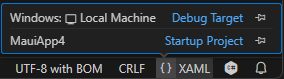

# First Steps with Telerik UI for .NET MAUI in Visual Studio Code

In this tutorial, you will create a simple .NET MAUI application and enhance it by adding a Telerik UI for .NET MAUI control. You will achieve this by using Visual Studio Code (on Windows or Mac) and utilizing the Telerik NuGet source that lets you download and install Telerik controls.

## Prerequisites

* To download the Telerik UI for .NET MAUI packages, you need a [Telerik account](https://www.telerik.com/account/). If you don't have one, you can [create one](https://www.telerik.com/account/) for free.
* To create the app, you need <a href="https://learn.microsoft.com/en-us/dotnet/maui/get-started/installation?view=net-maui-8.0&tabs=visual-studio-code" target="_blank">Visual Studio Code</a> with the .NET MAUI extension and the <a href="https://learn.microsoft.com/en-us/dotnet/maui/get-started/installation?view=net-maui-8.0&tabs=visual-studio-code#install-net-and-net-maui-workloads" target="_blank">.NET and .NET MAUI workloads</a>.

## Step 0: Start Your Free Trial

@[template](/_contentTemplates/get-started.md#start-free-trial)

## Step 1: Create a New MAUI Project

In this step, you will create a basic .NET MAUI project as a starting point for your application development, and then run it:

1. Open Visual Studio Code and select `Cmd/Ctrl+Shift+P`. Enter **.NET: New Project...** in the input field.

1. Select the **.NET MAUI App** option.

1. Enter a name for your app.

1. Select an empty folder for your project. If the folder is not empty, the file explorer opens again.

1. Wait for Visual Studio Code to create the project and complete its configuration.

1. Choose the **Debug Target**:

	6.1. Open a C# or XAML file, for example, `App.xaml`.

	6.2. Click the curly brackets symbol **{ }** in the bottom right corner of Visual Studio Code.

	* If you are working on a Mac machine, select **My Mac**.
	* If you are working on a Windows machine, select **Local Machine**.

		

1. Press `F5` to start a debug session. If Visual Studio Code prompts you to select a debugger, select C#.

If you encounter any issues creating the basic project, see the complete guide in <a href="https://learn.microsoft.com/en-us/dotnet/maui/get-started/first-app?pivots=devices-windows&view=net-maui-8.0&tabs=visual-studio-code" target="_blank">Microsoft's .NET MAUI documentation</a>.

## Step 2: Add the Telerik NuGet Server

Telerik maintains a NuGet feed with official UI for .NET MAUI releases and service packs. These packages are available for registered users with an active trial or commercial license. Adding the Telerik NuGet server as a source lets you download and install Telerik packages containing controls and utilities. As Visual Studio Code does not offer a built-in NuGet packet manager, use .NET CLI to add a new package source.

To add the Telerik NuGet source using .NET CLI, use the command below. Replace the placeholders with your Telerik account user name and password.

```
dotnet nuget add source https://nuget.telerik.com/v3/index.json --name TelerikNuGetFeed --username <TELERIK EMAIL> --password <TELERIK PASSWORD> --store-password-in-clear-text
```

>caution Storing passwords in plain text is strongly discouraged. This guide uses the `--store-password-in-clear-text` only for simplicity. For real-world scenarios, use secure methods, such as encrypted passwords or API keys. See <a href="https://learn.microsoft.com/en-us/nuget/consume-packages/consuming-packages-authenticated-feeds#security-best-practices-for-managing-credentials" target="_blank">Microsoft's security best practices</a> for more information on how to securely store your NuGet source credentials. 

## Step 3: Install the Telerik UI for .NET MAUI Controls

After configuring the Telerik NuGet source, install Telerik UI for .NET MAUI:

1. Navigate to your project's root directory.

1. Use .NET CLI to install the NuGet package:

	* If you have a trial license, use the following command:

		```
		dotnet add package Telerik.UI.for.Maui.Trial
		```

	* If you have purchased a commercial license, use the following command:

		```
		dotnet add package Telerik.UI.for.Maui
		```

> If your project uses the `Telerik.UI.for.Maui.8.0.0` NuGet package and .NET 9, you must also install the `Microsoft.Maui.Controls.Compatibility` package. This is needed because Telerik UI for .NET MAUI version 8.0.0 depends on Microsoft's compatibility package, which is no longer included in the default **.NET MAUI App** project template. This dependency has been removed in Telerik UI for .NET MAUI version 9.0.0.

## Step 4: Add the Telerik Namespace and Register the Controls

@[template](/_contentTemplates/get-started.md#add-namespace-register-controls)

## Step 5: Add a Telerik UI Component

@[template](/_contentTemplates/get-started.md#add-telerik-component)

## Step 6: Add Custom Content to the TemplatedButton

@[template](/_contentTemplates/get-started.md#add-custom-content)

## Next Steps

* [Telerik UI for .NET MAUI Installation Approaches]()
* [Restoring NuGet Packages in Your CI Workflow]()

## See Also

* [System Requirements]()
* [Telerik UI for .NET MAUI Product Page](https://www.telerik.com/maui-ui)
* [Using a Telerik Theme]()
