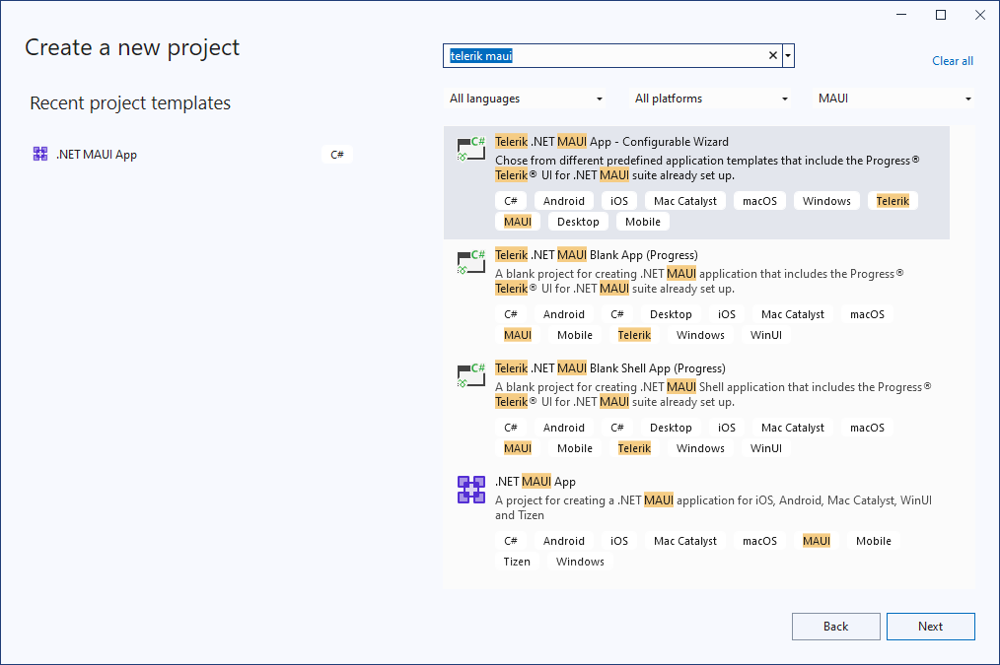
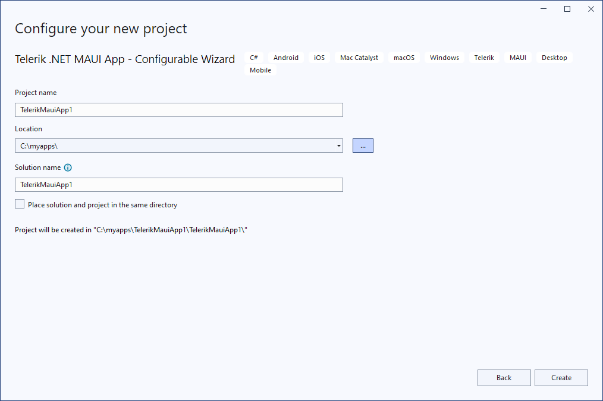
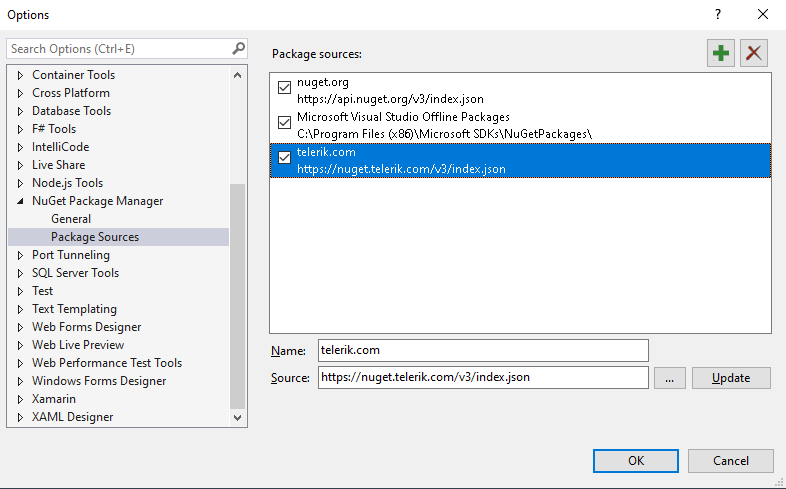
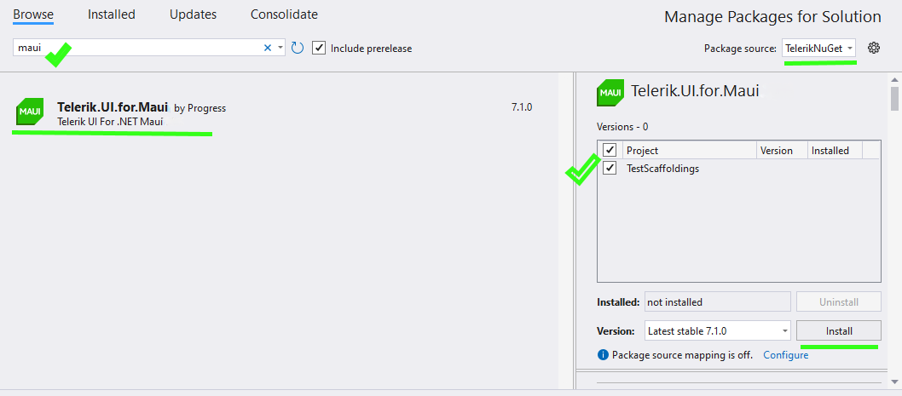

# First Steps with Telerik UI for .NET MAUI in Visual Studio

In this tutorial, you will enhance an existing .NET MAUI application by adding a Telerik UI for .NET MAUI control. You will achieve this by using Visual Studio for Windows and utilizing the Telerik NuGet source that will let you download and install Telerik controls.

## Prerequisites

* To download the Telerik UI for .NET MAUI packages, you need a [Telerik account](https://www.telerik.com/account/). If you don't have one, you can [create one](https://www.telerik.com/account/) for free.
* To create the app, you need Visual Studio 2022 17.8 or later with installed .NET MAUI workload.

## Step 0: Start Your Free Trial

@[template](/_contentTemplates/get-started.md#start-free-trial)

## Step 1: Download the Extension for Visual Studio

To use the **Telerik UI for .NET MAUI Create New Project** wizard, install the Telerik UI for .NET MAUI Visual Studio Extension. You can get the extension from <a href="https://marketplace.visualstudio.com/items?itemName=TelerikInc.telerik-maui-productivity-tools" target="_blank">the Visual Studio Code Marketplace.</a>

## Step 2: Create a New Project

To start the wizard, use the [Project](#project-menu) menu.

1. Open Visual Studio and choose the **Create a new project** option.
1. Search for **telerik maui**:

    

1. Select the **Telerik .NET MAUI Blank App** which represents a blank project for creating a .NET MAUI application that includes the Telerik .NET MAUI suite setup.

## Step 3: Configure the Project

Configure your **Telerik UI for .NET MAUI** project by setting your project name and its location.

    

Finally, Visual Studio opens the solution, which is pre-configured to use the Telerik UI for .NET MAUI controls and has the `Telerik.UI.for.Maui` NuGet package installed.

## Step 4: Add the Telerik NuGet Server

Telerik maintains a NuGet feed with official UI for .NET MAUI releases and service packs. These packages are available for registered users with an active trial or commercial license. Adding the Telerik NuGet server as a source in Visual Studio lets you download and install Telerik packages containing controls and utilities.

To add the Telerik NuGet source to Visual Studio:

1. In Visual Studio go to **Tools** > **NuGet Package Manager** > **Package Manager Settings**.

1. Select **Package Sources** and then click the **+** button to add a new package source.

1. Enter a **Name** for the new package source, for example, `telerik.com`.

1. Add the `https://nuget.telerik.com/v3/index.json` URL as a **Source**. Click **OK**.

1. Whenever Visual Studio displays a dialog to enter credentials for `nuget.telerik.com`, use your Telerik account email and password.

	

## Step 5: Install the Telerik UI for .NET MAUI Controls

1. In Visual Studio and go to **Tools** > **NuGet Package Manager** > **Manage NuGet Packages for Solution...**.

2. Install the Telerik UI for .NET MAUI package:

  1. Select the `telerik.com` **Package source** that you [added earlier](#step-2-add-the-telerik-nuget-server). As this is a private NuGet feed, you must authenticate 
  with your [Telerik account](https://www.telerik.com/account/) user name and password.

  1. Select the **Browse** tab and enter `MAUI` in the search box.

		* If using a trial license, select the `Telerik.UI.for.Maui.Trial` package.
		* If using a commercial license, select the `Telerik.UI.for.Maui` package.
  
  1. Select the checkbox for the target Project, and then click **Install**.

	 

## Step 6: Add the Telerik Namespace and Register the Controls

@[template](/_contentTemplates/get-started.md#add-namespace-register-controls)

## Step 7: Add a Telerik UI Component

@[template](/_contentTemplates/get-started.md#add-telerik-component)

## Step 8: Add Custom Content to the TemplatedButton

@[template](/_contentTemplates/get-started.md#add-custom-content)

## Next Steps

* [Telerik UI for .NET MAUI Installation Approaches]()
* [Restoring NuGet Packages in Your CI Workflow]()

## See Also

* [System Requirements]()
* [Telerik UI for .NET MAUI Product Page](https://www.telerik.com/maui-ui)
