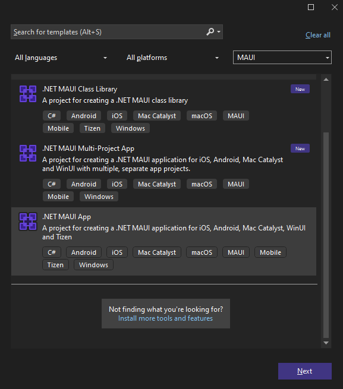

# First Steps with Telerik UI for .NET MAUI in Visual Studio

In this tutorial, you will create a simple .NET MAUI application and enhance it by adding a Telerik UI for .NET MAUI control. You will achieve this by using Visual Studio for Windows and utilizing the Telerik NuGet source that lets you download and install Telerik controls.

## Prerequisites

* To download the Telerik UI for .NET MAUI packages, you need a [Telerik account](https://www.telerik.com/account/). If you don't have one, you can [create one](https://www.telerik.com/account/) for free.
* To create the app, you need Visual Studio 2022 17.12 or later with installed .NET MAUI workload.

## Step 0: Start Your Free Trial

@[template](/_contentTemplates/get-started.md#start-free-trial)

## Step 1: Download Your License Key File

@[template](/_contentTemplates/get-started.md#license-key-download-win)

## Step 2: Create a New MAUI Project

In this step, you will create a basic .NET MAUI project as a starting point for your application development:

1. Open Visual Studio and select **Create a new project** in the start window.

1. Select the **.NET MAUI App** template, and click the **Next** button.

   
   
1. Name your project and select a location.

1. Choose the .NET framework for your project.

1. Wait until Visual Studio restores all dependencies (when done, all exclamation marks in the **Dependencies** tree view item disappear).

1. Click the **Windows Machine** button to build and run the app.

   

If you encounter any issues creating the basic project, see the complete guide in <a href="https://learn.microsoft.com/en-us/dotnet/maui/get-started/first-app?pivots=devices-windows&view=net-maui-8.0&tabs=vswin" target="_blank">Microsoft's .NET MAUI documentation</a>.

## Step 3: Add the Telerik NuGet Server

Telerik maintains a NuGet feed with official UI for .NET MAUI releases and service packs. These packages are available for registered users with an active trial or commercial license. Adding the Telerik NuGet server as a source in Visual Studio lets you download and install Telerik packages containing controls and utilities.

To add the Telerik NuGet source to Visual Studio:

1. In Visual Studio go to **Tools** > **NuGet Package Manager** > **Package Manager Settings**.

1. Select **Package Sources** and then click the **+** button to add a new package source.

1. Enter a **Name** for the new package source, for example, `telerik.com`.

1. Add the `https://nuget.telerik.com/v3/index.json` URL as a **Source**. Click **OK**.

1. Whenever Visual Studio displays a dialog to enter credentials for `nuget.telerik.com`, use your Telerik account email and password.

	

## Step 4: Install the Telerik UI for .NET MAUI Controls

1. In Visual Studio and go to **Tools** > **NuGet Package Manager** > **Manage NuGet Packages for Solution...**.

2. Install the Telerik UI for .NET MAUI package:

  1. Select the `telerik.com` **Package source** that you [added earlier](#step-2-add-the-telerik-nuget-server). As this is a private NuGet feed, you must authenticate 
  with your [Telerik account](https://www.telerik.com/account/) user name and password.

  1. Select the **Browse** tab and enter `MAUI` in the search box.

		* If using a trial license, select the `Telerik.UI.for.Maui.Trial` package.
		* If using a commercial license, select the `Telerik.UI.for.Maui` package.
  
  1. Select the checkbox for the target Project, and then click **Install**.

	 

> If your project uses the `Telerik.UI.for.Maui.8.0.0` NuGet package and .NET 9, you must also install the `Microsoft.Maui.Controls.Compatibility` package. This is needed because Telerik UI for .NET MAUI version 8.0.0 depends on Microsoft's compatibility package, which is no longer included in the default **.NET MAUI App** project template. This dependency has been removed in Telerik UI for .NET MAUI version 9.0.0.

## Step 5: Add the Telerik Namespace and Register the Controls

@[template](/_contentTemplates/get-started.md#add-namespace-register-controls)

## Step 6: Add a Telerik UI Component

@[template](/_contentTemplates/get-started.md#add-telerik-component)

## Step 7: Add Custom Content to the TemplatedButton

@[template](/_contentTemplates/get-started.md#add-custom-content)

## Next Steps

* [Telerik UI for .NET MAUI Installation Approaches]()
* [Restoring NuGet Packages in Your CI Workflow]()

## See Also

* [System Requirements]()
* [Telerik UI for .NET MAUI Product Page](https://www.telerik.com/maui-ui)
* [Using a Telerik Theme]()
