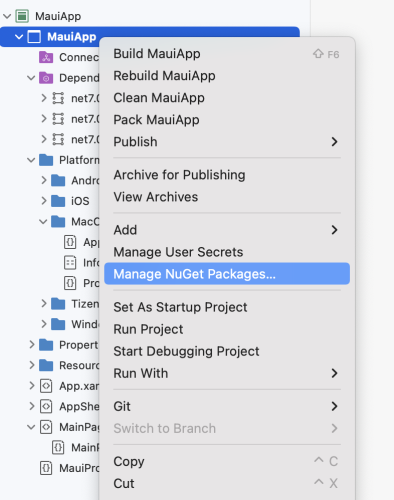
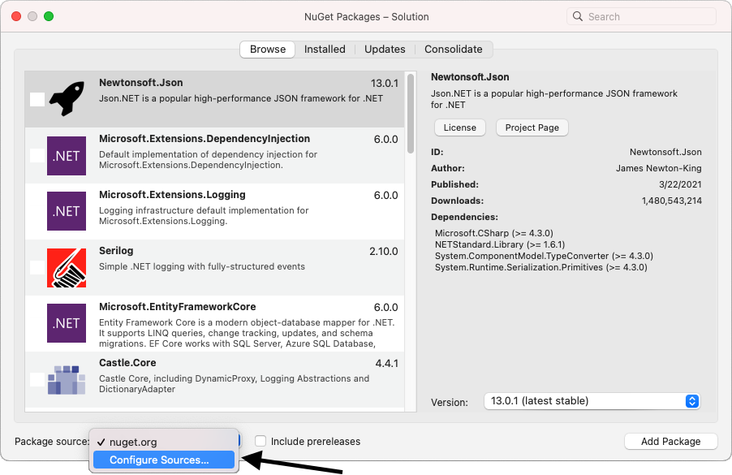
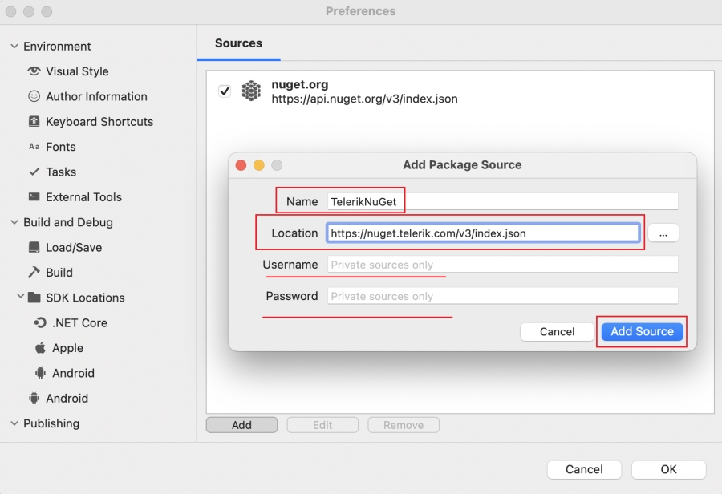
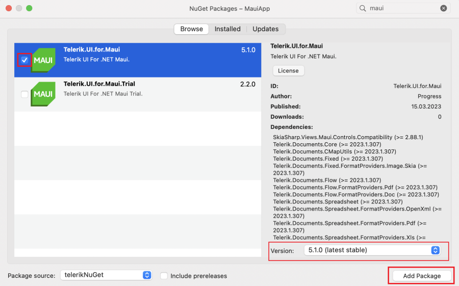

# First Steps by Installing with the NuGet Package on macOS

NuGet is a popular .NET package manager. Progress maintains the Telerik NuGet Feed for registered users and you can include the Telerik UI for .NET MAUI suite in your project as well as update to the latest available version from there.

While installing Telerik UI for .NET MAUI with NuGet works both for Windows and MacOS machines, this tutorial describes how to get up and running with the library by downloading and installing the controls on macOS. Here is the step by step guide you have to follow:

## Step 1: Set Up Your .NET MAUI Project

Before you start with the installation of Telerik UI for .NET MAUI, make sure you have a running .NET MAUI application. For more information on the required steps and system requirements, refer to the [Microsoft .NET MAUI official documentation](https://docs.microsoft.com/en-us/dotnet/maui/get-started/installation).

## Step 2: Download Telerik UI for .NET MAUI

Telerik UI for .NET MAUI enables you to download the suite either from the Telerik UI for .NET MAUI product page or through your Telerik account. For the purposes of this tutorial, let's download the batch from your Telerik account:

1. Log into your [Telerik Account](https://www.telerik.com/account/).

1. Click the __Downloads__ tab.

  

1. Search for MAUI and select the __Telerik UI for .NET MAUI__ product title.

  

1. On the next page, download the `.msi` and `.pkg` automatic installation files, and the Telerik .NET MAUI NuGet Package.

  

## Step 3: Add the Telerik NuGet Package Source to Visual Studio for Mac

Now, let's add the Telerik UI for .NET MAUI package through the Telerik NuGet feed. To use the available packages, you need to have an active Telerik account and to authenticate.

1. Click on the solution folder in Visual Studio for Mac to display the context menu and choose **Manage NuGet Packages**.

  

1. Choose the **Configure Source** option from the drop-down in the lower left corner.

  

1. On the next dialog you can see all the available sources. Choose **Add** to add the new server.

  

1. In the **Location** field, add the Telerik server by filling in its [`https://nuget.telerik.com/v3/index.json`](https://nuget.telerik.com/v3/index.json) URL. Click **Add Source**.

  Note that the [`https://nuget.telerik.com/v3/index.json`](https://nuget.telerik.com/v3/index.json) server will be deprecated and you are recommended to switch to the v3 API, which is faster, more lightweight, and also reduces the number of requests from NuGet clients.

  

The Telerik server is now ready to use. You can go to your solution and open the **Solution Package Manager**.

## Step 4: Install the Telerik .NET MAUI NuGet Package

Now, you need to add the Telerik package to the .NET MAUI solution project that you created:

1. Select the Telerik NuGet server as a package source and enter your credentials when prompted.
1. Search for the `Telerik.UI.for.Maui` package and select it.
1. Choose the projects which require the package.
1. Select the desired version and click **Add Package**.

## Next Steps

* [Available Product Files and Assemblies]()
* [Restoring NuGet Packages in Your CI Workflow]()
* [Telerik UI for .NET MAUI Installation Approaches]()

## See Also

* [System Requirements for macOS]()
* [Telerik Toolbox for .NET MAUI on macOS]()
* [Telerik Project Template for VS on macOS]()
* [Telerik UI for .NET MAUI Product Page](https://www.telerik.com/maui-ui)
