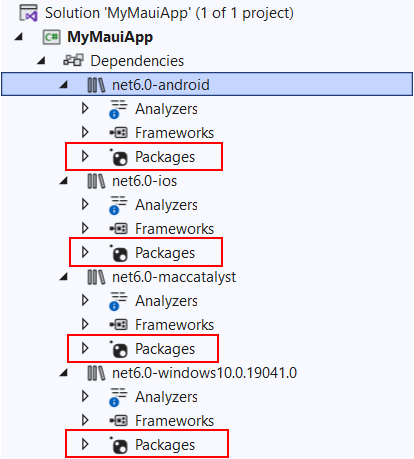

# Migrate my Xamarin.Forms app to .NET MAUI app

.NET MAUI is already official and most probably you’re already planning the migration process of your Xamarin.Forms apps to .NET MAUI in order to receive the latest features and mobile operating system support. 

In this guide we’ll go through the needed steps to migrate your app built with Telerik Xamarin controls to .NET MAUI app that uses Telerik .NET MAUI controls.

## Migrate Xamarin.Forms app to .NET MAUI app

You wouldn’t need to rewrite your existing Xamarin.Forms app to move it to .NET Multi-platform App UI (.NET MAUI). Still, there are some code changes that need to be implemented to ensure the smooth transition to .NET 6.0 and update to .NET MAUI.

To migrate a Xamarin.Forms app to .NET 6 and update the code to .NET MAUI, you'll need to do the following:

* Convert the projects from .NET Framework to .NET SDK style.
* Update namespaces.
* Update any incompatible NuGet packages.
* Address any breaking API changes.
* Run the converted app and verify that it functions correctly.

>important Check the official Microsoft guide for the migration process here: [Migrate your app from Xamarin.Forms](https://docs.microsoft.com/en-us/dotnet/maui/get-started/migrate).

## Migrate to Telerik UI for .NET MAUI controls

As soon as your Xamarin.Forms app has been migrated to .NET MAUI, now you’re ready to replace the Telerik Xamarin references with Telerik .NET MAUI as well as register the Telerik .NET MAUI controls.

### Step 1: Replace Telerik references

In general, there are two ways to reference our controls – by manually adding the required Telerik assemblies to the solution or by referencing the Telerik nuget packages. 

* Use Telerik Nuget Server to reference Telerik nuget package

You've already had **Telerik Nuget Server** configured in Visual Studio. All you need to do is to uninstall `Telerik.UI.for.Xamarin` nuget package and install `Telerik.UI.for.Maui` package instead.

> Check detailed steps on how to configure Telerik Nuget Server and install the Telerik .NET MAUI nuget package here: [Installing with Nuget]().

* Reference required assemblies

If you've added the Telerik Xamarin assemblies to the corresponding projects - shared, Android, iOS, the same approach is also available for .NET MAUI controls.

You would need to download either an automatic installation for Windows/Mac or a zip containing the binaries from your Telerik account - find detailed steps in the [Download Product Files]() topic.

&mdash;For automatic installation guide on Windows refer to [Installing Telerik UI for .NET MAUI from MSI file]();
&mdash;For automatic installation on Mac go to [Installing Telerik UI for .NET MAUI from PKG file]().
 
No matter whether you've used the automatic installation or the zip, you'll have Binaries folder containing all the needed assemblies in platform-specific folders - Android, iOS, MacCatalyst, WinUI.

Just need to add the assemblies from these folders to the corresponding platforms' Packages folders inside the .NET MAUI project:



### Step 2: Register the Telerik .NET MAUI controls inside CreateMauiApp method:

Register the Telerik controls through the `Telerik.Maui.Controls.Compatibility.UseTelerik` extension method called inside the CreateMauiApp method of the MauiProgram.cs file of your project:

**1.** Go to `MauiProgram.cs` file and add the needed namespace:

```C#
using Telerik.Maui.Controls.Compatibility;
```

**2.** Call the `UseTelerik()` method inside the `CreateMauiApp` method:

```C#
public static class MauiProgram
{
	public static MauiApp CreateMauiApp()
	{
		var builder = MauiApp.CreateBuilder();
		builder
			.UseTelerik()
			.UseMauiApp<App>()
			.ConfigureFonts(fonts =>
			{
				fonts.AddFont("OpenSans-Regular.ttf", "OpenSansRegular");
			});

		return builder.Build();
	}
}
```

### Step 3: Replace the used Telerik Xamarin components with Telerik .NET MAUI components.

Telerik UI for .NET MAUI suite now offers a wide range of UI controls and keeps growing with each release. You can check the exact list of the available controls in the [Introduction](../introduction) article. 

When planning to replace the existing Xamarin controls you're using, consider the following:

* Some components, such as DataGrid, ListView, Barcode, Button, etc can be directly replaced, just need to change the namespace. All the Telerik .NET MAUI controls use a common `telerik` namespace: `xmlns:telerik="http://schemas.telerik.com/2022/xaml/maui"`.

For example, let's have the following `RadListView` definition in a Xamarin.Forms app:

```XAML
<telerikDataControls:RadListView x:Name="listView" ItemsSource="{Binding Source}">
    <telerikDataControls:RadListView.ItemTemplate>
        <DataTemplate>
            <telerikListView:ListViewTemplateCell>
                <telerikListView:ListViewTemplateCell.View>
                    <Grid>
                        <Label Margin="10" Text="{Binding Name}" />
                    </Grid>
                </telerikListView:ListViewTemplateCell.View>
            </telerikListView:ListViewTemplateCell>
        </DataTemplate>
    </telerikDataControls:RadListView.ItemTemplate>
</telerikDataControls:RadListView>
```

where the namespaces are defined like this:

```XAML
xmlns:telerikDataControls="clr-namespace:Telerik.XamarinForms.DataControls;assembly=Telerik.XamarinForms.DataControls"
xmlns:telerikListView="clr-namespace:Telerik.XamarinForms.DataControls.ListView;assembly=Telerik.XamarinForms.DataControls"         
```

In a .NET MAUI app it should be replaced with:

```XAML
<telerik:RadListView x:Name="listView" ItemsSource="{Binding Source}">
    <telerik:RadListView.ItemTemplate>
        <DataTemplate>
            <telerik:ListViewTemplateCell>
                <telerik:ListViewTemplateCell.View>
                    <Grid>
                        <Label Margin="10" Text="{Binding Name}" />
                    </Grid>
                </telerik:ListViewTemplateCell.View>
            </telerik:ListViewTemplateCell>
        </DataTemplate>
    </telerik:RadListView.ItemTemplate>
</telerik:RadListView>
```

with the `telerik` common namespace:

```XAML
xmlns:telerik="http://schemas.telerik.com/2022/xaml/maui"
```

* Some components, such as MaskedEntries, Entry, Pickers, TabView have API changes, so you would need to refer to corresponding "Migration from Xamarin.Forms" topic for each of them:
	* [Entry: Migration from Xamarin.Forms]()
	

*	In case you use components that are currently not available in .NET MAUI:
	* We’re planning to deliver a few more .NET MAUI controls this year, please check the [Telerik UI for .NET MAUI Roadmap](https://www.telerik.com/support/whats-new/maui-ui/roadmap) for more details on what’s coming in 2022.
	* You can also take a look at the [Telerik UI for .NET MAUI Feedback Portal](https://feedback.telerik.com/maui) for the logged feature requests for new components;
	* Contact us directly either through the [support ticketing system](https://www.telerik.com/account/support-center/contact-us/technical-support?pid=2338), [our forums](https://www.telerik.com/forums/maui) or [feedback portal](https://feedback.telerik.com/maui).

## Port Custom Renderers to Handlers


	
## See Also

- [Telerik UI for .NET Sample Applications]()