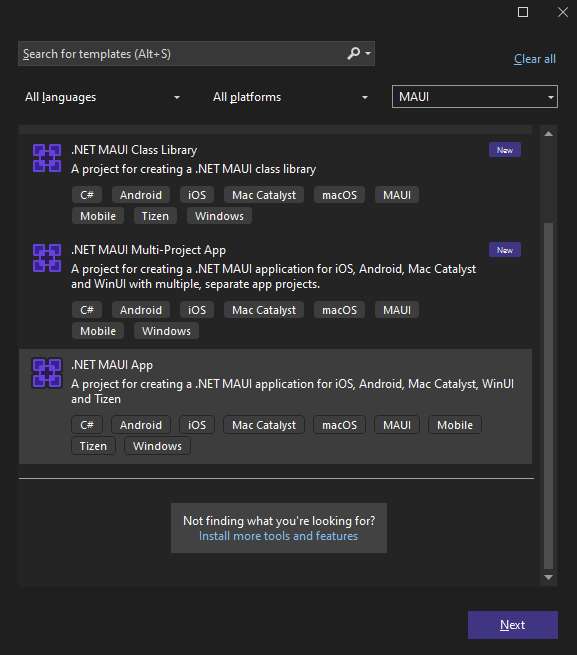
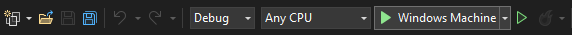
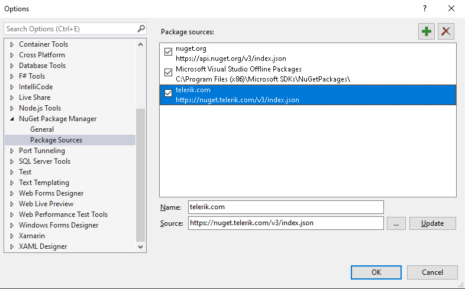
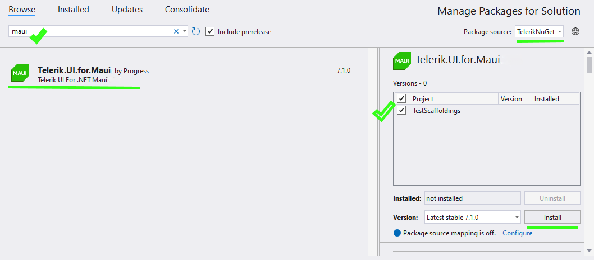
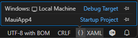

# Quick Start with Telerik UI for .NET MAUI

This guide walks you through the essential steps to get Telerik UI for .NET MAUI up and running in your app.

## Prerequisites

To create a .NET MAUI project, you need either of the following:

* <a href="https://learn.microsoft.com/en-us/dotnet/maui/get-started/installation?view=net-maui-9.0&tabs=vswin" target="_blank">Visual Studio 2022 17.12 or later</a> with installed <a href="https://learn.microsoft.com/en-us/dotnet/maui/get-started/installation?view=net-maui-9.0&tabs=vswin#installation-1" target="_blank">.NET MAUI workload</a>.
* <a href="https://learn.microsoft.com/en-us/dotnet/maui/get-started/installation?view=net-maui-8.0&tabs=visual-studio-code" target="_blank">Visual Studio Code</a> with the .NET MAUI extension and the <a href="https://learn.microsoft.com/en-us/dotnet/maui/get-started/installation?view=net-maui-8.0&tabs=visual-studio-code#install-net-and-net-maui-workloads" target="_blank">.NET and .NET MAUI workloads</a>.

## Step 1: Start Your Free Trial

@[template](/_contentTemplates/get-started.md#start-free-trial)

## Step 2: Download Your License Key File

To download and install your Telerik [license key file]():

1. Go to the <a href="https://www.telerik.com/account/your-licenses/license-keys" target="_blank">License Keys page</a> in your Telerik account.
1. Click the **Download License Key** button.
1. Save the `telerik-license.txt` file to the appropriate location for your OS:
    * (on Windows) `%AppData%\Telerik\telerik-license.txt`
    * (on Mac or Linux) `~/.telerik/telerik-license.txt`

This will make the license key available to all Telerik .NET apps that you develop on your local machine.

## Step 3: Create a New MAUI Project

Choose your preferred IDE to create a new .NET MAUI project and install the Telerik UI for .NET MAUI controls:

<TabStrip>
<TabStripTab title="Visual Studio">

### Step 1:

1. Open Visual Studio and select **Create a new project** in the start window.

1. Select the **.NET MAUI App** template, and click the **Next** button.

   

1. Name your project and select a location.

1. Choose the .NET framework for your project.

1. Wait until Visual Studio restores all dependencies (when done, all exclamation marks in the **Dependencies** tree view item disappear).

1. Click the **Windows Machine** button to build and run the app.

   

If you encounter any issues creating the basic project, see the complete guide in <a href="https://learn.microsoft.com/en-us/dotnet/maui/get-started/first-app?pivots=devices-windows&view=net-maui-8.0&tabs=vswin" target="_blank">Microsoft's .NET MAUI documentation</a>.

### Step 2: Install the Telerik UI for .NET MAUI Controls

The `Telerik.UI.for.Maui` package is available on the public <a href="https://www.nuget.org/packages/Telerik.UI.for.Maui" target="_blank">NuGet.org</a> registry (recommended) and on the authenticated Telerik NuGet server.

#### From NuGet.org (Recommended)

1. In Visual Studio go to **Tools** > **NuGet Package Manager** > **Manage NuGet Packages for Solution...**.

1. Make sure the **Package source** is set to `nuget.org`.

1. Select the **Browse** tab, enter `Telerik.UI.for.Maui` in the search box, and select the package.

1. Select the checkbox for the target project, and then click **Install**.

#### From the Telerik NuGet Server (Alternative)

@[template](/_contentTemplates/common/nuget.md#generate-nuget-key)

>caption Add the Telerik NuGet source to Visual Studio:

1. In Visual Studio go to **Tools** > **NuGet Package Manager** > **Package Manager Settings**.

1. Select **Package Sources** and then click the **+** button to add a new package source.

1. Enter a **Name** for the new package source, for example, `telerik.com`.

1. Add the `https://nuget.telerik.com/v3/index.json` URL as a **Source**. Click **OK**.

1. Whenever Visual Studio displays a dialog to enter credentials for `nuget.telerik.com`, use `api-key` as the username and your NuGet API key as the password.

	

>caption Install the Telerik UI for .NET MAUI package:

1. Select the `telerik.com` **Package source** that you [added earlier](#step-2-add-the-telerik-nuget-server). As this is a private NuGet feed, you must authenticate using `api-key` as the username and [your NuGet API key](#step-2-add-the-telerik-nuget-server) as the password.

1. Select the **Browse** tab, enter `maui` in the search box, and then select the `Telerik.UI.for.Maui` package.

1. Select the checkbox for the target project, and then click **Install**.



> If your project uses the `Telerik.UI.for.Maui.8.0.0` NuGet package and .NET 9, you must also install the `Microsoft.Maui.Controls.Compatibility` package. This is needed because Telerik UI for .NET MAUI version 8.0.0 depends on Microsoft's compatibility package, which is no longer included in the default **.NET MAUI App** project template. This dependency has been removed in Telerik UI for .NET MAUI version 9.0.0.

### Step 3: Add the Telerik Namespace and Register the Controls

If your .NET MAUI project uses the default project template provided by Microsoft (not the Telerik project template), you must configure the Telerik namespace, register the controls, and call `UseTelerik`:

@[template](/_contentTemplates/get-started.md#add-namespace-register-controls)

> If your project uses the `Telerik.UI.for.Maui.8.0.0` NuGet package and .NET 9, you must also install the `Microsoft.Maui.Controls.Compatibility` package. This is needed because Telerik UI for .NET MAUI version 8.0.0 depends on Microsoft's compatibility package, which is no longer included in the default **.NET MAUI App** project template. This dependency has been removed in Telerik UI for .NET MAUI version 9.0.0.

### Step 4: Add a Telerik UI Component

@[template](/_contentTemplates/get-started.md#add-telerik-component)

### Step 5: Add Custom Content to the TemplatedButton

@[template](/_contentTemplates/get-started.md#add-custom-content)

</TabStripTab>
<TabStripTab title="Visual Studio Code">

### Step 1: Create a New MAUI Project

1. Open Visual Studio Code and press `Cmd/Ctrl+Shift+P`. Enter **.NET: New Project...** in the input field.

1. Select the **.NET MAUI App** option.

1. Enter a name for your app.

1. Select an empty folder for your project. If the folder is not empty, the file explorer opens again.

1. Wait for Visual Studio Code to create the project and complete its configuration.

1. Choose the **Debug Target**:

	1. Open a C# or XAML file, for example, `App.xaml`.

	1. Click the curly brackets symbol **{ }** in the bottom right corner of Visual Studio Code.

		* If you are working on a Mac, select **My Mac**.
		* If you are working on Windows, select **Local Machine**.

		

1. Press `F5` to start a debug session. If Visual Studio Code prompts you to select a debugger, select C#.

If you encounter any issues creating the basic project, see the complete guide in <a href="https://learn.microsoft.com/en-us/dotnet/maui/get-started/first-app?pivots=devices-windows&view=net-maui-8.0&tabs=visual-studio-code" target="_blank">Microsoft's .NET MAUI documentation</a>.

### Step 2: Install the Telerik UI for .NET MAUI Controls

The `Telerik.UI.for.Maui` package is available on the public <a href="https://www.nuget.org/packages/Telerik.UI.for.Maui" target="_blank">NuGet.org</a> registry (recommended) and on the authenticated Telerik NuGet server.

#### From NuGet.org (Recommended)

Navigate to your project's root directory in the terminal and run:

```bash
dotnet add package Telerik.UI.for.Maui
```

#### From the Telerik NuGet Server (Alternative)

@[template](/_contentTemplates/common/nuget.md#generate-nuget-key)

Use the command below to add the Telerik NuGet source. Replace the placeholder with the API key that you generated.

```bash
dotnet nuget add source https://nuget.telerik.com/v3/index.json --name TelerikNuGetFeed --username api-key --password <YOUR-NUGET-API-KEY> --store-password-in-clear-text
```

>See <a href="https://learn.microsoft.com/en-us/nuget/consume-packages/consuming-packages-authenticated-feeds#security-best-practices-for-managing-credentials" target="_blank">Microsoft's security best practices</a> for more information on how to securely store your NuGet source credentials.

Then install the package:

```bash
dotnet add package Telerik.UI.for.Maui --source TelerikNuGetFeed
```

### Step 3: Add the Telerik Namespace and Register the Controls

If your .NET MAUI project uses the default project template provided by Microsoft (not the Telerik project template), you must configure the Telerik namespace, register the controls, and call `UseTelerik`:

@[template](/_contentTemplates/get-started.md#add-namespace-register-controls)

> If your project uses the `Telerik.UI.for.Maui.8.0.0` NuGet package and .NET 9, you must also install the `Microsoft.Maui.Controls.Compatibility` package. This is needed because Telerik UI for .NET MAUI version 8.0.0 depends on Microsoft's compatibility package, which is no longer included in the default **.NET MAUI App** project template. This dependency has been removed in Telerik UI for .NET MAUI version 9.0.0.

### Step 4: Add a Telerik UI Component

@[template](/_contentTemplates/get-started.md#add-telerik-component)

### Step 5: Add Custom Content to the TemplatedButton

@[template](/_contentTemplates/get-started.md#add-custom-content)

</TabStripTab>
</TabStrip>

## Next Steps

<article-card-container>
	<article-card
		href="/aicomponents"
		src="../images/aicomponents/AIPrompt_Light_Large.svg"
		title="AI Components"
		subTitle="AI Controls & Features"
		darkSrc="../images/aicomponents/AIPrompt_Dark_Large.svg"
		description="Explore the AI-powered controls and features available in Telerik UI for .NET MAUI.">
	</article-card>
	<article-card
		href="/ai/mcp-server"
		src="../images/aicomponents/Chat_Light_Large.svg"
		title="AI Coding Assistant"
		subTitle="MCP Server"
		darkSrc="../images/aicomponents/AI_Data_Operations_Dark_Large.svg"
		description="Use the Telerik MCP server to get AI-assisted coding support for .NET MAUI development.">
	</article-card>
	<article-card
		href="/introduction#list-of-net-maui-ui-controls"
		src="../images/aicomponents/AI_Data_Operations_Light_Large.svg"
		title="Use Controls"
		subTitle="All Controls"
		description="Browse the full list of Telerik UI for .NET MAUI controls available for your application.">
	</article-card>
	<article-card
		href="/demos-and-sample-apps/overview"
		src="../images/samples-apps.png"
		title="Sample Applications"
		subTitle="Sample Apps"
		description="Explore sample applications built with Telerik UI for .NET MAUI to see the controls in action.">
	</article-card>
	<article-card
		href="/styling-and-themes/overview"
		src="../front-image.png"
		title="Theming and Styles"
		subTitle="Styling"
		description="Learn how to apply and customize themes across your Telerik UI for .NET MAUI application.">
	</article-card>
	<article-card
		href="/font-icons/examples-icons"
		src="../images/font-icons.png"
		title="Font Icons"
		subTitle="Icons"
		description="Use the built-in Telerik font icons to enhance your .NET MAUI application UI.">
	</article-card>
</article-card-container>

## See Also

* [Using a Telerik Theme]()
* [Telerik Font Icons]()
