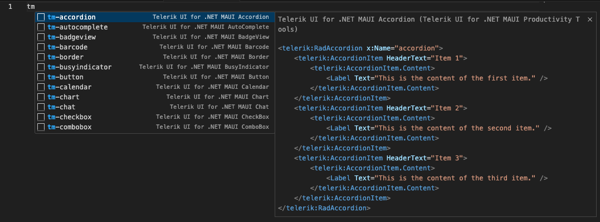

# Code Snippets

The Telerik Visual Studio Code extension provides a handy feature for increased developer productivity – code snippets for fast UI component reference and configuration. 

## Get the Extension

To use the **Telerik UI for .NET MAUI Code Snippets**, install the Telerik UI for .NET MAUI Visual Studio Code Extension. 

## Add a Code Snippet to the page

1. Use the `tm` shortcut that stands for Telerik MAUI and select a snippet from the dropdown menu.
    1. Alternatively, type the component name, and the available snippets will appear in a dropdown menu. 
1. Use a `Tab` sequence to populate the available attributes of the component.

  

## Available Code Snippets

| Code Snippet               | Component                                |
|----------------------------|------------------------------------------|
| tm-accordion               | [Accordion]() |
| tm-autocomplete            | [AutoComplete]()     |
| tm-barcode                 | [Barcode]() |
| tm-badgeview               | [BadgeView]() |
| tm-border                  | [Border]() |
| tm-busyindicator           | [BusyIndicator]() |
| tm-button                  | [Button]()   |
| tm-calendar                | [Calendar]()   |
| tm-chart                   | [Chart]() |
| tm-checkbox                | [CheckBox]() |
| tm-combobox                | [ComboBox]() |
| tm-chat                    | [Chat]()    |
| tm-dataform                | [DataForm]() |
| tm-datagrid                | [DataGrid]() |
| tm-datepicker              | [DatePicker]() |
| tm-datetimepicker          | [DateTimePicker]() |
| tm-docklayout              | [DockLayout]() |
| tm-entry                   | [Entry]() |
| tm-expander                | [Expander]() |
| tm-radial-gauge            | [Gauge]() |
| tm-horizontal-gauge        | [Gauge]()       |
| tm-imageeditor             | [ImageEditor]()       |
| tm-itemscontrol            | [ItemsControl]() |
| tm-listpicker              | [ListPicker]() |
| tm-listview                | [ListView]()       |
| tm-map                     | [Map]() |
| tm-maskedentry             | [MaskedEntry]()       |
| tm-navigationview          | [NavigationView]() |
| tm-numericinput            | [NumericInput]()           |
| tm-path                    | [Path]()         |
| tm-pdfviewer               | [PDF Viewer]() |
| tm-popup                   | [Popup]() |
| tm-progressbar             | [ProgressBar]()           |
| tm-rangeslider             | [RangeSlider]() |
| tm-rating                  | [Rating]({%slug rating-overview}) |
| tm-templated-rating        | [Rating]() |
| tm-richtexteditor          | [RichTextEditor]() |
| tm-scheduler               | [Scheduler]()   |
| tm-segmented-control       | [SegmentedControl]() |
| tm-sidedrawer              | [SideDrawer]()       |
| tm-signaturepad            | [SignaturePad]() |
| tm-slideview               | [SlideView]() |
| tm-tabview                 | [TabView]() |
| tm-templatedpicker         | [TemplatedPicker]() |
| tm-timepicker              | [TimePicker]() |
| tm-timespanpicker          | [TimeSpanPicker]() |
| tm-toolbar                 | [Toolbar]()         |
| tm-treeview                | [TreeView]()   |