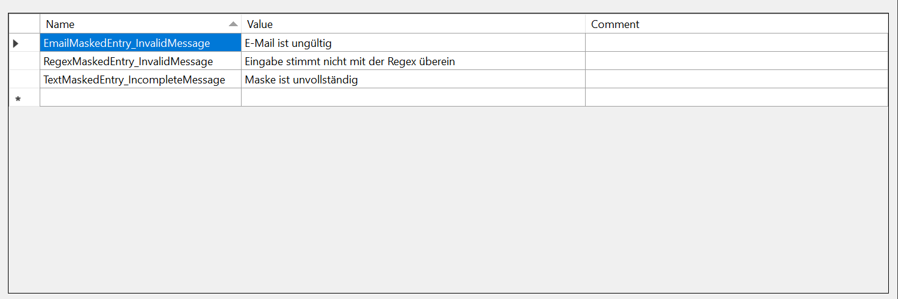
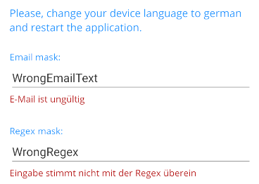

# Globalization and Localization

Localization and Globalization is the process of designing and developing your application in such a way that it adapts to different languages and culture configurations.

This topic provides an overview on how you could utilize the Telerik .NET MAUI localization and globalization feature of the Telerik .NET MAUI controls.

## Globalization

Globalization refers to developing an application in such a way that it works with respect to the target device culture. This includes numbers formatting which can vary between cultures, especially for some specific symbols, such as decimal separators, currency and other, as well as date and time formatting. Following is a list of Telerik .NET MAUI controls that support globalization:

* Calendar
* DatePicker
* DateTimePicker
* MaskedEntry
* NumericInput
* Scheduler
* TimePicker
* TimeSpanPicker

## Localization

Localization refers to the translation of application resources into localized versions for the specific languages that the application supports. Check below a list of Telerik .NET MAUI controls that support localization:

* [Conversational UI(Chat)]()
* [DataForm]()
* [DataGrid]()
* [ImageEditor]()
* [MaskedEntry]()
* [DatePicker]()
* [DateTimePicker]()
* [ListPicker]()
* [Scheduler]()
* [TemplatedPicker]()
* [TimePicker]()
* [TimeSpanPicker]()
* [PDF Viewer]()
* [TreeDataGrid]()

The localization mechanism in Telerik .NET MAUI controls is implemented through `TelerikLocalizationManager` class and more specifically the `TelerikLocalizationManager.Manager` static property. To enable localization to any of the listed above components you should choose between the approaches below:

* [Localization using Custom Localization Manager](#localization-using-custom-localization-manager)

* [Localization using ResourceManager](#localization-using-resourcemanager)

In both cases you would need to provide a translation of all the resource keys used inside the supported controls.

### Localization using Custom Localization Manager

To apply localization to your controls just instantiate your custom TelerikLocalizationManager and set it to the static property `TelerikLocalizationManager.Manager`, before the creation of the UI. Below you could find an example with MaskedEntry control.

1. Create a custom class that inherits from `TelerikLocalizationManager` and override the `GetString()` method:

 ```C#
 public class CustomTelerikLocalizationManager : TelerikLocalizationManager
 {
    public override string GetString(string key)
    {
        if (key == "EmailMaskedEntry_InvalidMessage")
        {
            return "Email ist ungültig";
        }

        if (key == "RegexMaskedEntry_InvalidMessage")
        {
            return "Eingabe stimmt nicht mit der Regex überein";
        }

        if (key == "TextMaskedEntry_IncompleteMessage")
        {
            return "Maske ist unvollständig";
        }

        return base.GetString(key);
    }
 }
 ```

1. Add the namespace:

 ```C#
using Telerik.Maui;
 ```

1. Set it as the `TelerikLocalizationManager.Manager`:

 ```C#
TelerikLocalizationManager.Manager = new CustomTelerikLocalizationManager();
 ```

1. Add the namespace:

 ```C#
using Telerik.Maui;
 ```

>important You should set the custom manager before the `InitializeComponent()` method is invoked otherwise the default values will be applied to the RadMaskedEntry.

### Localization using ResourceManager

The second option for applying localization is through setting a custom `ResourceManager`.

In the same way as the built-in mechanism for localizing .NET applications uses [RESX files](https://docs.microsoft.com/en-us/dotnet/core/extensions/create-resource-files) and the classes in the `System.Resources` and `System.Globalization` namespaces, Telerik .NET MAUI controls rely on similar setup to achieve the functionality.

You should add different resource `.RESX` files according to the different languages/cultures which you would like to use. Imagine that you want to translate your control, MaskedEntry for example, into English and German. You will have to add two new resource files to your .NET MAUI project with `Embedded resource` Build action:

* `MaskResource.resx` - this resource file will store the English(default) resources for the MaskedEntry control.

* `MaskResource.de.resx` - this resource file will store the German resources for the MaskedEntry control. It will be automatically used when the language of the target device is set to German.

Next image shows an example of a custom resource file used for German:



In order to apply the localization from the `MaskResource` resource files, you would need to set the `ResourceManager` property of the `TelerikLocalizationManager.Manager` to the `MaskResource.ResourceManager`:

```C#
TelerikLocalizationManager.Manager.ResourceManager = MaskResource.ResourceManager;

InitializeComponent();
```

>important You should set the custom manager before the `InitializeComponent()` method is invoked otherwise the default values will be applied to the RadMaskedEntry.

The image below shows the localization applied to the MaskedEntry ValidationErrorMessage



>important You can check working localization examples in the **MaskedEntry/Features** folder within the [SDK .NET MAUI application]().
