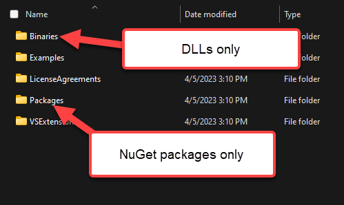

# Installation Approaches for Telerik .NET MAUI

You can use Telerik UI for .NET MAUI on Windows and macOS. Depending on the operation system you are using and on the preferred way to work with the product, the suite can be installed in the following ways:

* [(Windows) MSI file installation](#msi-file-installation)
* [(macOS) PKG file installation](#pkg-file-installation)
* [(Windows & macOS) NuGet installation](#nuget-installation)

Even though it's not recommended, after installing Telerik UI for .NET MAUI, you can still [add the required assemblies manually](#manually-adding-the-required-assemblies).  

## MSI File Installation

MSI files are intended to provide an easy and automatic installation experience of a product on Windows machines. The Telerik UI for .NET MAUI MSI file installs the controls on your computer in a `Program Files/Progress` folder and automatically creates the necessary virtual folders and projects.

Apart from the described in detail approach for [installing the suite from your Telerik account](), you can also download the product from its product page:

1. Log into your [Telerik Account](https://www.telerik.com/account/).

1. Go to the [Telerik UI for .NET MAUI product page](https://www.telerik.com/maui-ui).

1. Click the **Download Telerik UI for .NET MAUI** button.

  

1. As a result, the download starts automatically.

  

## PKG File Installation

PKG files are intended to provide an easy and automatic installation experience of a product on Mac machines. The Telerik UI for .NET MAUI PKG file installs the controls on your computer in a `Program Files/Progress` folder and automatically creates the necessary virtual folders and projects.

For the step-by-step guide, refer to the article on [installing Telerik UI for .NET MAUI on macOS with the PKG installation file]().

## NuGet Installation

The NuGet packages are single ZIP files with the `.nupkg` extension that contain the compiled code (DLLs), other related files, and a descriptive manifest that includes information such as the version package number.

* For more information about how to install Telerik UI for .NET MAUI with NuGet on Windows-running machines, refer to the article on [first steps with NuGet on Windows]().
* For more information about how to install Telerik UI for .NET MAUI with NuGet on macOS-running machines, refer to the article on [first steps with NuGet on macOS]().
* For more information about restoring Telerik UI for .NET MAUI NuGet packages in your CI workflow, refer to the article on [using token-based NuGet authentication]().

## Manually Using Assembly References

Apart from the described steps in the getting started guides, you can also use a manual installation approach for referencing the required Telerik UI for .NET MAUI assemblies into your solution. The manual approach is available in the following cases:

* During the MSI installation&mdash;After you have [automatically installed Telerik UI for .NET MAUI with the MSI file](), the assemblies will be located in the `C:\Program Files\Progress\` (for 32bit machines) or `C:\Program Files (x86)\Progress\` (for 64bit machines) default directory.
* Using the ZIP file - Alternatively, you can download the ZIP file with all the Telerik UI for .NET MAUI assemblies as described in the article on the [available product files](). You can then unzip the file to any location on your machine and reference the assemblies from that location.

No matter whether you've used the `.msi` automatic installation or the `zip` file, you'll receive the `Binaries/Net7` and `Binaries/Net8` folders, which contain the Android, iOS, MacCatalyst, and WinUI platform-specific folders with all assemblies you need.

To manually reference the assembly references, create a `libs` folder in your solution folder. Then, copy the content from the desired .NET folder into your "libs" folder (e.g. `Binaries/NET7` copyto-> `libs`). You can now directly reference the DLLs in that `libs` folder instead of the installation folder.

Note that *Visual Studio 2022 does not have support for differentiating DLL references for each target platform*, you must manually edit the csproj file and add conditions for each target platform.

```
<ItemGroup>
    <!-- You can keep the SHARED assembly references in here -->
    <Reference Include="..." />
</ItemGroup>

<ItemGroup Condition="$([MSBuild]::GetTargetPlatformIdentifier('$(TargetFramework)')) == 'windows'">
    <!-- Put Windows-only assembly references in here -->
    <Reference Include="..." />
</ItemGroup>

<ItemGroup Condition="$([MSBuild]::GetTargetPlatformIdentifier('$(TargetFramework)')) == 'iOS'">
    <!-- Put iOS-only assembly references in here -->
    <Reference Include="..." />
</ItemGroup>

<ItemGroup Condition="$([MSBuild]::GetTargetPlatformIdentifier('$(TargetFramework)')) == 'maccatalyst'">
    <!-- Put MacCatalyst-only assembly references in here -->
    <Reference Include="..." />
</ItemGroup>

<ItemGroup Condition="$([MSBuild]::GetTargetPlatformIdentifier('$(TargetFramework)')) == 'android'">
    <!-- Put Android-only assembly references in here -->
    <Reference Include="..." />
</ItemGroup>
```

>important As some of the controls included in Telerik UI for .NET MAUI suite rely on the SkiaSharp rendering library, you must also install the `SkiaSharp.Views.Maui.Controls.Compatibility` NuGet package.

## Referencing Local NuGet Package Files

If you would rather use offline NuGet package files, you'll need to make a copy of the .nupkg files that would normally get restored from the Telerik NuGet server. You will find offline copies of the .nupkg files in the `Packages` folder of the installation directory. 



Create a `local_packages` folder in your solution directory and copy all those nupkg files into it. Once those are copied, you can now add a new PackageSource to your nuget.config that points to that directory. With that package source in the nuget.config, you will see it when using the NuGet Package Manager.

For example:

```
<?xml version="1.0" encoding="utf-8"?>
<configuration>
  <packageSources> 
    <PackageSources>
      <add key="telerik_offline" value="../local_packages/" />
  </PackageSources>
</configuration>
```

>note You will have to restart Visual Studio before it recognizes any changes to a nuget.config file or see a newly added nuget.config file.

## See Also

* [MSI Quickstart]()
* [PKG Quickstart]()
* [Quickstart with NuGet on Windows]()
* [Quickstart with NuGet on macOS]()
