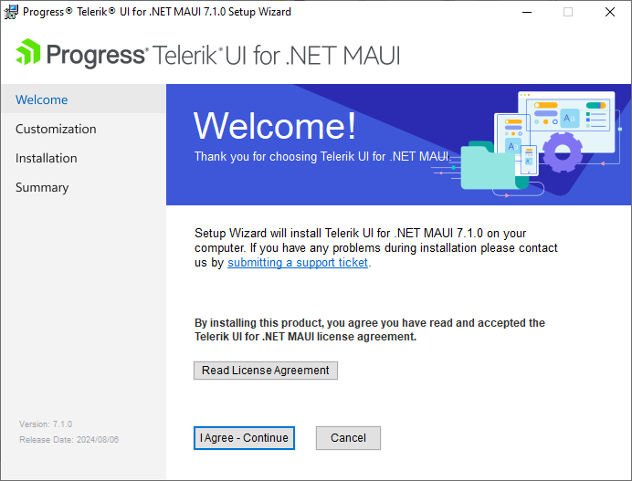
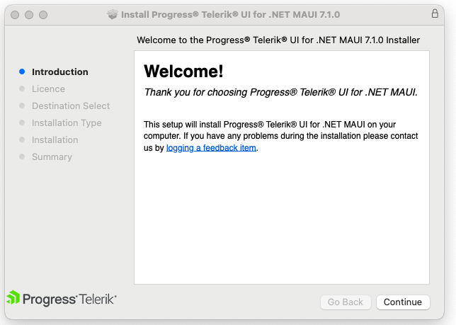

# Using the Automated Installers for Telerik UI for .NET MAUI

You can install Telerik UI for .NET MAUI using automated installers on both Windows and macOS.

Using the automated installers has several advantages:

* The installers deliver not only the UI controls but also a set of complete examples that you can browse and explore.
* As a part of the installation process, both installers automatically [download and set up your license key file]().
* The installer for Windows includes the Visual Studio extensions that help you improve your productivity.

>The steps in this article require an active trial or commercial license. If you are just starting with Telerik UI for .NET MAUI and want to activate your free trial, see [Starting a Free Trial]() instead.

## Installing on Windows

The Telerik UI for .NET MAUI installer for Windows is packaged as an MSI file. The MSI installs the controls in the `C:\Program Files\Progress\` folder and automatically creates the necessary virtual folders and projects.

To install Telerik UI for .NET MAUI using the MSI:

1. Download the MSI from the [Downloads](https://www.telerik.com/account/downloads/product-download?product=MAUI) section of your Telerik account.

1. Open the `Telerik_UI_for_dot_NET_Maui_[version].msi` file and follow the instructions. The file automatically installs Telerik UI for .NET MAUI on your PC.

    

    >On a 32-bit machine, the wizard suggests installing the UI for .NET MAUI controls in `C:\Program Files (x86)\Progress\`. On a 64-bit machine, the suggested folder is `C:\Program Files\Progress\`.

## Installing on macOS

The Telerik UI for .NET MAUI installer for macOS is a PKG file. The PKG installs the controls in the `Documents/Progress` folder.

1. Download the PKG from the [Downloads](https://www.telerik.com/account/downloads/product-download?product=MAUI) section of your Telerik account.

1. Run the `Telerik_UI_for_dot_NET_Maui_[version].pkg` file and follow the instructions. The file automatically installs Telerik UI for .NET MAUI on your Mac.

    

## Using the Installed Extras

After the installation is complete, explore the installation folder of the MAUI controls where you can find the following folders:

* `Binaries`&mdash;Includes the `Net9` and `Net10` folders. Each folder contains the needed assemblies for Android, iOS, MacCatalyst, and WinUI. You can use them to [manually reference]() the Telerik UI for .NET MAUI DLLs in your app.

* `Examples`&mdash;Contains the sample applications demonstrating the Telerik UI for .NET MAUI controls. For more details, go to the [Sample Applications]() section.

* `LicenseAgreements`&mdash;Provides the product End-User License Agreement (EULA).

* `Packages`&mdash;Contains the `Telerik.UI.for.Maui.[version].nupkg` NuGet package. Use it in case you need to set up a local NuGet source and reference the `Telerik.UI.for.Maui.[version].nupkg` from there.

* `VSExtensions`&mdash;Contains the installation file for the Visual Studio extension for Visual Studio 2022. For more details, go to [Visual Studio Integration] section.

## See Also

- [UI for MAUI Installation Methods]()
- [Starting a Free Trial]()
- [Sample Applications]()
