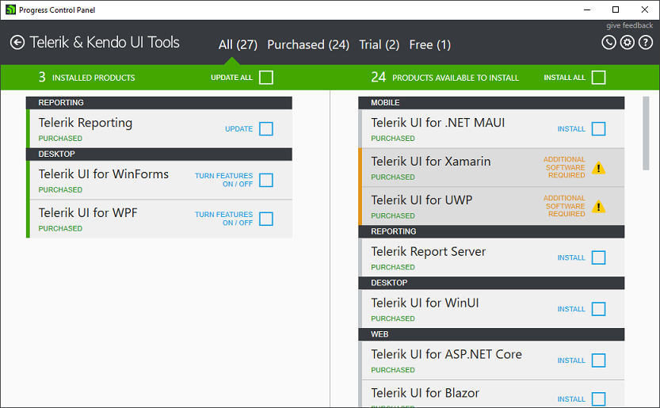

# Progress Control Panel

Progress Control Panel is a standalone desktop application for Windows that enables developers to install, monitor, and manage their Telerik UI products like UI for .NET MAUI. In addition, the Control Panel also automates the configuration of the NuGet source for the Telerik products.

To install Telerik UI for .NET MAUI by using the Progress Control Panel:

1. <a href="https://www.telerik.com/try/control-panel" target="_blank">Download </a> the Progress Control Panel.

1. Run the downloaded application and log in with your Telerik account.

1. Select Telerik UI for .NET MAUI and, if desired, any other products for installation.

For more information and detailed installation and configuration instructions, see the <a href="https://docs.telerik.com/controlpanel/introduction" target="_blank">Progress Control Panel documentation</a>.

    
## See Also

* [UI for .NET MAUI - Installation Approaches]()
* [Get Started with UI for .NET MAUI in Visual Studio for Windows]()