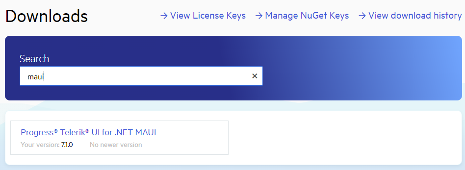
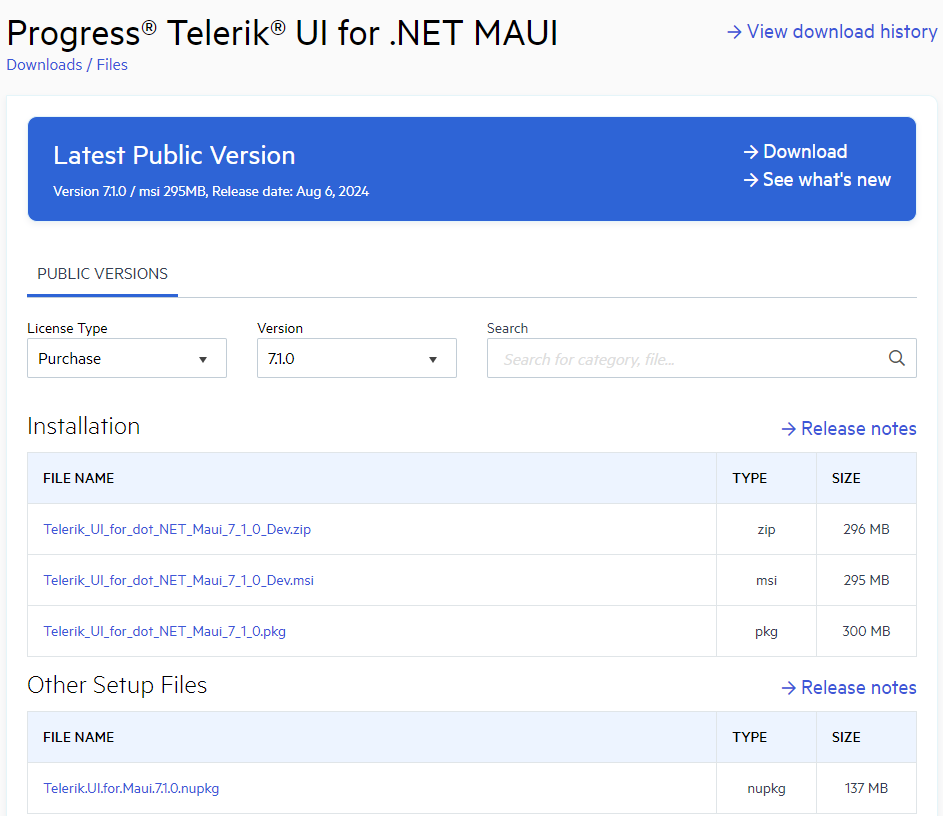

# Download Product Files

You can download the following Telerik UI for .NET MAUI files from the Downloads section of your Telerik Account:

* Standalone installation
* NuGet packages
* Old versions

1. Log into your [Telerik account](https://www.telerik.com/account/).

2. Click on the __Downloads__ tab:

 

3. Select __Telerik UI for .NET MAUI__ product title:

 

4. The next page allows you to download the Windows automatic installation msi file, Mac automatic installation pkg file and NuGet Packages.

 

Below you can find a list of the available files:

### Installation

* Telerik_UI_for_dot_NET_Maui_[Version]_[License].zip - contains binaries, VSExtensions and examples used for manual installation.
* Telerik_UI_for_dot_NET_Maui_[Version]_[License].msi - runnable msi file used for automatic installation (for use on PC).
* Telerik_UI_for_dot_NET_Maui_[Version]_[License].pkg - runnable pkg file used for automatic installation (for use on Mac).

### Other Setup Files

* Telerik.UI.for.Maui.[Version].nupkg - nuget package that contains the Telerik UI for .NET MAUI assemblies. 
* telerik.ui.for.maui.[Version].mpack - a Visual Studio for Mac add-in which provides a project template, pre-setup with all requirements to run Telerik UI for .NET MAUI components.

## See Also

- [First Steps]()
- [Installing from MSI file]()
- [Installing from PKG file]()
- [Installing with NuGet]()
- [Restoring NuGet Packages in Your CI Workflow]()
