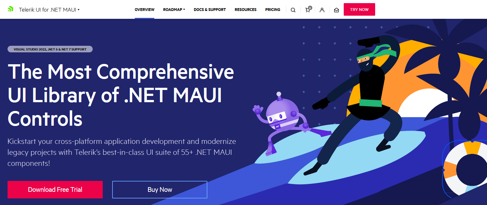
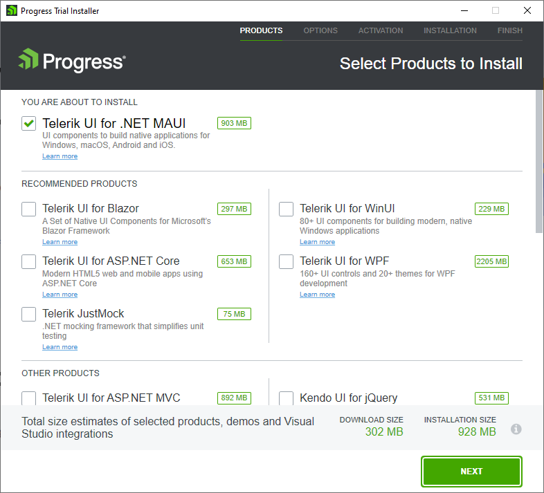

# Installing a Trial Version

The Telerik UI for .NET MAUI trial version gives you full access to all Telerik .NET MAUI components and their functionality. In addition, you get free technical support for 30 days.

>The trial version installer activates your free trial period once you reach the last installation step. It also automatically downloads the [license key file]() used to activate the MAUI controls.

To start your Telerik UI for .NET MAUI trial:

1. Go to the [Telerik UI for .NET MAUI product page](https://www.telerik.com/maui-ui).
    
    

1. Click the **Download Free Trial** button.

    * If you aren't logged in to your Telerik account, you will be redirected to the login page.
    * If you don't have an account yet, enter your email address and you will see the registration form.

1. Use the downloaded file to start the Progress Trial Installer:

    - On Windows, open the downloaded EXE file, make sure that **Telerik UI for .NET MAUI** is selected, and continue with the setup.

        

    - On macOS, use the downloaded PKG file, make sure that **Telerik UI for .NET MAUI** is selected, and continue with the setup.
 
After completing all installation steps, you activate your 30 day free trial.

## See Also

* [Using the Automated Installer]()
* [Installing with NuGet]()
