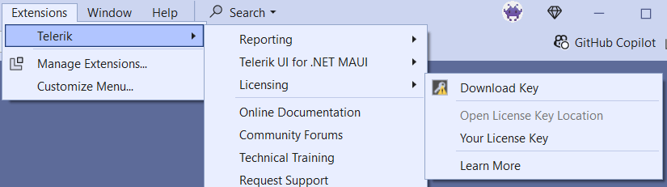
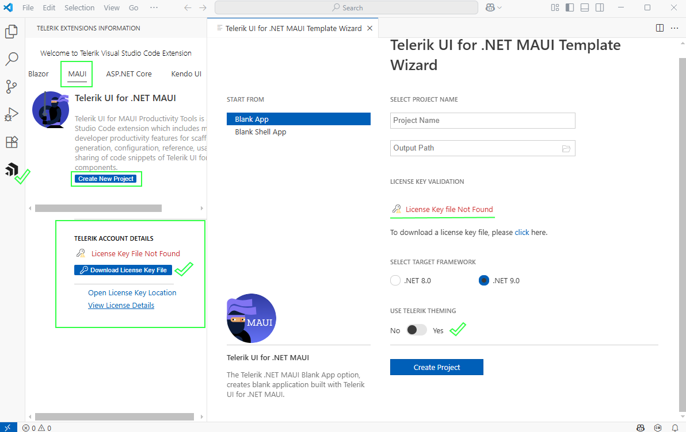
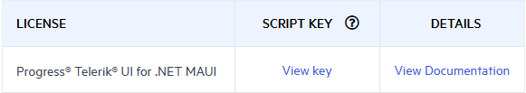

# Installing Your Telerik UI for .NET MAUI License Key

Starting with the Q1 2025 release, the UI components from the Telerik UI for .NET MAUI library require activation through a license key (trial or commercial). This article describes how to download your personal license key and use it to activate the Telerik UI for .NET MAUI components.

An invalid license results in [errors and warnings]() during build and run-time indicators such as watermarks and banners.

To download a license key for Telerik UI for .NET MAUI, you must have either a developer license or a trial license. If you are new to Telerik UI for .NET MAUI, sign up for a [free trial](https://www.telerik.com/try/ui-for-maui) first, and then follow the steps below.

Depending on your development environment and preferences, you can install your license key in either of the following ways:

* [Automatic Installation for projects with NuGet references](#automatic-license-key-installation)&mdash;Suitable for developers using Telerik productivity tools like the Telerik extensions for Visual Studio and the Progress Control Panel
* [Manual installation for projects with NuGet references](#manual-license-key-installation)&mdash;Suitable for trial users and developers who prefer to manage their projects and Telerik product versions manually.
* [Manual installation for projects using assembly references (no NuGet packages)](#adding-a-license-key-in-projects-without-nuget-references)&mdash;Suitable for developers who cannot use NuGet references in their projects and use the Telerik DLLs instead.

## Automatic License Key Installation

Telerik provides tools that automatically provision your license key. These tools include the [Progress Control Panel](), the [Visual Studio Extensions]() and [Visual Studio Code extensions]().

### Installing a License Key with the VS Extensions

To install your license key by using the [Telerik UI for .NET MAUI Visual Studio extensions]():

1. Open Visual Studio.
1. Go to **Extensions** > **Telerik** **Licensing** > **Download Key**.

    

### Installing a License Key with the VS Code Extensions

To install your license key by using the [Telerik UI for .NET MAUI Visual Studio Code extensions]():

1. Open Visual Studio Code
1. Follow the instructions described in the [Start the Wizard article](#start-the-wizard) for opening the Telerik Extensions menu.
1. Check the **TELERIK ACCOUNT DETAILS** field in the wizard and press the **Download License Key File** button.

    

### Installing a License Key with the Progress Control Panel

To install your Telerik License Key by using the [Progress Control Panel](), start the application. It automatically downloads your license key file `telerik-license.txt` to your home directory:

* On Windows `%AppData%\Telerik` or `C:\Users\[windows_username]\%AppData%\Roaming\Telerik`.
* On Mac/Linux: `~/.telerik/`.

## Manual License Key Installation

To manually download and install a license key for Telerik UI for .NET MAUI:

1. Go to the [License Keys](https://www.telerik.com/account/your-licenses/license-keys) page in your Telerik account.

1. Click the **Download License Key** button.

    

### Activating the Telerik UI for .NET MAUI Components

To activate the Telerik UI for .NET MAUI controls:

* Copy the [downloaded](#manual-license-key-installation) `telerik-license.txt` license key file to your home directory. This makes the license key available to all projects that you develop on your computer:

    * For Windows: `%AppData%\Telerik\telerik-license.txt`.
        * For the standard Windows user, that path resolves to `C:\Users\[windows_username]\AppData\Roaming\Telerik\telerik-license.txt`, it can resolve differently for service accounts.
    * For Mac/Linux: `~/.telerik/telerik-license.txt`. If `.telerik` folder does not exist, create such, and paste the `telerik-license.txt` file in it.
    
* Alternatively, copy the `telerik-license.txt` license key file to the root folder of your project. This makes the license key available only to this project. Do not commit the file to source control as this is your personal license key.

When you build the project, the `Telerik.Licensing` NuGet package automatically locates the license file and uses it to activate the MAUI controls.

> If your project doesn’t use NuGet packages, see the [next document section](#adding-a-license-key-in-projects-without-nuget-references).

## Adding a License Key in Projects Without NuGet References

Telerik strongly recommends the use of NuGet packages whenever possible. Only include the license key as a code snippet when NuGet packages are not an option.

If you cannot use NuGet packages in your project, add the license as a code snippet:

1. Go to the [License Keys page](https://www.telerik.com/account/your-licenses/license-keys) in your Telerik account.

1. On the Telerik UI for .NET MAUI row, click the **View key** link in the **SCRIPT KEY** column.

    

1. Copy the C# code snippet into a new file, for example, `TelerikLicense.cs`.

1. Add the `TelerikLicense.cs` file to your project.

>Do not publish the license key code snippet in publicly accessible repositories. This is your personal license key.

## Updating Your License Key

Whenever you purchase a new Telerik UI for .NET MAUI license or renew an existing one, always [download a new license key](#manual-license-key-installation). The new license key includes information about all previous license purchases. This process is referred to as a license key update. Once you have the new license key, use it to [activate the Telerik UI for .NET MAUI](#activate-the-telerik-ui-for-net-maui-components).

## See Also

* [License Activation Errors and Warnings]()
* [Adding the License Key to CI Services]()
* [Frequently Asked Questions about Your Telerik UI for .NET MAUI License Key]()
