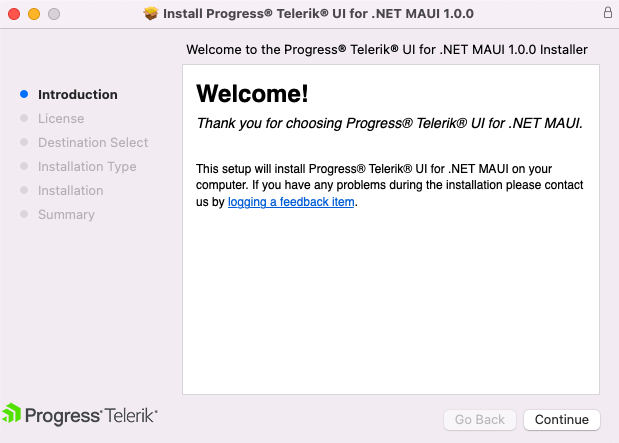
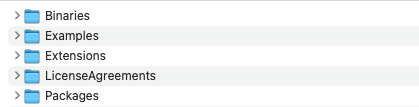

# Installing Telerik UI for .NET MAUI from PKG file

To install Telerik UI for .NET MAUI on your machine from the Apple Installer .pkg file, follow the instructions below:

1. Go to the Telerik UI for .NET MAUI download page following the instructions in [Download Product Files]() topic.

1. Run the `Telerik_UI_for_dot_NET_Maui_[version].pkg` file and follow the instructions. 

	
	
	The file automatically installs Telerik UI for .NET MAUI on your Mac.

1. The installation folder provides the following subdirectories:

    * **Binaries**&mdash;Contains the needed assemblies for Android, iOS, MacCatalyst, and WinUI.
    * **Examples**&mdash;Contains the samples applications demonstrating the Telerik UI for .NET MAUI controls. For more details go to [Sample Applications]() topic.
    * **LicenseAgreements**&mdash;Provides the product End-User License Agreement (EULA).
    * **Packages**&mdash;Contains the `Telerik.UI.for.Maui.[version].nupkg` file as well as the Document Processing nuget packages.
	* **VSExtensions**&mdash;Contains the Project Wizard for Visual Studio for Mac.
	
	
	
## See Also

- [Project Template]()