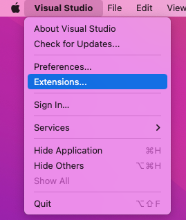
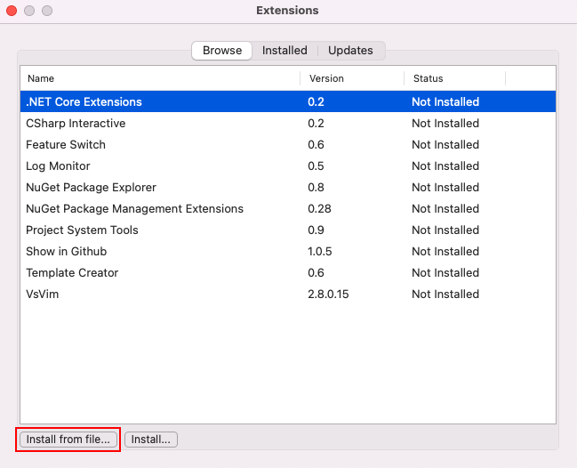
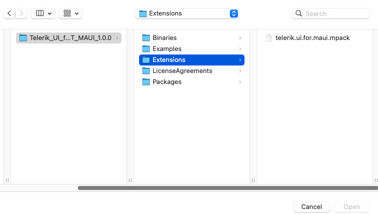
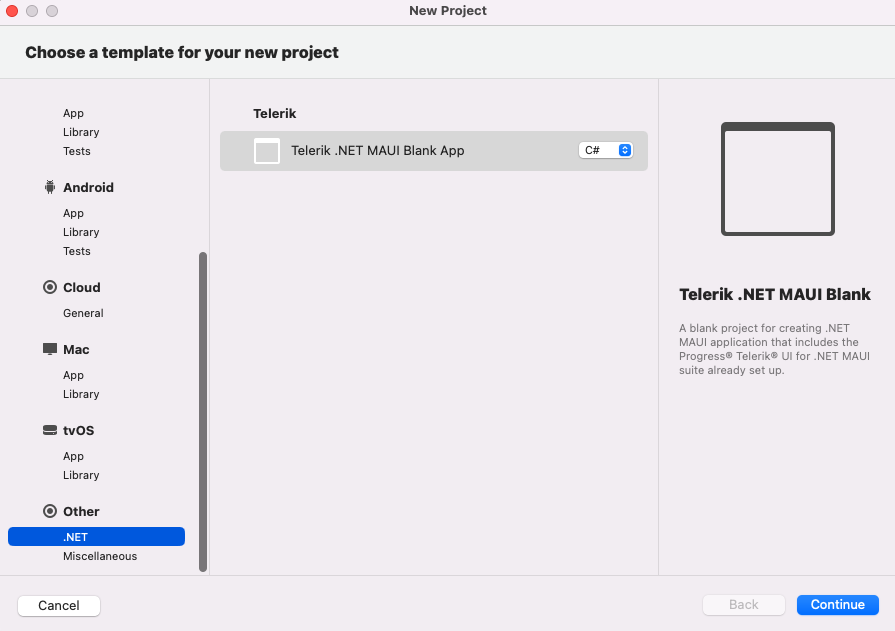
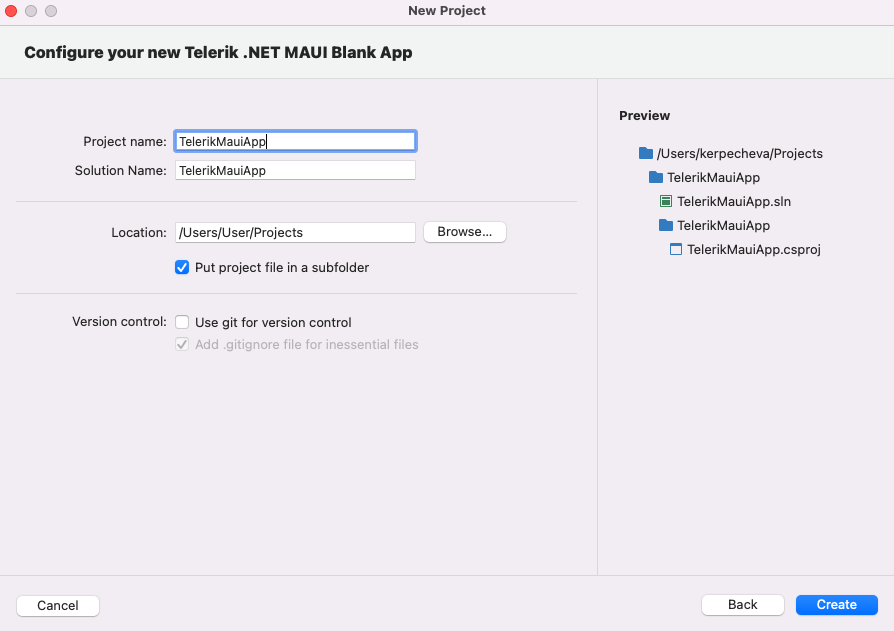

# Project Template for Visual Studio for Mac

The Telerik UI for .NET MAUI project template is a Visual Studio add-in that improves the getting started experience for Telerik customers. It provides a project template that is pre-setup with all requirements to run our components, so you can start writing .NET MAUI apps right away.

## Installation

You can access the Telerik UI for .NET MAUI Project Template in the following ways:

* If you have already installed Telerik UI for .NET MAUI, navigate to the **/[installation-path]/Telerik UI for .NET MAUI [version]/Extensions** folder - in it you'll find the **telerik.ui.for.maui.mpack** file.

* You can download the **telerik.ui.for.maui.mpack** file from your Telerik account. Go to [Download Product Files]() for exact steps on how to navigate to the download page.

Then, you have to install the project wizard add-in package. Open the Visual Studio **Extension Manager** and select the *Install form file...* option:

#### Accessing Visual Studio Extensions

Once you have accessed the **Extension Manager**, the following dialog will appear and you should look for the **Install from file** option.

#### Reaching the Extension Manager

Navigate to the **telerik.ui.for.maui.mpack** file. 

#### The ProjectTemplate location

If the add-in is successfully added to Visual Studio, you should see it in the **IDE** extensions section.

**Restart Visual Studio for Mac** to complete the installation.

## New Telerik .NET MAUI Blank App

Now you can create a new project using the Telerik Project Template.

#### Create New Project Dialog

The **telerik.ui.for.maui.mpack** template can be found in *Other > .NET* section.

#### Configure Application Dialog

Follow the steps to setup your app.

When you are done the project will contain all required packages and binaries and you can start writing your app right away.
