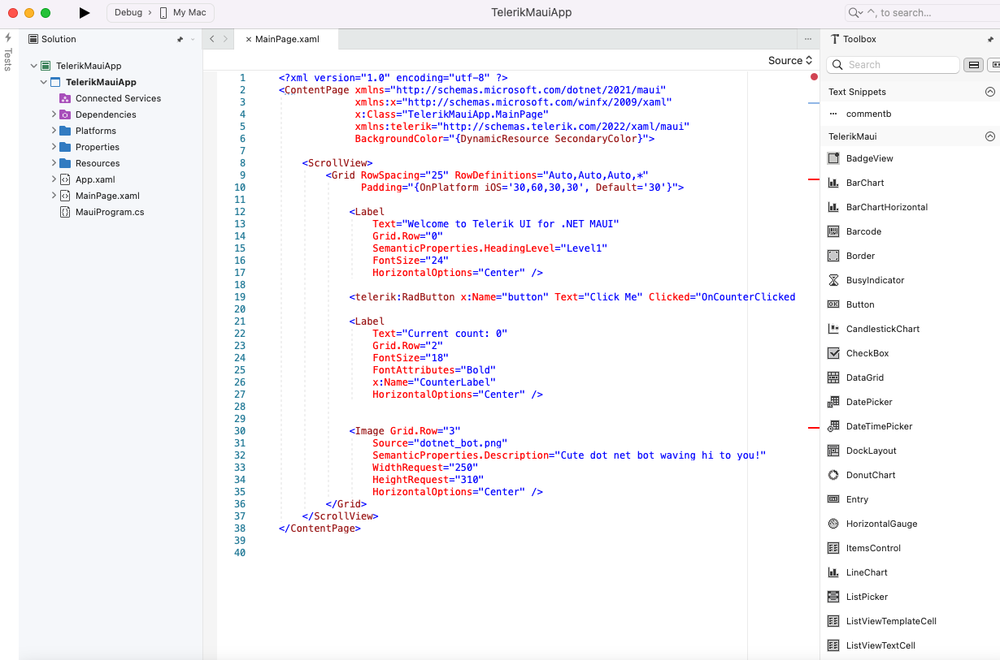
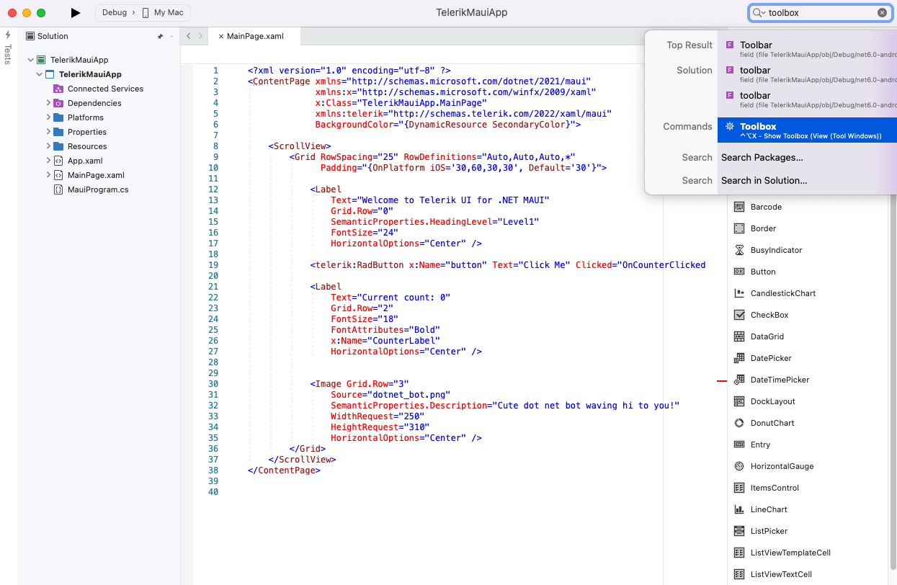
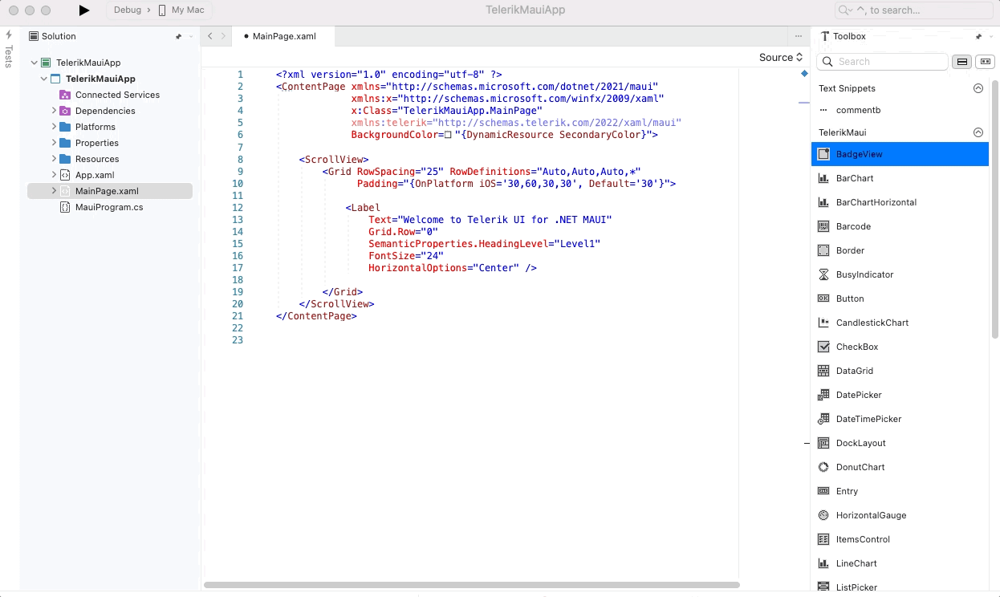

# Telerik UI for .NET MAUI Toolbox for Visual Studio for Mac

This article introduces **Telerik UI for .NET MAUI Toolbox** for Visual Studio for Mac which will ease the process of adding Telerik controls to your .NET MAUI application on Mac.

In order to use the Telerik UI for .NET MAUI Toolbox, first you have to install the [Project Template for Visual Studio for Mac]().

## Showing the Telerik Toolbox

In order to show the Toolbox and start using the controls, you should navigate to the MainPage.xaml file in your project and click on it. If the **telerik.ui.for.maui.mpack** file is installed successfully, Toolbox window is visible in the project when you click on the MainPage.xaml file (or any other XAML file inside your project). You can also find this option when typing “Toolbox” in the Search filed (top right corner in Visual Studio for Mac).

Next images show where you can find the options in Visual Studio for Mac:

#### Showing the Telerik Toolbox when clicking on MainPage.xaml

#### Showing the Telerik Toolbox from Search field

Once you have clicked the option you should be prompted to the window which contains the different controls from the suite.

>important If no usable controls are present in the toolbox - make sure all the required references are added and try rebuilding your project.

## Adding Controls to Your Project

Embedding the controls from the suite is made as easy as possible and all you need to do is simply drag one of the controls within your XAML file. This will add the control definition and will also map the needed namespace declarations. Next quick screencast shows how the action is performed.

#### Adding Telerik controls to your application

## See Also

- [Project Template for Visual Studio for Mac]()
- [Telerik NuGet packages server]()
