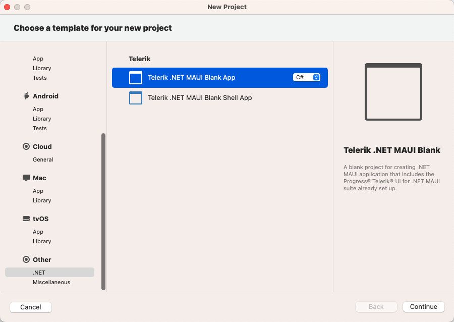
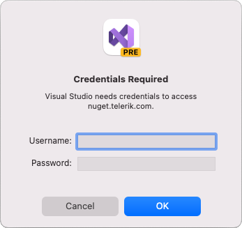
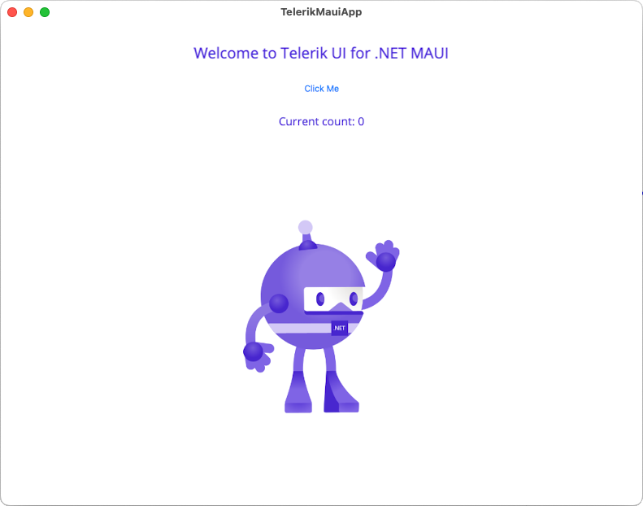

# Telerik Project Template for VS on macOS

The Telerik UI for .NET MAUI project template for Visual Studio (VS) on macOS aims to help developers when creating .NET MAUI applications with Telerik UI for .NET MAUI components.

The project template for VS on macOS is an add-in that improves the getting started experience for Telerik developers and is pre-configured with all requirements to run the Telerik UI for .NET MAUI components.

>important Telerik Visual Studio Project Template for Mac will be phased out in 2024, following the [discontinuation of Visual Studio for Mac](https://devblogs.microsoft.com/visualstudio/visual-studio-for-mac-retirement-announcement/). As a recommended replacement, consider using the [.NET MAUI Extension](https://marketplace.visualstudio.com/items?itemName=ms-dotnettools.dotnet-maui) for Visual Studio Code. For detailed guidance on getting started with the .NET MAUI Extension for Visual Studio Code, refer to our [blog post](https://www.telerik.com/blogs/beyond-basics-getting-started-net-maui-extension-visual-studio-code).

## Accessing the Project Template

1. Install the add-in by using either of the following ways:

  * If you have already installed Telerik UI for .NET MAUI, navigate to the `/[installation-path]/Telerik UI for .NET MAUI [version]/Extensions` folder. It contains the `telerik.ui.for.maui.mpack` file.

  * Download the `telerik.ui.for.maui.mpack` file from your Telerik account. For details on how to do this, go to the topic about the [available Telerik UI for .NET MAUI product files]().

1. Install the project wizard add-in package by opening the VS **Extension Manager** and selecting the **Install form file...** option:

  

  As a result, the following dialog will appear.

  

1. Select the **Install from file** option.

1. Navigate to the `telerik.ui.for.maui.mpack` file.

  

  If the add-in is successfully added to VS, you will see it in the **IDE** extensions section.

1. Complete the installation by selecting the **Restart Visual Studio for Mac** option.

## Creating New Projects

Now, you can create a new project by using the Telerik Project Template.

1. From the **New project** dialog, select:

	* The **Telerik .NET MAUI Blank App** option, creates blank application.

	* The **Telerik .NET MAUI Blank Shell App** option, creates a blank .NET MAUI Shell application. You can use this project as a .NET MAUI Shell example. In addition, you can use the features like Shell Navigation, .NET MAUI Shell flyout and .NET MAUI Shell tabs. For more details on .NET MAUI Shell review the official [Microsoft documentation](https://learn.microsoft.com/en-us/dotnet/maui/fundamentals/shell/). 

  

1. Navigate to **Other** > **.NET**, choose the `telerik.ui.for.maui.mpack` template, and follow the prompts.

  

  If you do not have the [Telerik NuGet Server]() set up in Visual Studio, a message will pop up, so you can enter your Telerik credentials. The Telerik NuGet Server will be automatically configured as a NuGet source in Visual Studio:

  

  As a result, the project will contain all required Telerik packages and you can start writing your app right away.

  The following image shows the end result after running the application.

  

## See Also

* [Available Product Files and Assemblies]()
* [System Requirements for macOS]()
* [Telerik Toolbox for .NET MAUI on macOS]()
* [Telerik UI for .NET MAUI Sample Apps]()
