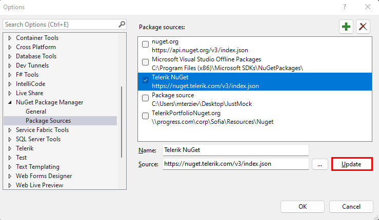
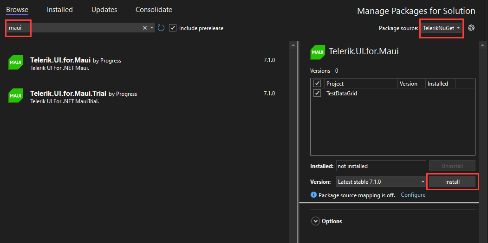

# Installing with NuGet in Visual Studio

To install the Telerik UI for .NET MAUI components, you can use NuGet packages from the public <a href="https://www.nuget.org/packages/Telerik.UI.for.Maui" target="_blank">nuget.org</a> registry (recommended) or from the authenticated Telerik NuGet server.

## Installing from NuGet.org (Recommended)

The `Telerik.UI.for.Maui` package is available on the default `nuget.org` package source in Visual Studio. No additional configuration or authentication is required:

1. Open or create a .NET MAUI project in Visual Studio.
1. Right-click the solution in the **Solution Explorer** and select **Manage NuGet Packages for Solution...**.
1. Make sure the **Package source** is set to `nuget.org`.
1. Click the **Browse** tab, search for `Telerik.UI.for.Maui`, and select it.
1. Choose the target project, select the desired version, and click **Install**.

## Installing from the Telerik NuGet Server

The Telerik NuGet server is a private authenticated feed that you can use as an alternative to nuget.org. This online source lets you download and install various versions of the .NET MAUI controls and enables quick updates with minimal manual intervention.

Before adding the Telerik NuGet server to Visual Studio, make sure you have:

1. .NET MAUI installed on the machine. For more information on the required steps and system requirements, refer to the <a href="https://docs.microsoft.com/en-us/dotnet/maui/get-started/installation" target="_blank">Microsoft .NET MAUI installation guide</a>.
2. A commercial or trial license for Telerik .NET MAUI. Note that the Telerik NuGet server requires authentication and checks if you have a valid license.

### Step 1: Generate an API Key

@[template](/_contentTemplates/common/nuget.md#generate-nuget-key)

### Step 2: Add the Telerik NuGet Package Source to Visual Studio

To configure the Telerik NuGet feed in Visual Studio:

1. Open Visual Studio.
1. Go to **Tools > NuGet Package Manager > Package Manager Settings**.
1. Select **Package Sources**, and then click the + button.
1. In the **Source** field, enter `https://nuget.telerik.com/v3/index.json`. If you use a locally available NuGet package downloaded from <a href="https://www.telerik.com/account/" target="_blank">your Telerik account</a>, add the path to the local package instead of the URL.
1. Click **Update** and then **OK**.

  

You have successfully added the Telerik NuGet feed as a Package source.

### Reset Store Credentials

If you previously stored credentials for the Telerik NuGet server, you need to reset them to be able to authenticate with your new API key. Here are the steps you need to follow:

@[template](/_contentTemplates/common/nuget.md#reset-store-credentials)

### Step 3: Install the Telerik UI for .NET MAUI NuGet Package

The next steps describe how to authenticate your local NuGet instance and display the available packages:

1. Create a new .NET MAUI project or open an existing project.
1. Right-click the solution in the **Solution Explorer** window.
1. Select **Manage NuGet Packages for Solution...**.
1. Select the Telerik NuGet **Package source** from the drop-down list.
1. Click the **Browse** tab to see the available packages.
1. In the authentication window, enter `api-key` in the **User name** field and the [generated API key](#step-1-generate-an-api-key) in the **Password** field.

   

1. In the Visual Studio Package Manager, you will see all packages that are licensed to your user account.
1. Search for the `Telerik.UI.for.Maui` package and select it.
1. Choose the projects which require the package.
1. Select the desired version and click **Install**.



### Step 4: Register the Required Handlers

To visualize the [Telerik UI for .NET MAUI](https://www.telerik.com/maui-ui) controls, you have to register the required handlers by calling the `Telerik.Maui.Controls.Compatibility.UseTelerik` extension method inside the `Configure` method of the `MauiProgram.cs` file of your project.

1. Add the needed `using` settings inside the `MauiProgram.cs` file.

 ```C#
using Telerik.Maui.Controls.Compatibility;
 ```

1. Call the `UseTelerik()` method inside the `MauiProgram.cs` file.

 ```C#
public static class MauiProgram
{
	public static MauiApp CreateMauiApp()
	{
		var builder = MauiApp.CreateBuilder();
		builder
			.UseTelerik()
			.UseMauiApp<App>()
			.ConfigureFonts(fonts =>
			{
				fonts.AddFont("OpenSans-Regular.ttf", "OpenSansRegular");
			});

		return builder.Build();
	}
}
 ```

## See Also

* [Troubleshooting Common NuGet Setup Issues]()
* [Productivity Extensions for Visual Studio]()
* [Telerik Toolbox for .NET MAUI on Windows]()
