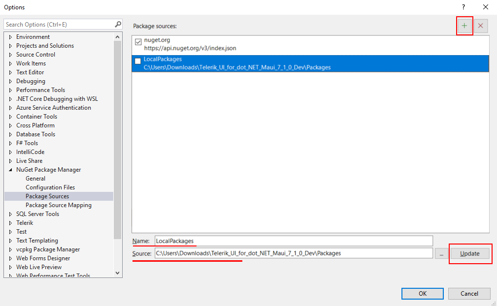

# Installing from a Local NuGet Source

In some cases, you may want to place your Telerik UI for .NET MAUI NuGet packages in your local system storage or on a private server. This lets you control the installable versions in your development environment and also enables you to install the Telerik UI for .NET MAUI NuGet packages without internet access.

To get the NuGet package with the Telerik UI for .NET MAUI controls:

1. Go to your Telerik account and visit the [MAUI downloads](https://www.telerik.com/account/downloads/product-download?product=MAUI).

1. Download the `Telerik.UI.for.Maui.[version].nupkg` file.

>To download the NuGet package with the Telerik UI for .NET MAUI controls, you need an active trial or commercial license.

To set up a local NuGet source, you can use either of the following methods:
* [The NuGet packet manager in Visual Studio](#setting-up-a-local-nuget-source-in-visual-studio).
* [The `nuget.config` file](#setting-up-the-nuget-source-in-nugetconfig).

## Setting Up a Local NuGet Source in Visual Studio

To configure a local NuGet source in Visual Studio:

1. Open Visual Studio.
1. Go to **Tools > NuGet Package Manager > Package Manager Settings**
1. Select **Package Sources**, and then click the + button.
1. In the **Source** field, add the path to the downloaded NuGet package or the URL for your private server.
1. Click **Update** and then **OK**.

  

## Setting Up the NuGet Source in Nuget.Config

An alternative way to configure your system to use locally available NuGet files is to directly edit the `nuget.config` file:

1. Go to the `NuGet.Config` file:

  * On Windows, open the `%AppData%\NuGet\NuGet.Config` file.
  * On Mac, open either the  `~/.config/NuGet/NuGet.Config` or `~/.nuget/NuGet/NuGet.Config` file (varies by tooling).

    If the file doesn't exist on your machine, create it by running the `dotnet new nugetconfig` command in the terminal. For more information about the command, see <a href="https://learn.microsoft.com/en-us/dotnet/core/tools/dotnet-new" target="blank">Microsoft's docs</a>.

2. Add the path or URL to the NuGet file containing the Telerik UI for .NET MAUI library. Here is an example of how your config file can look like:

```xml
<?xml version="1.0" encoding="utf-8"?>
<configuration>
    <packageSources>
    <!--To inherit the global NuGet package sources remove the <clear/> line below -->
    <clear />
    <add key="nuget" value="https://api.nuget.org/v3/index.json" />
    <add key="telerik" value="add the path to the local package" />
    </packageSources>
</configuration>
```

The local NuGet package does not require you to configure the authentication in the `NuGet.Config` files as it has already been downloaded from your Telerik account.

For more details about the `NuGet.Config` file, see the following resources:
* <a href="https://learn.microsoft.com/en-us/nuget/reference/nuget-config-file#packagesources" target="_blank">Configuring the NuGet package sources</a>
* <a href="https://learn.microsoft.com/en-us/nuget/consume-packages/configuring-nuget-behavior#creating-a-new-config-file" target="_blank">Creating a new NuGet config file</a>