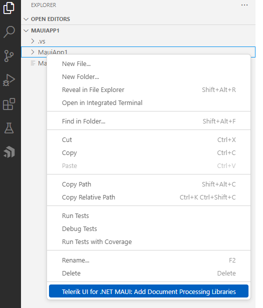
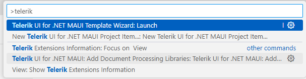
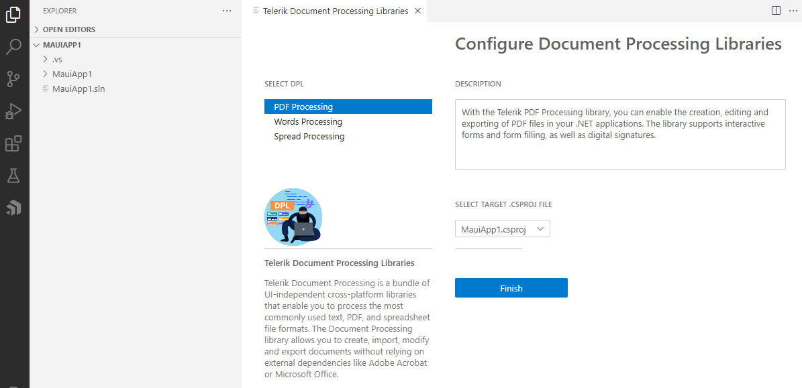

# Document Processing Libraries

This article demonstrates how to add the Telerik Document Processing Libraries to a new .NET MAUI project or to an existing one.

## Get the Extension

To add the Telerik Document Processing Libraries you have to install the `Telerik UI for .NET MAUI Productivity Tools` extension. You can get the extension from:

@[template](/_contentTemplates/common/extension.md#vscode-extension-downloads)

## Start the Wizard

You can start the Telerik UI for .NET MAUI Document Processing Libraries Wizard in either of the following ways:

* Open the **File Explorer Context Menu**.

    1. In the Explorer, right-click a file.
    1. Select **Telerik UI for Maui: Add Document Processing Libraries**.

    

* Use the **Code Editor Command Palette**.

    1. To open the Command Palette menu, use:
        - `Ctrl+Shift+P` on Windows/Linux
        - `Cmd+Shift+P` on Mac.

    1.Select **Telerik UI for Maui: Add Document Processing Libraries**.

    

## Configure the Project

The wizard allows you to choose which library to add to the project. If the library has any dependencies, they are added automatically.

## See Also

* [Creating New Projects with Visual Studio Code]()
* [Snippets]()
* [Scaffolding Pages]()