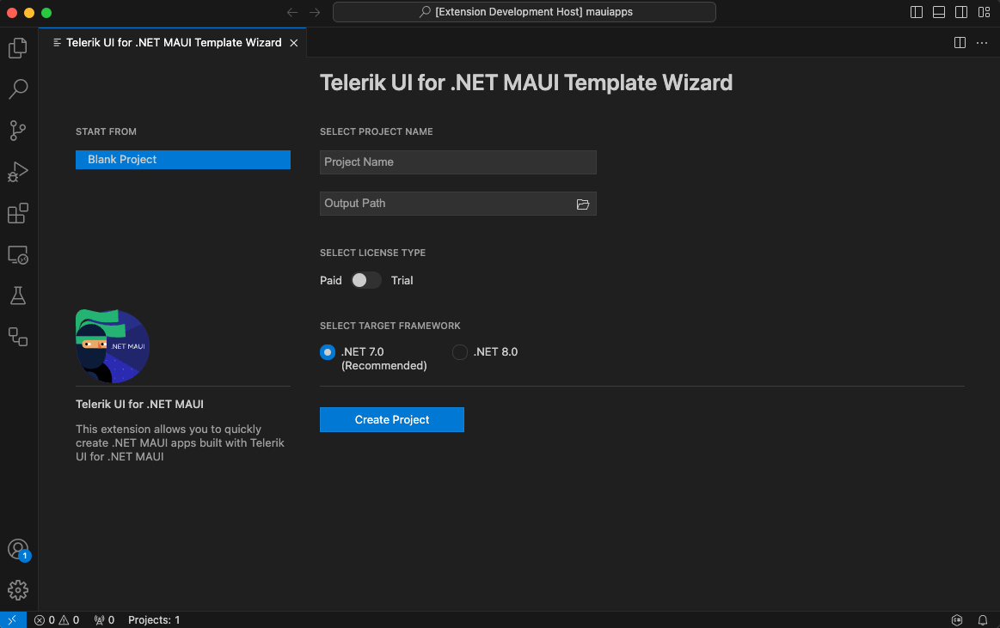

# Create New Projects

This article demonstrates how to use the Telerik Extension for Visual Studio Code to create a new project that is pre-configured for the Progress&reg; Telerik&reg; UI for .NET MAUI components.

## Get the Extension

To use the **Telerik UI for .NET MAUI Template Wizard**, install the Telerik UI for .NET MAUI Visual Studio Code Extension. You can get the extension from:

 - The Visual Studio Marketplace.

 - The Extensions tab in Visual Studio Code - search for Telerik UI for .NET MAUI Productivity Tools, select the extension, and then click Install.

## Start the Wizard

You can create a Telerik .NET MAUI project by accessing the project template feature from the Visual Studio Code Extensions menu. To open the menu, use:

 - `Ctrl+Shift+P` in Windows/Linux 
 - `Cmd+Shift+P` on Mac. 

Next in the menu, look for and select **Telerik UI for .NET MAUI Template Wizard: Launch** and press Enter. 

## Configure the Project

The Create New Project wizard provides two options to start you project:

 -  Blank Project - allows you to create a blank project that is pre-configured for the Progress® Telerik® UI for .NET MAUI components.

 The wizard allows you to configure the following options:

  - Project name
  - Location of the created project
  - Your Telerik license (trial or commercial)
  - The .NET version you want to use