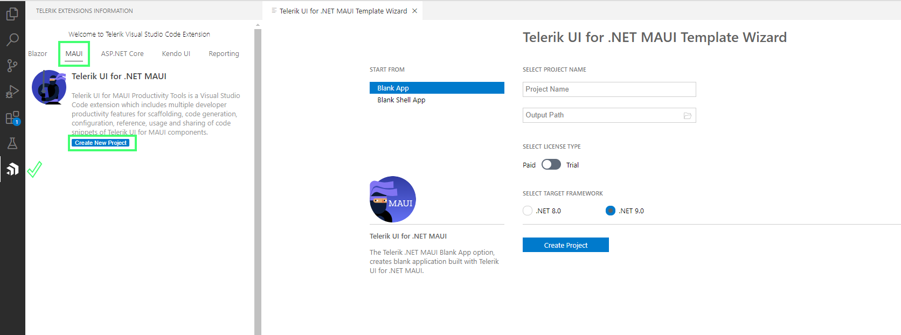
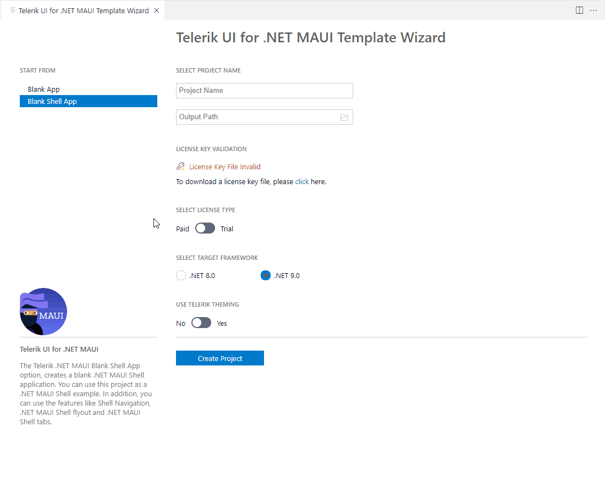

# Create New Projects

This article demonstrates how to use the Telerik Extension for Visual Studio Code to create a new project that is pre-configured for the Progress&reg; Telerik&reg; UI for .NET MAUI components.

## Get the Extension

To use the **Telerik UI for .NET MAUI Template Wizard**, install the `Telerik UI for .NET MAUI Productivity Tools` extension. You can get the extension from:

* <a href="https://marketplace.visualstudio.com/items?itemName=TelerikInc.telerik-maui-productivity-tools" target="_blank">The Visual Studio Code Marketplace.</a>

* The **Extensions** tab in Visual Studio Code&mdash;search for `Telerik UI for .NET MAUI Productivity Tools`, select the extension, and then click **Install**.

## Start the Wizard

You can start the Telerik UI for .NET MAUI Template Wizard in either of the following ways:

* Click the **Telerik Extensions Information** icon in the Visual Studio Code activity bar.

    1. Click on the **Telerik Extensions Information** icon
    1. Select **MAUI** tab
    1. Click **Create New Project**.
    1. The **Telerik UI for .NET MAUI Template Wizard** opens
    1. Using the Template Wizard you can create a new **Blank App** or **Blank Shell App**.

    

* From the Visual Studio Code Extensions menu

    1. To open the menu, use:
        - `Ctrl+Shift+P` on Windows/Linux
        - `Cmd+Shift+P` on Mac.

    1. Select **Telerik UI for .NET MAUI Template Wizard: Launch** from the menu and press **Enter**. 
    1. The **Telerik UI for .NET MAUI Template Wizard** opens
    1. Using the Template Wizard you can create a new **Blank App** or **Blank Shell App**.

    

## Select a Project

The Create New Project wizard provides two options to start you project:

 -  Blank App&mdash;Allows you to create a blank project that is pre-configured for the Progress® Telerik® UI for .NET MAUI components.
 -  Blank Shell App&mdash;Allows you to create a blank shell project that is pre-configured for the Progress® Telerik® UI for .NET MAUI components.

## Add a Theme to the Project

You can add a [theme]() to the project by enabling the **USE TELERIK THEMING** option from the Wizard. 

Choose between two themes&mdash;the `Platform` and the `Telerik`, and the available swatches for each.

## Configure the Project

The wizard allows you to configure the following options:

  - Project name
  - Location of the created project (Output Path)
  - License key file&mdash;the Telerik Visual Studio Code extension notifies you about a missing or outdated [license key](), and lets you install or update it.
  - Your Telerik license (trial or commercial)
  - The .NET version you want to use