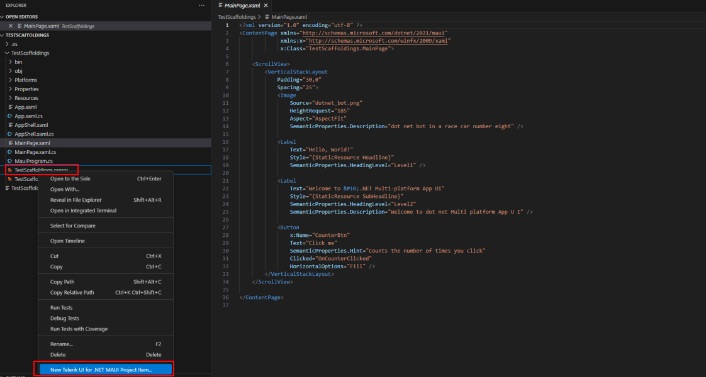
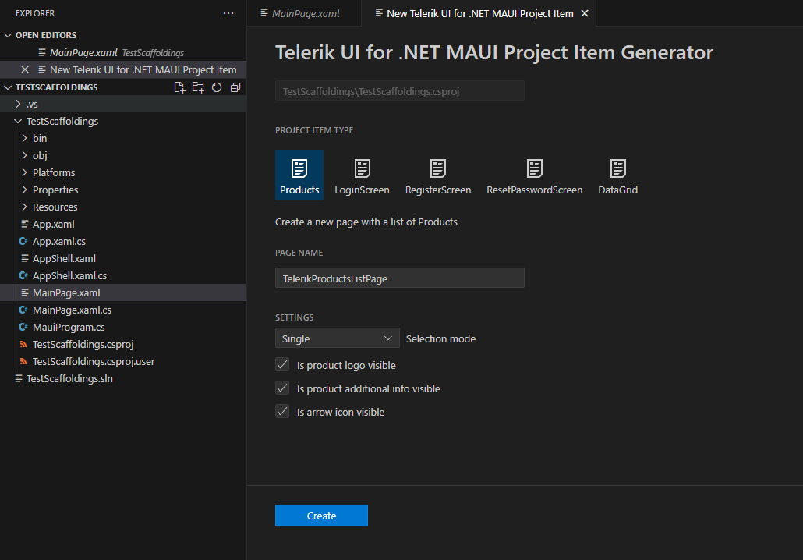
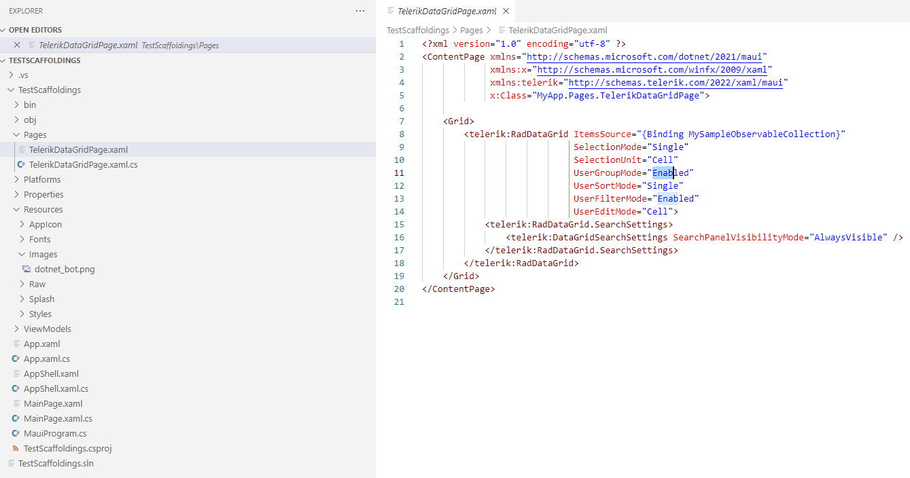

# .NET MAUI Scaffoldings for Visual Studio Code

The Telerik UI for .NET MAUI Visual Studio Code extension provides scaffoldings for increased developer productivity. The scaffoldings allow you to quickly add predefined pages with controls to your application and define the parameters of the controls through an UI.

## Get the Extension

To use the Telerik UI for .NET MAUI Scaffoldings, install the `Telerik UI for .NET MAUI Productivity Tools` extension for Visual Studio Code. You can get the extension from:

* <a href="https://marketplace.visualstudio.com/items?itemName=TelerikInc.telerik-maui-productivity-tools" target="_blank">The Visual Studio Marketplace.</a>

* The **Extensions** tab in Visual Studio Code&mdash;search for `Telerik UI for .NET MAUI Productivity Tools`, select the extension, and then click **Install**.

## Add The Scaffolding Page to Your App

To add the desired screen to your MAUI application:

1. Open the project in Visual Studio Code.
1. Right-click the name of the `.csproj` file.

1. From the popup menu, select **New Telerik UI for .NET MAUI Project Item Generator**.


1. From the UI form, select the desired page and set the available parameters.


As a result, the VS code extension does the following:
* Adds the page to the `Pages` folder of the application. If the folder does not exist, it will be created. 
* Adds a `ViewModel` for the created page to the `ViewModels` folder. If the folder does not exist, it will be created.

The next image shows the file structure created for the `Products` screen:


## Displaying a Scaffolded Screen in Your App

To show a newly scaffolded page in your MAUI app, specify the page's namespace.

In the example below, the screen is set directly to the `ShellContent` in the `AppShell.xaml`:

```XAML
<Shell
    x:Class="TestScaffoldings.AppShell"
    xmlns="http://schemas.microsoft.com/dotnet/2021/maui"
    xmlns:x="http://schemas.microsoft.com/winfx/2009/xaml"
    xmlns:local="clr-namespace:TestScaffoldings"
    xmlns:pages="clr-namespace:MyApp.Pages"
    Shell.FlyoutBehavior="Disabled"
    Title="TestScaffoldings">

    <ShellContent
        Title="Home"
        ContentTemplate="{DataTemplate pages:TelerikProductsListPage}"
        Route="MainPage" />

</Shell>
```

## Available Scaffoldings

* Products page&mdash;Uses the Telerik UI for .NET MAUI [CollectionView]() control.
* DataGrid page&mdash;Uses the Telerik UI for .NET MAUI [DataGrid]() control.
* Login page&mdash;Uses the Telerik UI for .NET MAUI [Entry]() and [TemplatedButton]() controls.
* Register page&mdash;Uses the Telerik UI for .NET MAUI [Entry]() and [TemplatedButton]() controls.
* Reset password page&mdash;Uses the Telerik UI for .NET MAUI [Entry]() and [TemplatedButton]() controls.