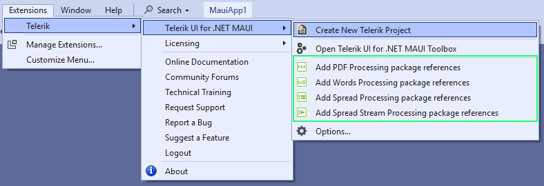
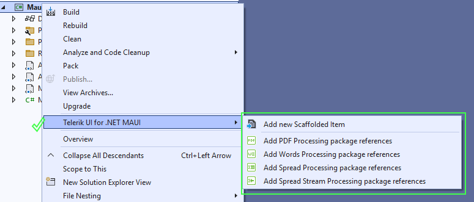
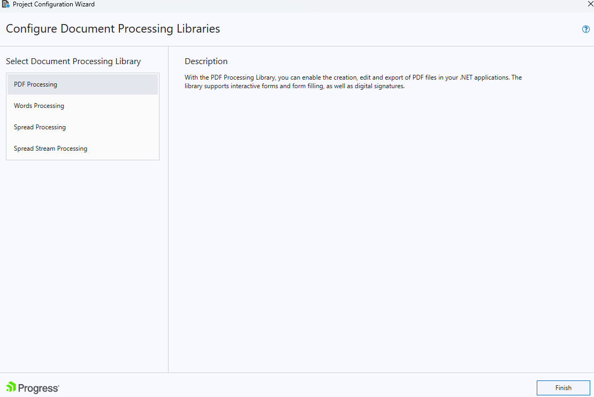

# Document Processing Libraries

This article demonstrates how to add the Telerik Document Processing Libraries to a new .NET MAUI project or to an existing one.

To add the Telerik Document Processing Libraries, you will use the [Add Processing package reference wizard](#get-the-wizard), which is a feature of the Telerik extensions.

@[template](/_contentTemplates/common/extension.md#vs-extension-download)

### Extensions Menu

1. Open the **Extensions** menu in Visual Studio.
1. Select **Telerik** > **Telerik UI for .NET MAUI** > **Add Processing package reference**.

    

### Project Menu

1. Right-click on the project.
1. Select **Telerik UI for .NET MAUI** option.

    

## Configure the Project

The wizard allows you to choose which library to add to the project. If the library has any dependencies, they are added automatically.

## See Also

* [Toolbox Extension for Visual Studio]()
* [Scaffolding Pages and Screens in Visual Studio]()
