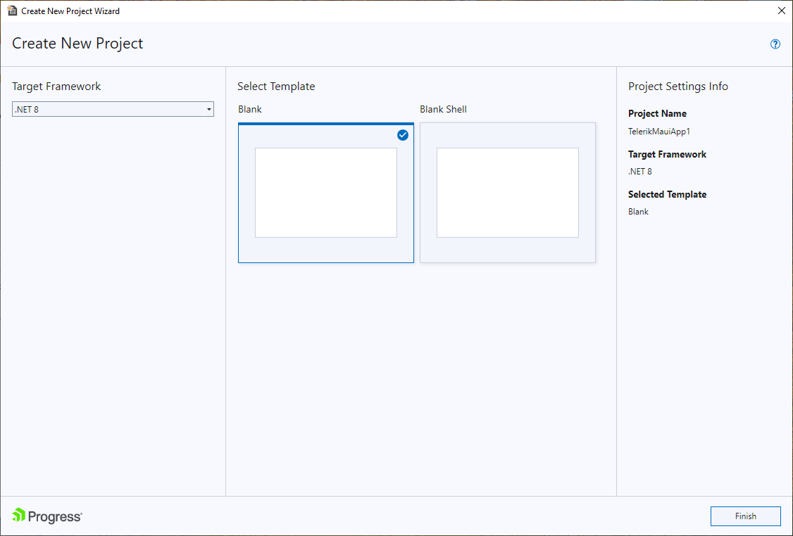
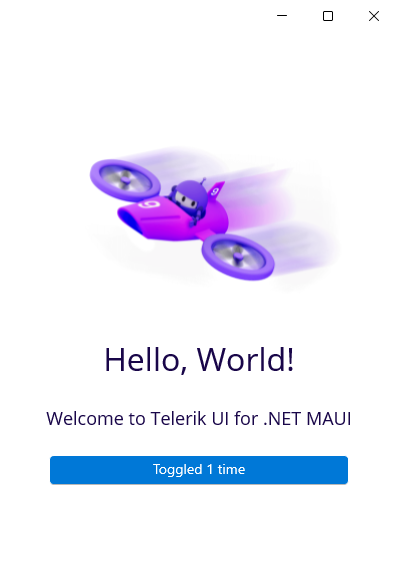

# Creating New Projects

This article demonstrates how to use the Telerik Visual Studio extensions to create a new project that is pre-configured for the Progress&reg; Telerik&reg; UI for .NET MAUI components.

## Get the Wizard

To use the **Telerik UI for .NET MAUI Create New Project** wizard, install the Telerik UI for .NET MAUI Visual Studio Extension. You can get the extension from:

* <a href="https://marketplace.visualstudio.com/items?itemName=TelerikInc.ProgressTelerikMAUIExtensions" target="_blank">The Visual Studio Marketplace.</a>

* The Extensions tab in Visual Studio&mdash;search for `Progress Telerik UI for .NET MAUI Extension`, select the extension, and then click **Install**.

* [The Telerik UI for .NET MAUI automated installer]()

## Start the Wizard

To start the wizard, use either the [Extensions](#extensions-menu) or the [Project](#project-menu) menu.

### Extensions Menu

1. Open the **Extensions** menu in Visual Studio.
1. Select **Telerik** > **Telerik UI for .NET MAUI** > **Create New Project**.

    

### Project Menu

1. Open Visual Studio and choose the **Create a new project** option.
1. Search for **telerik maui**:

    

1. Select one of the supported project templates:

     * **Telerik .NET MAUI App - Configurable Wizard**&mdash;Represents a configurable wizard, which contains various predefined application templates that include the Telerik .NET MAUI suite setup. 
     * **Telerik .NET MAUI Blank App**&mdash;Represents a blank project for creating a .NET MAUI application that includes the Telerik .NET MAUI suite setup.
     * **Telerik .NET MAUI Blank Shell App**&mdash;Creates a blank .NET MAUI Shell application. You can use this project as a .NET MAUI Shell example. In addition, you can use features like Shell Navigation, .NET MAUI Shell flyout, and .NET MAUI Shell tabs. For more details on .NET MAUI Shell, review the official [Microsoft documentation](https://learn.microsoft.com/en-us/dotnet/maui/fundamentals/shell/). 

## Configure the Project

1. The next step lets you configure your **Telerik UI for .NET MAUI** project by setting your project name and its location.

    

1. (Optional) When using the **Telerik .NET MAUI App - Configurable Wizard** project template, an additional screen for choosing the predefined application template loads:

    

    * The **Telerik .NET MAUI Blank App** option creates blank application.

    * The **Telerik .NET MAUI Blank Shell App** option creates a blank .NET MAUI Shell application.

Finally, Visual Studio opens the solution, which is pre-configured to use the Telerik UI for .NET MAUI controls and has the `Telerik.UI.for.Maui` NuGet package installed.

If this is the first time Visual Studio connects to the [Telerik NuGet Server](), you will see a request to enter your Telerik credentials. Then, the Telerik NuGet Server will be automatically configured as a NuGet source in Visual Studio:

  

The following image shows the end result after running the application.

## See Also

* [Toolbox Extension for Visual Studio]()
* [Scaffolding Pages and Screens in Visual Studio]()
