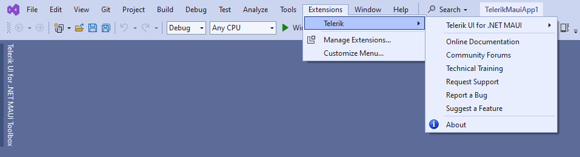

# Visual Studio Integration Overview

Use the Telerik UI for .NET MAUI Visual Studio extensions to speed up common development tasks in Visual Studio. The extensions help you create Telerik-ready projects, add controls from the Toolbox, scaffold pages and screens, add Document Processing libraries, and manage Telerik licensing prompts inside the IDE.

This overview explains what the extensions include, how to install them, and where to find them after installation.

The Telerik UI for .NET MAUI Visual Studio extensions support the following tasks:

- [Project creation]() lets you create a **Telerik .NET MAUI Blank App** or **Telerik .NET MAUI Blank Shell App** that is already configured for Telerik UI for .NET MAUI.
- [Toolbox support]() lets you add Telerik controls to your .NET MAUI application from the Visual Studio Toolbox.
- [Scaffolding pages and screens]() lets you generate predefined pages and configure control parameters through a UI.
- [Document Processing library integration]() adds the required package references through a wizard.
- [License notifications]() alert you when the Telerik license key is missing or outdated and guide you through updating it.

If you are new to the Visual Studio integration, start with project creation, then verify Toolbox support, try scaffolding, and confirm that your Telerik license key is installed and up to date.

The Telerik UI for .NET MAUI VS extensions support Visual Studio 2022.

## Install the Visual Studio Extensions

Use one of the following installation options:

1. Install the Telerik UI for .NET MAUI Visual Studio extension from the [Visual Studio Marketplace](https://marketplace.visualstudio.com/items?itemName=TelerikInc.ProgressTelerikMAUIExtensions).
2. Install from Visual Studio:

	- Open the **Extensions** tab in Visual Studio.
	- Search for `Progress Telerik UI for .NET MAUI Extension`.
	- Select the extension and click **Install**.

3. Install through the [Telerik UI for .NET MAUI automated installer]().

## Extensions Location in Visual Studio

After installation, open the Telerik UI for .NET MAUI extension menu in Visual Studio:

**Extensions** > **Telerik** > **Telerik UI for .NET MAUI**

From this menu, you can access the Telerik project templates, Toolbox-related features, scaffoldings, and additional integration points.

## See Also

- [Create .NET MAUI Projects with Visual Studio]()
- [Add Telerik Controls with the Visual Studio Toolbox]()
- [Scaffold .NET MAUI Pages and Screens in Visual Studio]()
