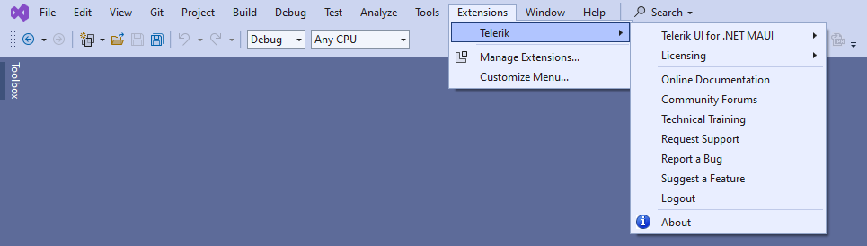

# Visual Studio Integration Overview

To integrate with Visual Studio (VS), Telerik UI for .NET MAUI provides VS extensions. These extensions enhance the experience in developing .NET MAUI applications with Telerik UI for .NET MAUI.

The extensions handle the following major points in the development with Telerik UI for .NET MAUI:

* [Project creation]()&mdash;Through the **Telerik .NET MAUI Blank App** and **Telerik .NET MAUI Blank Shell App** project templates, you can quickly create an application that is pre-configured to use Telerik UI for .NET MAUI.
* [Toolbox support]()&mdash;The Telerik UI for .NET MAUI Toolbox extension facilitates the adding of Telerik controls to your .NET MAUI application.
* [Scaffolding Pages and Screens]()&mdash;The scaffoldings allow you to quickly add predefined pages with controls to your application and define the parameters of the controls through an UI.
* Notifies you about a missing or outdated [license key](), and lets you install or update it.

The Telerik UI for .NET MAUI VS extensions support Visual Studio 2022.

You can get the extension from:

* <a href="https://marketplace.visualstudio.com/items?itemName=TelerikInc.ProgressTelerikMAUIExtensions" target="_blank">The Visual Studio Marketplace.</a>

* The Extensions tab in Visual Studio&mdash;search for `Progress Telerik UI for .NET MAUI Extension`, select the extension, and then click **Install**.

* [The Telerik UI for .NET MAUI automated installer]()

To access the VS extensions, go to the **Extensions** > **Telerik** > **Telerik UI for .NET MAUI** menu.

## See Also

* [Creating New Projects with Visual Studio]()
* [Toolbox Extension]()
