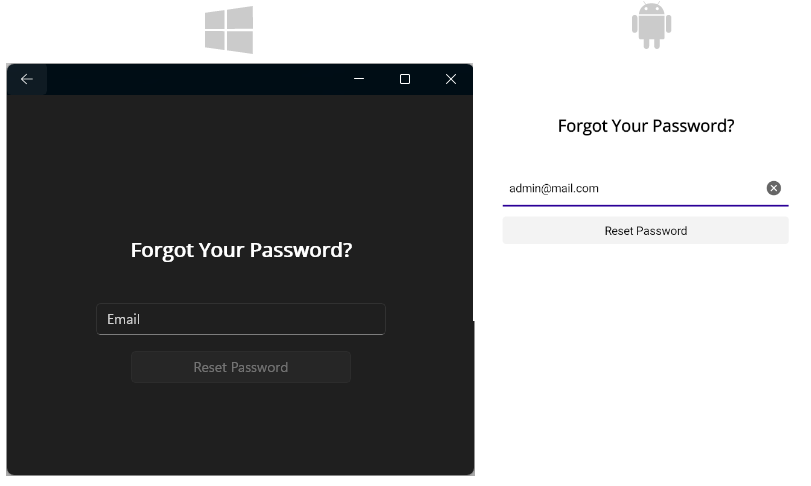

# .NET MAUI Scaffolding Pages and Screens for Visual Studio

The Telerik UI for .NET MAUI Visual Studio extension lets you scaffold an app page (screen) and increase your productivity. The scaffoldings allow you to quickly add predefined pages with controls to your application and define the parameters of the controls through an UI.

## Get the Extension

To use the Telerik UI for .NET MAUI Scaffoldings, install the `Progress Telerik UI for .NET MAUI Extension` extension for Visual Studio. You can get the extension from:

* <a href="https://marketplace.visualstudio.com/items?itemName=TelerikInc.ProgressTelerikMAUIExtensions" target="_blank">The Visual Studio Marketplace.</a>

* The Extensions tab in Visual Studio&mdash;search for `Progress Telerik UI for .NET MAUI Extension`, select the extension, and then click **Install**.

* The Telerik UI for .NET MAUI [MSI installer](). For more information, go to the [Getting Started with the Telerik VS extensions]() topic.

## Add The Scaffolding Page to Your App

To add the desired screen to your MAUI application:

1. Open the project in Visual Studio.
1. Right-click the name of the project.
1. From the popup menu select **Telerik UI for .NET MAUI** -> **Add new Scaffolded Item**.


1. From the UI form, select the desired page and set the available parameters.


As a result, the VS code extension does the following:
* Adds the page to the `Pages` folder of the application. If the folder does not exist, it will be created. 
* Adds a `ViewModel` for the created page to the `ViewModels` folder. If the folder does not exist, it will be created.

The next image shows the file structure created for the `DataGrid` page:


## Displaying a Scaffolded Screen in Your App

To show a newly scaffolded page in your MAUI app, specify the page's namespace.

In the example below, the screen is set directly to the `ShellContent` in the `AppShell.xaml`:

```XAML
<Shell
    x:Class="TestScaffoldings.AppShell"
    xmlns="http://schemas.microsoft.com/dotnet/2021/maui"
    xmlns:x="http://schemas.microsoft.com/winfx/2009/xaml"
    xmlns:local="clr-namespace:TestScaffoldings"
    xmlns:pages="clr-namespace:MyApp.Pages"
    Shell.FlyoutBehavior="Disabled"
    Title="TestScaffoldings">

    <ShellContent
        Title="Home"
        ContentTemplate="{DataTemplate pages:TelerikDataGridPage}"
        Route="MainPage" />

</Shell>
```

This is the result on Android and WinUI:


## Available Scaffoldings

* [Products page](#products-page)
* [DataGrid page](#datagrid-page)
* [Login screen](#login-screen)
* [Register screen](#register-screen)
* [Reset password screen](#reset-password-screen)

### Products Page

The Products page represents a list of products. The main control used on this page is the Telerik UI for .NET MAUI [CollectionView]() control. The scaffolding page allows you to configure the selection mode of the CollectionView and whether to add the predefined icons used in the template.

The image shows the default appearance of the page:


### DataGrid Page

The DataGrid page represents a data displayed in a table. The main control used on this page is the Telerik UI for .NET MAUI [DataGrid]() control. The scaffolding page allows you to configure the data source used in the DataGrid, the selection mode, whether editing, sorting, filtering and grouping the data in the control will be enabled.

The image shows the default appearance of the page:


### Login Screen

The Login screen represents a login panel. The main controls used on this screen are the Telerik UI for .NET MAUI [Entry]() and [TemplatedButton]() controls. The scaffolding page allows you to add a social login panel to this screen.

The image shows the default appearance of the page:


### Register Screen

This screen allows you to add a register page to your .NET MAUI application. The main controls used on this screen are the Telerik UI for .NET MAUI [Entry]() and [TemplatedButton]() controls.

The image shows the default appearance of the page:


### Reset Password Screen

This screen allows you to add a reset password page to your application. The main controls used on this screen are the Telerik UI for .NET MAUI [Entry]() and [TemplatedButton]() controls.

The image shows the default appearance of the page:



## See Also

* [Available Product Files and Assemblies]()
* [System Requirements for Windows]()
* [Telerik Extensions and Project Templates for VS on Windows]()
* [Telerik UI for .NET MAUI Sample Apps]()