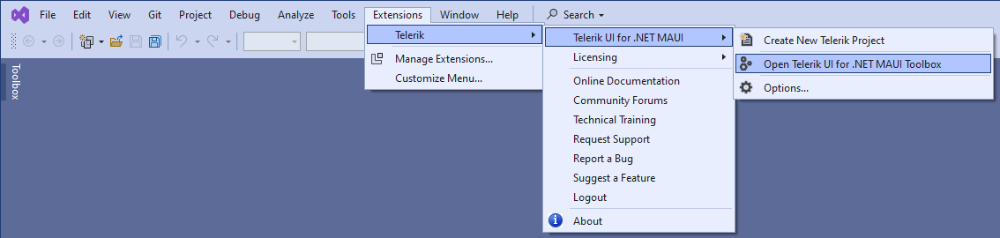
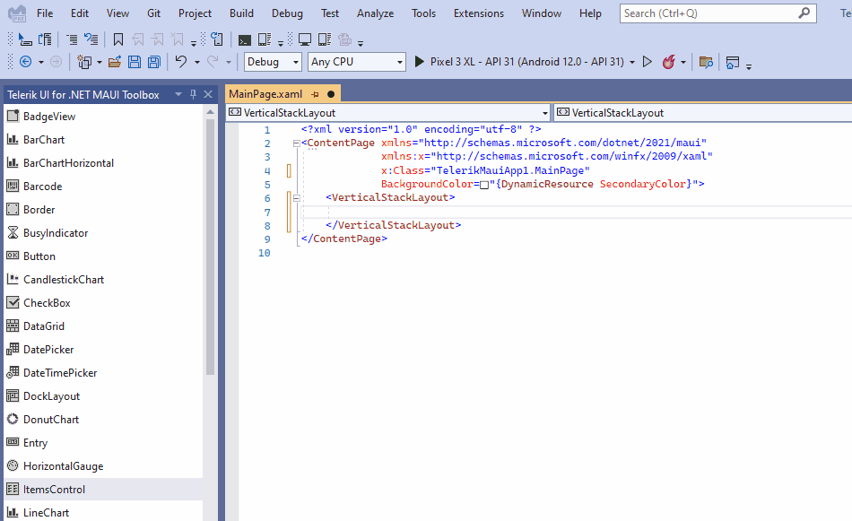

# Telerik Toolbox for .NET MAUI on Windows

The Toolbox is part of the Visual Studio extensions for Telerik UI for .NET MAUI and facilitates the process of adding Telerik controls to your .NET MAUI application.

## Get the Extension

To use the Toolbox, install the Telerik UI for .NET MAUI Visual Studio Extension. You can get the extension from:

* <a href="https://marketplace.visualstudio.com/items?itemName=TelerikInc.ProgressTelerikMAUIExtensions" target="_blank">The Visual Studio Marketplace.</a>

* The Extensions tab in Visual Studio&mdash;search for `Progress Telerik UI for .NET MAUI Extension`, select the extension, and then click **Install**.

* [The Telerik UI for .NET MAUI automated installer]()

## Adding Controls with the Toolbox

To add the desired Telerik UI for .NET MAUI controls with the Toolbox:

1. In Visual Studio, navigate to the **Extensions** tab.

1. Select **Telerik** > **Telerik UI for .NET MAUI** > **Open Telerik UI for .NET MAUI Toolbox**.

  Alternatively, in the top right corner in Visual Studio for Windows, find the **Quick Launch** search field and type **Telerik UI for .NET MAUI Toolbox**.

  

1. Open the Toolbox. As a result, a window with the controls from the suite will appear.

  >important If the controls you see in the Toolbox are not the ones you need, make sure that you've added all the required references. Then, rebuild your project.

1. To embed the controls, drag one of them within your XAML file. As a result, the control definition will be added to your project and the needed namespace declarations will be mapped.

  

## See Also

* [UI for MAUI Installation Methods]()
* [System Requirements for Windows]()
* [Productivity Extensions for Visual Studio]()
* [Telerik UI for .NET MAUI Sample Apps]()
