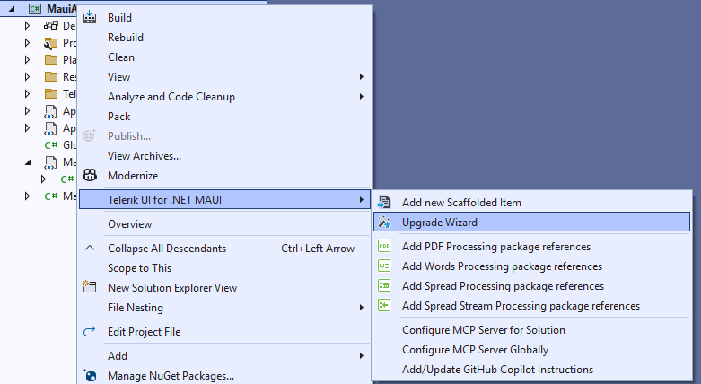
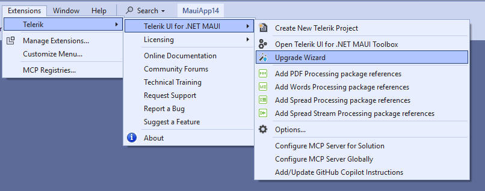
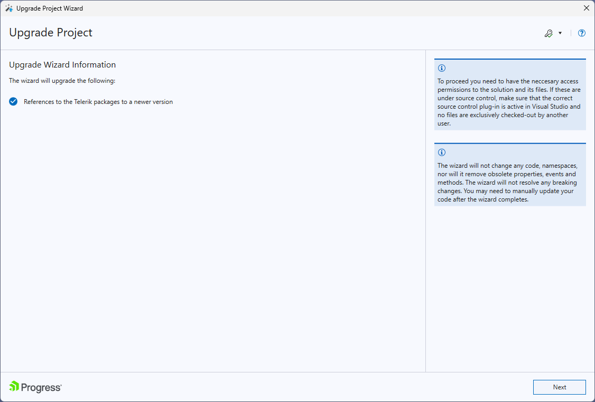
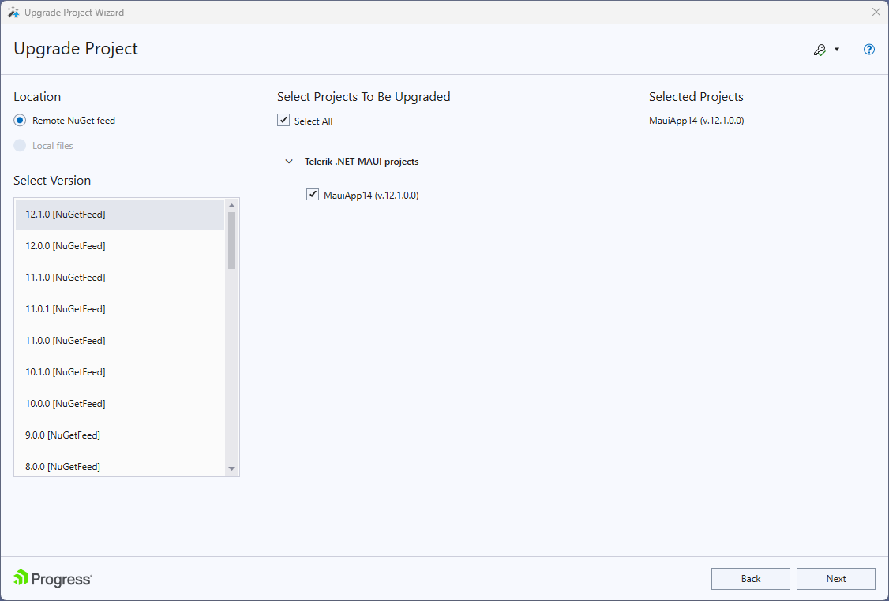
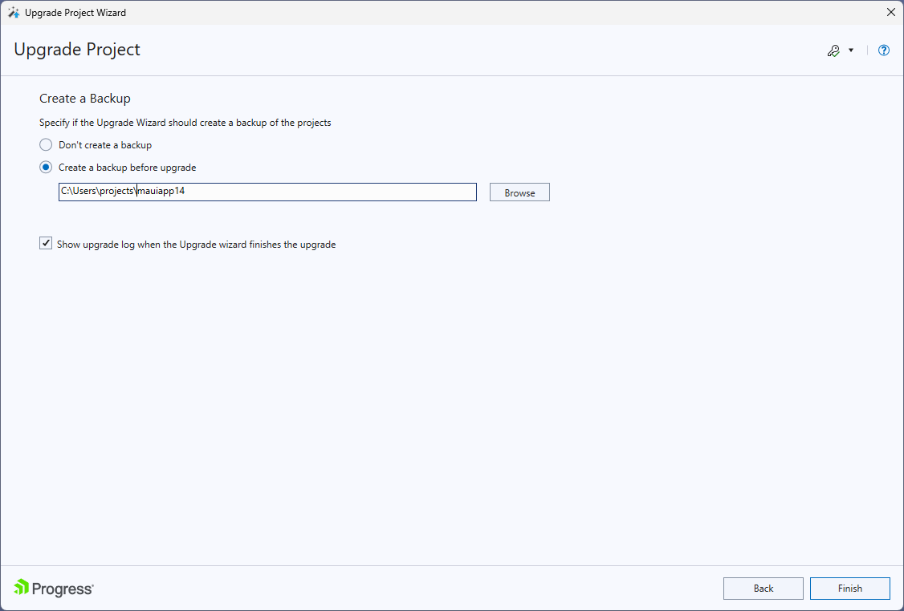
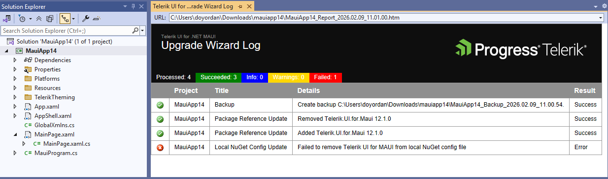

# Upgrading Projects

This article demonstrates how to use the [Telerik Visual Studio Extension]() to upgrade a project that is pre-configured with the Telerik UI for .NET MAUI controls.

The **Upgrade Project Wizard** upgrades the version of existing Telerik UI for .NET MAUI applications. To open the wizard:

1. In Visual Studio, open the project you want to upgrade.

2. Open the Telerik UI for .NET MAUI Upgrade Wizard in one of the following ways:

    * Right-click on the project in the **Solution Explorer** -> **Telerik UI for .NET MAUI** -> **Upgrade Wizard**.

      

      or 

    * Go to the **Extensions** > **Telerik** > **Telerik UI for .NET MAUI** > **Upgrade Wizard** menu.

      

3. When selecting the Upgrade Wizard, the following information window appears.

    

4. Press **Next** button to proceed to the next step.

5. The next page of the Upgrade Wizard lists all projects from the solution that use Telerik UI for .NET MAUI. Choose the projects that you want to upgrade and the version to which they will be upgraded.

    >tip We recommend selecting all projects that reference UI for Blazor and upgrading them to the same product version.

6. Select the version of Telerik UI for .NET MAUI you want to upgrade to and click **Next**.

    

7. The next page allows you to create a backup before running the upgrade wizard by selecting the **Create a backup before upgrade** option. By default, the backup is created in the same location as the project with the name of the project. You can choose a different location for the backup by clicking on the **Browse** button. 
    
    

    >tip We recommend creating a backup before upgrading your project.
 
8. When clicking the **Finish** button, the upgrade process starts. After the process is finished, a summary page appears with the results of the upgrade.

    

## See Also

* [Toolbox Extension for Visual Studio]()
* [Scaffolding Pages and Screens in Visual Studio]()
