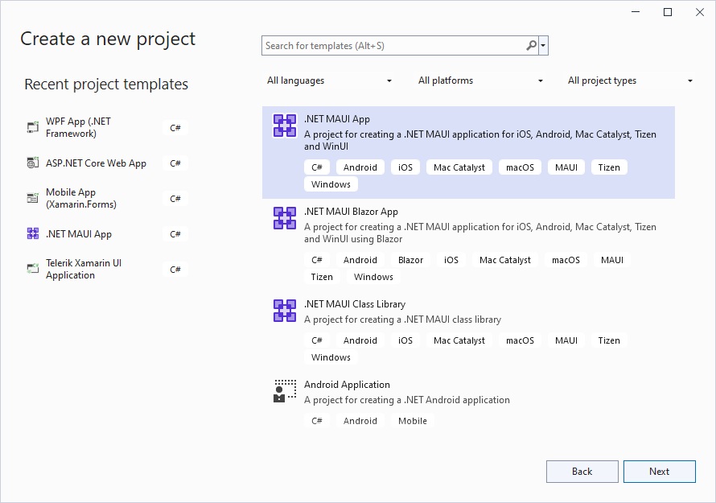

# Using Telerik UI for .NET MAUI on Windows

This article aims to help you set up your application to use **Telerik UI for .NET MAUI** suite on **Windows OS**.

## 1. Start with .NET MAUI app

Depending on your scenario, you either have an existing app where you will add our components, or you have to create a new blank app.
 
### Add Telerik components to an already existing app

You can manually reference the Telerik UI for .NET MAUI assemblies into your project or use the Telerik Nuget packages. For detailed instructions, go to [Step 2: Add references to Telerik Components](#2-add-references-to-telerik-components).
 
### Create a new app with Telerik UI for .NET MAUI

If you just start your app, you have two options:

- Use our [Project Templates](#using-the-telerik-net-maui-app-project-templates) to create a project that has everything setup for you. You can start using our components right away without manually adding the Telerik.Ui.for.Maui nuget package.

	>tip We strongly recommend using project templates. If you choose this option, you can skip the next steps in this article and jump directly to the **Getting Started** topic of any control.

- Create a new .NET MAUI app in Visual Studio and add the required references to Telerik assemblies.

	If your scenario requires creating a new app from scratch, please proceed following the steps below:

	1. Create a new solution using the **.NET MAUI App** template:

		

	1. In the next **Configure your new project** window, name your project, choose a suitable location for it.

> For a complete instructions go to [Get Started: Build you first app](https://docs.microsoft.com/en-us/dotnet/maui/get-started/first-app?pivots=devices-android) topic in Microsoft Docs.

## 2. Add references to Telerik Components

You have two options: 

### Telerik NuGet package server

You can use our [Telerik NuGet package server]() to include our suite in your solution and/or update to the latest available version.

### Manually add required assemblies

If you prefer to manually reference the required Telerik UI for .NET MAUI assemblies into your solution, you can get them in the following ways:

* Through the MSI installation - in this case after [installing Telerik UI for .NET MAUI]() on your machine, you can find the assemblies in the following default folder: C:\Program Files\Progress\ or C:\Program Files (x86)\Progress\ for a 64bit machine;
* Download a ZIP file containing all the assemblies, for more details on this go to [Download Product Files]() topic. You can then unzip the file to any location on your machine and reference the assemblies from that location.

No matter whether you've used the automatic installation or the zip, you'll have Binaries folder has two folders Net6 and Net7 that contain platform-specific folders - Android, iOS, MacCatalyst, WinUI. All assemblies are in these folders

	Just need to add the assemblies from these folders to the corresponding platforms' Packages folders inside the .NET MAUI project:

	
	
	>important As some of the controls included in Telerik UI for .NET MAUI suite rely on **SkiaSharp** rendering library, you should also install **SkiaSharp.Views.Maui.Controls.Compatibility** nuget package.

## See Also

- [Visual Studio Extensions]()
- [Telerik NuGet packages server]()
