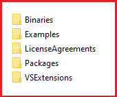

# Installing Telerik UI for .NET MAUI from MSI file #

To install Telerik UI for .NET MAUI on your machine from the Windows Installer MSI file, follow the instructions below:

1. Go to the Telerik UI for .NET MAUI download page following the instructions in [Download Product Files]() topic.

1. Run the `Telerik_UI_for_Maui_[version]_Preview.msi` file and follow the instructions. The file automatically installs Telerik UI for .NET MAUI on your PC.

    On a 32-bit machine, the wizard will suggest to install the UI for .NET MAUI controls in `C:\Program Files\Progress\`. On a 64-bit machine, the wizard will suggest to install the UI for .NET MAUI controls in `C:\Program Files (x86)\Progress\`.

1. The installation folder provides the following subdirectories:

    * **Binaries**&mdash;Contains the needed assemblies for Android, iOS, MacCatalyst, and WinUI.
    * **Examples**&mdash;Contains the SDK application with the Telerik UI for .NET MAUI controls.
    * **LicenseAgreements**&mdash;Provides the product End-User License Agreement (EULA).
    * **Packages**&mdash;Contains the `Telerik_UI_for_Maui_[version]_Preview.nupkg` file.
	* **VSExtensions**&mdash;Contains VSExtension for Visual Studio 2022.

    

## See Also

- [VSExtensions]()