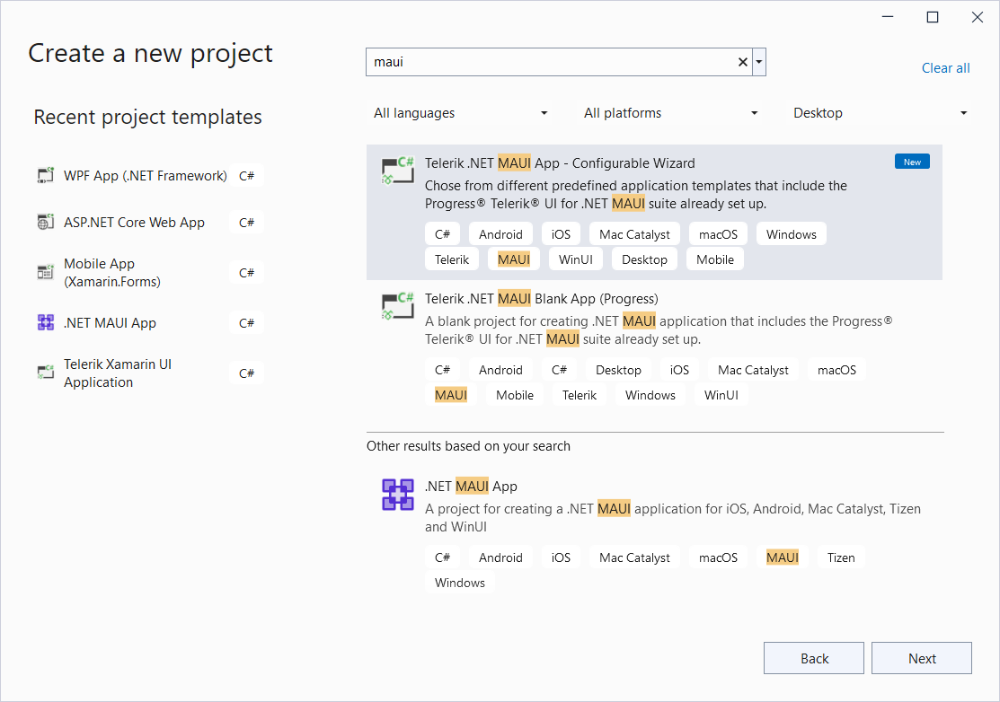
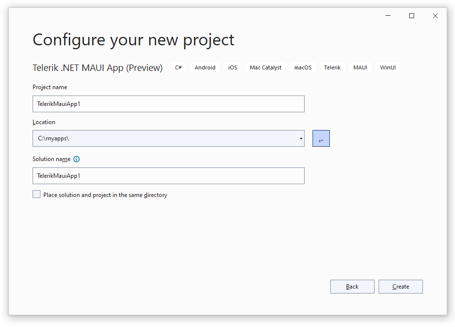
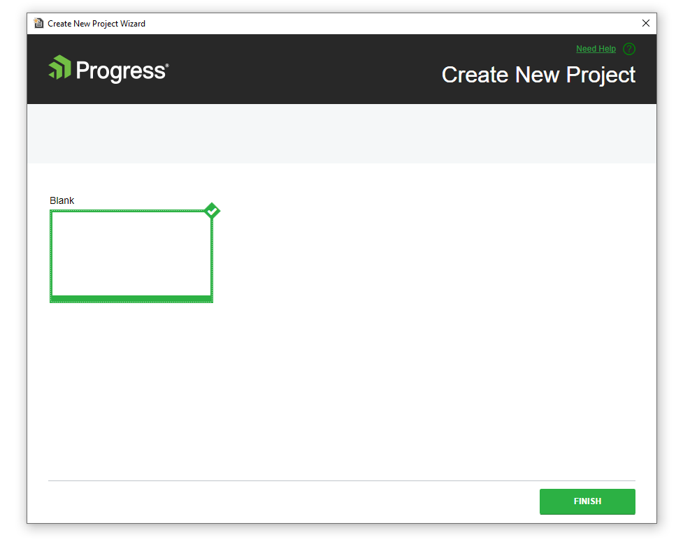
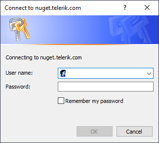

# Telerik Project Templates for VS on Windows

The Telerik UI for .NET MAUI extensions and project templates for Visual Studio (VS) on Windows aim to help developers when creating .NET MAUI applications with Telerik UI for .NET MAUI components.

## Available Extensions

The extensions handle the following major points in the development with Telerik UI for .NET MAUI:

* Project creation&mdash;Through the **Telerik .NET MAUI App** and **Telerik .NET MAUI Blank App** project templates, you can quickly create an application that is pre-configured to use Telerik UI for .NET MAUI.
* Toolbox support&mdash;The [Telerik UI for .NET MAUI Toolbox extension for Windows]() facilitates the adding of Telerik controls to your .NET MAUI application.

## Using the Project Templates

Telerik UI for .NET MAUI supports two project template apps. Both of them are installed as part of the [Telerik UI for .NET MSI installation](). When you finish with the automatic installation, you're ready to utilize them.

To start building your Telerik UI for .NET MAUI project with the project templates for VS on Windows:

1. Include the following components for Visual Studio to work properly:

	* The **Mobile Development with .NET** workload with the **.NET MAUI** component.
	* The individual **Text Template Transformation** component.

1. Open Visual Studio and choose the **Create a new project** option.

1. Search for **maui**:

	

	As a result, you can see the supported project templates:

	 * **Telerik .NET MAUI App**&mdash;Represents a configurable wizard, which contains various predefined application templates that include the Telerik .NET MAUI suite setup.
	 * **Telerik .NET MAUI Blank App**&mdash;Represents a blank project for creating a .NET MAUI application that includes the Telerik .NET MAUI suite setup.

1. Depending on your preferences, you can select either of the available options for configuring your Telerik UI for .NET MAUI project.

	* If you select the **Telerik .NET MAUI App** configurable wizard, the **Configure your new project** screen loads. In it, set your project name and location.

	

	An additional screen for choosing the predefined application template loads:

	

	* If you select the **Telerik .NET MAUI Blank App** option, you can start configuring the created blank application.

1. Visual Studio opens the solution directly configured to use the Telerik UI for .NET MAUI controls and the `Telerik.UI.for.Maui` NuGet package is installed.

	If you do not have the [Telerik NuGet Server]() set up in Visual Studio, a message will pop up, so you can enter your Telerik credentials. The Telerik NuGet Server will be automatically configured as a NuGet source in Visual Studio:

	

The following image shows the end result after running the application.

## See Also

* [MS Docs Get Started: Build you first app](https://docs.microsoft.com/en-us/dotnet/maui/get-started/first-app?pivots=devices-android)
## See Also

* [Available Product Files and Assemblies]()
* [System Requirements for Windows]()
* [Telerik Toolbox for .NET MAUI on Windows]()
* [Telerik UI for .NET MAUI Sample Apps]()
