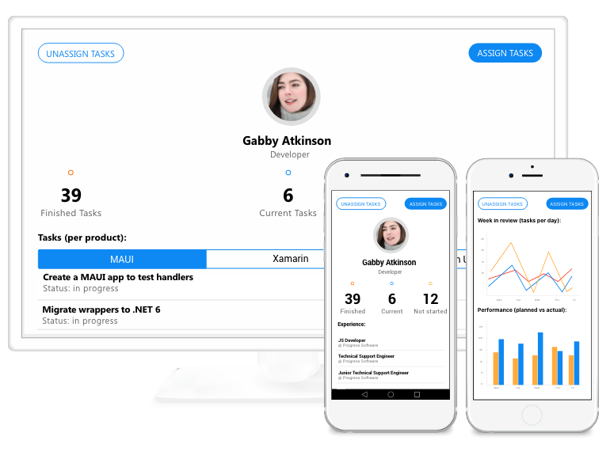

# Welcome to Telerik UI for .NET MAUI

Thank you for choosing Telerik UI for .NET MAUI!

**Telerik UI for .NET MAUI** is the most extensive UI suite on the market that delivers controls for building modern and professional-looking mobile and desktop applications for cross-platform implementation targeting Android, iOS, macOS, and Windows from a single shared code-base.

This brand-new UI library comes with [sample demo applications]() that showcase the growing number of controls. In addition to expanding the list of controls, the regular releases ensure that the suite is up to date with the latest versions from Microsoft.





>tip This online MAUI documentation covers the latest version of Telerik UI for MAUI. If needed, download the [offline PDF MAUI documentation](#learning-resources) for the required product version.

## List of .NET MAUI UI Controls

Telerik UI for .NET MAUI features the following controls for cross-platform development with .NET MAUI:



By clicking on each control you will navigate to the detailed .NET MAUI documentation explaining the key features and how to utilize them.

## Supported Platforms

@[template](/_contentTemplates/common/supported-platforms.md#supported-platforms)

## Trial Version and Commercial License

Telerik UI for .NET MAUI library is a commercial UI library. You are welcome to explore its full functionality and get technical support from the team when you register for a free 30-day trial. To use it commercially, you need to [purchase a license](https://www.telerik.com/purchase/maui-ui). Feel free to review the Telerik UI for .NET MAUI [License Agreement](https://www.telerik.com/purchase/license-agreement/maui-ui) to get acquainted with the full terms of use.

## .NET MAUI Support Options

For any issues you might encounter while working with Telerik UI for .NET MAUI, you can use a number of available support channels:

* Telerik UI for .NET MAUI license holders and active trialists can take advantage of the outstanding customer support delivered by the developers building the library. To submit a support ticket, use the [UI for .NET MAUI dedicated support](https://www.telerik.com/account/support-tickets) system.
* [Telerik UI for .NET MAUI forum](https://www.telerik.com/forums/maui) is part of the free support you can get from the community and from the Telerik UI for .NET MAUI team on all kinds of general issues and questions you have.
* [Telerik UI for .NET MAUI feedback portal](https://feedback.telerik.com/maui) provides information on the features in discussion and also the planned ones for release.
* For any features that have already been released, visit the [Telerik UI for .NET MAUI Release History](https://www.telerik.com/support/whats-new/maui-ui/release-history) and [What's New](https://www.telerik.com/support/whats-new/maui-ui) pages.
* This official Telerik UI for .NET MAUI documentation is public and available for all users. If you want to share your feedback on a specific article, fill in the **Is this article helpful?** form and tell us more about whether the content was useful for you to successfully achieve what you wanted.

## Learning Resources

* [Official Microsoft .NET MAUI Documentation](https://docs.microsoft.com/en-us/dotnet/maui)&mdash;Find the solutions, scenarios, and resources you need to get started with .NET MAUI.
* [Knowledge Base](https://docs.telerik.com/devtools/maui/knowledge-base)&mdash;As part of the Telerik UI .NET MAUI documentation, the Knowledge Base provides a collection of articles describing common use cases we came upon during our everyday work.
* [Telerik UI for .NET MAUI Product Page](https://www.telerik.com/maui-ui)&mdash;The leading source of information on Telerik UI for .NET MAUI—it provides an overview of each component included in the suite, What's New section, Release History, and more.
* [Telerik UI for .NET MAUI YouTube Channel](https://www.youtube.com/playlist?list=PLvmaC-XMqeBZnCAEuEcW9LsUnfQm65B1N)&mdash;Allows you in-depth surfing through the .NET MAUI videos that cover a variety of topics—from the why of transitioning to MAUI to DevOps in MAUI and more!
* [Offline PDF documentation](https://www.telerik.com/account/downloads/product-download?product=MAUI)&mdash;Download the offline PDF documentations for the **Telerik UI for MAUI** and **Telerik Document Processing** under the **Documentation** section of your Telerik account.

## Next Steps with .NET MAUI UI

* [Getting Started with Telerik UI for .NET MAUI (Online Guide)]()

## See Also

- [.NET MAUI Examples Apps]()
