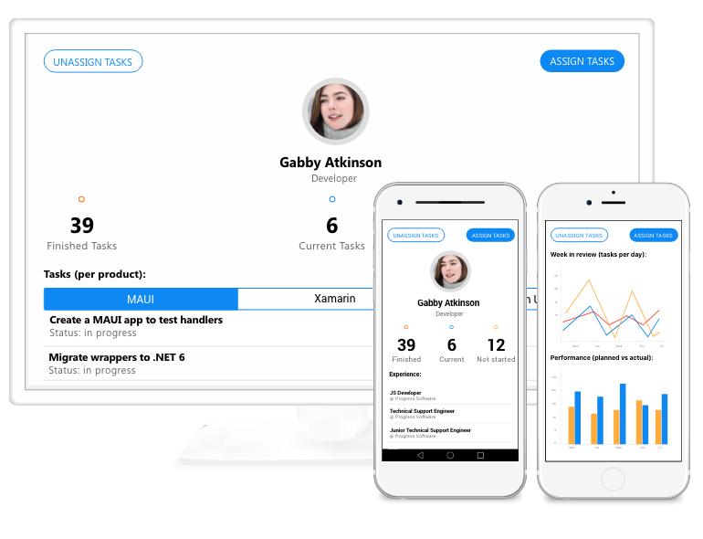

# Welcome to Telerik UI for .NET MAUI

**Telerik UI for .NET MAUI** is the most extensive UI suite on the market that delivers controls for building modern and professional-looking mobile and desktop applications for cross-platform implementation targeting Android, iOS, macOS, and Windows from a single shared code-base.

This comprehensive UI library includes controls, [sample demo applications](), and regular updates aligned with the latest Microsoft .NET MAUI versions.

<CtaPanelIntroduction></CtaPanelIntroduction>

## Getting Started Quickly

Choose a path based on what you need:

- **New to Telerik UI for .NET MAUI?** Start with [Getting Started with Telerik UI for .NET MAUI]().
- **Migrating from Xamarin?** Follow the [migration guides](#migration-paths) to upgrade your existing apps.
- **Looking for a specific component?** Browse the [complete list of controls](#list-of-net-maui-ui-controls) below.
- **Want to see working examples?** Explore the [sample demo applications]().

>tip This documentation covers the latest version of Telerik UI for .NET MAUI. For earlier versions, download the [offline PDF documentation](#learning-resources) from your Telerik account.

## List of .NET MAUI UI Controls

The suite includes high-performance, customizable controls organized by category. Click any control name to explore its documentation, features, and code examples.

Telerik UI for .NET MAUI features the following controls for cross-platform development with .NET MAUI:

<IntroTable>
    <IntroTableColumn>
        <IntroTableSection title="Data Controls">
            <IntroTableAnchor title="CollectionView" href="slug:collectionview-overview"></IntroTableAnchor>
            <IntroTableAnchor title="DataForm" href="slug:dataform-overview" tag="updated"></IntroTableAnchor>
            <IntroTableAnchor title="DataGrid" href="slug:datagrid-overview"></IntroTableAnchor>
            <IntroTableAnchor title="DataPager" href="slug:datapager-overview"></IntroTableAnchor>
            <IntroTableAnchor title="ItemsControl" href="slug:itemscontrol-overview"></IntroTableAnchor>
            <IntroTableAnchor title="TreeDataGrid" href="slug:treedatagrid-overview"></IntroTableAnchor>
        </IntroTableSection>
        <IntroTableSection title="Data Visualization">
            <IntroTableAnchor title="Barcodes" href="slug:barcode-overview"></IntroTableAnchor>
            <IntroTableAnchor title="Charts" href="slug:chart-overview"></IntroTableAnchor>
            <IntroTableAnchor title="Gauges" href="slug:gauge-overview" tag="updated"></IntroTableAnchor>
            <IntroTableAnchor title="Map" href="slug:map-overview"></IntroTableAnchor>
            <IntroTableAnchor title="ProgressBar" href="slug:progressbar-overview"></IntroTableAnchor>
            <IntroTableAnchor title="Ratings" href="slug:rating-overview"></IntroTableAnchor>
        </IntroTableSection>
        <IntroTableSection title="Chatbots">
            <IntroTableAnchor title="Conversation UI (Chat)" href="slug:chat-overview"></IntroTableAnchor>
        </IntroTableSection>
    </IntroTableColumn>
    <IntroTableColumn>
        <IntroTableSection title="Editors">
            <IntroTableAnchor title="AutoComplete" href="slug:autocomplete-overview"></IntroTableAnchor>
            <IntroTableAnchor title="ComboBox" href="slug:combobox-overview"></IntroTableAnchor>
            <IntroTableAnchor title="DatePicker" href="slug:datepicker-overview"></IntroTableAnchor>
            <IntroTableAnchor title="DateTimePicker" href="slug:datetimepicker-overview"></IntroTableAnchor>
            <IntroTableAnchor title="Editor" href="slug:editor-overview"></IntroTableAnchor>
            <IntroTableAnchor title="Entry" href="slug:entry-overview"></IntroTableAnchor>
            <IntroTableAnchor title="ImageEditor" href="slug:imageeditor-overview"></IntroTableAnchor>
            <IntroTableAnchor title="ListPicker" href="slug:listpicker-overview"></IntroTableAnchor>
            <IntroTableAnchor title="MaskedEntries" href="slug:maskedentry-overview"></IntroTableAnchor>
            <IntroTableAnchor title="NumericInput" href="slug:numericinput-overview"></IntroTableAnchor>
            <IntroTableAnchor title="RangeSlider" href="slug:rangeslider-overview"></IntroTableAnchor>
            <IntroTableAnchor title="RichTextEditor" href="slug:richtexteditor-overview"></IntroTableAnchor>
            <IntroTableAnchor title="TemplatedPicker" href="slug:templatedpicker-overview"></IntroTableAnchor>
            <IntroTableAnchor title="TimePicker" href="slug:timepicker-overview"></IntroTableAnchor>
            <IntroTableAnchor title="TimeSpanPicker" href="slug:timespanpicker-overview"></IntroTableAnchor>
            <IntroTableAnchor title="SignaturePad" href="slug:signaturepad-overview"></IntroTableAnchor>
            <IntroTableAnchor title="Slider" href="slug:slider-overview"></IntroTableAnchor>
        </IntroTableSection>
    </IntroTableColumn>
    <IntroTableColumn>
        <IntroTableSection title="Navigation &amp; Layouts">
            <IntroTableAnchor title="Accordion" href="slug:accordion-overview"></IntroTableAnchor>
            <IntroTableAnchor title="BottomSheet" href="slug:bottomsheet-overview"></IntroTableAnchor>
            <IntroTableAnchor title="DockLayout" href="slug:docklayout-overview"></IntroTableAnchor>
            <IntroTableAnchor title="Expander" href="slug:expander-overview"></IntroTableAnchor>
            <IntroTableAnchor title="NavigationView" href="slug:navigationview-overview"></IntroTableAnchor>
            <IntroTableAnchor title="SideDrawer" href="slug:sidedrawer-overview"></IntroTableAnchor>
            <IntroTableAnchor title="SlideView" href="slug:slideview-overview"></IntroTableAnchor>
            <IntroTableAnchor title="TabView" href="slug:tabview-overview"></IntroTableAnchor>
            <IntroTableAnchor title="TreeView" href="slug:treeview-overview"></IntroTableAnchor>
            <IntroTableAnchor title="WrapLayout" href="slug:wraplayout-overview"></IntroTableAnchor>
        </IntroTableSection>
        <IntroTableSection title="Calendar &amp; Scheduling">
            <IntroTableAnchor title="Calendar" href="slug:calendar-overview"></IntroTableAnchor>
            <IntroTableAnchor title="Scheduler" href="slug:scheduler-overview" tag="updated"></IntroTableAnchor>
        </IntroTableSection>
        <IntroTableSection title="Buttons">
            <IntroTableAnchor title="Button" href="slug:button-overview"></IntroTableAnchor>
            <IntroTableAnchor title="CheckBox" href="slug:checkbox-overview"></IntroTableAnchor>
            <IntroTableAnchor title="DropDownButton" href="slug:dropdownbutton-overview" tag="new"></IntroTableAnchor>
            <IntroTableAnchor title="SegmentedControl" href="slug:segmentedcontrol-overview" tag="updated"></IntroTableAnchor>
            <IntroTableAnchor title="SmartPasteButton" href="slug:smartpastebutton-overview" tag="new"></IntroTableAnchor>
            <IntroTableAnchor title="SpeechToTextButton" href="slug:speechtotextbutton-overview"></IntroTableAnchor>
            <IntroTableAnchor title="TemplatedButton" href="slug:templatedbutton-overview" tag="updated"></IntroTableAnchor>
            <IntroTableAnchor title="ToggleButton" href="slug:togglebutton-overview" tag="updated"></IntroTableAnchor>
        </IntroTableSection>
    </IntroTableColumn>
    <IntroTableColumn>
        <IntroTableSection title="Interactivity &amp; UX">
            <IntroTableAnchor title="AIPrompt" href="slug:aiprompt-overview"></IntroTableAnchor>
            <IntroTableAnchor title="BadgeView" href="slug:badgeview-overview"></IntroTableAnchor>
            <IntroTableAnchor title="Border" href="slug:border-overview"></IntroTableAnchor>
            <IntroTableAnchor title="BusyIndicator" href="slug:busyindicator-overview"></IntroTableAnchor>
            <IntroTableAnchor title="GridSplitter" href="slug:gridsplitter-overview"></IntroTableAnchor>
            <IntroTableAnchor title="Path" href="slug:path-overview"></IntroTableAnchor>
            <IntroTableAnchor title="Popup" href="slug:popup-overview"></IntroTableAnchor>
            <IntroTableAnchor title="PromptInput" href="slug:promptinput-overview" tag="new"></IntroTableAnchor>
            <IntroTableAnchor title="Skeleton" href="slug:skeleton-overview"></IntroTableAnchor>
            <IntroTableAnchor title="Toolbar" href="slug:toolbar-overview"></IntroTableAnchor>
        </IntroTableSection>
        <IntroTableSection title="PDF Viewer">
            <IntroTableAnchor title="PDF Viewer" href="slug:pdfviewer-overview"></IntroTableAnchor>
        </IntroTableSection>
        <IntroTableSection title="Document Processing Libraries">
            <IntroTableAnchor title="PdfProcessing" href="slug:document-processing-libraries-overview"></IntroTableAnchor>
            <IntroTableAnchor title="WordsProcessing" href="slug:document-processing-libraries-overview"></IntroTableAnchor>
            <IntroTableAnchor title="SpreadProcessing" href="slug:document-processing-libraries-overview"></IntroTableAnchor>
            <IntroTableAnchor title="SpreadStreamProcessing" href="slug:document-processing-libraries-overview"></IntroTableAnchor>
            <IntroTableAnchor title="ZipLibrary" href="slug:document-processing-libraries-overview"></IntroTableAnchor>
        </IntroTableSection>
    </IntroTableColumn>
</IntroTable>

By clicking on each control you will navigate to the detailed .NET MAUI documentation explaining the key features and how to utilize them.

## Supported Platforms

@[template](/_contentTemplates/common/supported-platforms.md#supported-platforms)

## Reasons for Choosing Telerik UI for .NET MAUI

**Telerik UI for .NET MAUI** is designed to accelerate cross-platform development:

- **70+ Customizable Controls**&mdash;Data grids, charts, editors, navigation components, and more—all optimized for .NET MAUI.
- **Cross-Platform Native Apps**&mdash;Build native apps for Android, iOS, macOS, and Windows with a single codebase.
- **Consistent Design System**&mdash;Uniform look and feel across all supported platforms.
- **Visual Studio Integration**&mdash;Seamless tooling support reduces setup overhead and speeds integration.
- **Visual Studio Code Support**&mdash;Use the extensions to scaffold pages, add controls, and manage licenses in VS Code.
- **Saves Development Time**&mdash;Ready-to-use, feature-rich components let you focus on app logic instead of UI details.
- **Regular Updates**&mdash;Stays aligned with Microsoft's .NET MAUI releases and includes new features quarterly.
- **Dedicated Support**&mdash;Technical support, community forums, and extensive documentation included.

**Telerik UI for .NET MAUI introduction video overview**

<iframe width="560" height="315" src="https://www.youtube.com/embed/x0fY4qwkBTk?si=ULFP7NkbskhG9DEb" title="Introduction to Telerik UI for .NET MAUI: Course Overview and Prerequisites" frameborder="0" allow="accelerometer; autoplay; clipboard-write; encrypted-media; gyroscope; picture-in-picture; web-share" referrerpolicy="strict-origin-when-cross-origin" allowfullscreen></iframe>

## Migration Paths

If you are upgrading an existing Xamarin or Xamarin.Forms application to .NET MAUI, these resources will help:

- [Migrate from Xamarin to .NET MAUI](https://www.telerik.com/maui-ui/migration)&mdash;Full migration path and best practices.
- [Xamarin Custom Renderers to .NET MAUI Handlers](https://learn.microsoft.com/en-us/dotnet/maui/migration/renderer-to-handler?view=net-maui-8.0) &mdash;How to convert existing custom renderers.
- [Migrate Xamarin Controls to .NET MAUI Controls](https://docs.telerik.com/devtools/maui/migrate-to-net-maui) &mdash;Component-by-component migration guide.

## Trial and Commercial License

**Telerik UI for .NET MAUI** is a commercial library. You can evaluate it free for 30 days and get [technical support](https://www.telerik.com/account/support-tickets) during evaluation. To use it in production, [purchase a license](https://www.telerik.com/purchase/maui-ui). Review the [License Agreement](https://www.telerik.com/purchase/license-agreement/maui-ui) for full terms.

## .NET MAUI Support Options

When you need help, you have several options:

- **AI Coding Assistant**&mdash;Get tips and code snippets from the [Telerik MAUI AI Coding Assistant]().
- **Priority Support**&mdash;License holders can submit tickets to [dedicated support](https://www.telerik.com/account/support-tickets).
- **Community Forum**&mdash;Ask questions and connect with the community at the [Telerik UI for .NET MAUI forum](https://www.telerik.com/forums/maui).
- **Feature Requests**&mdash;Share ideas and vote on features in the [feedback portal](https://feedback.telerik.com/maui).
- **What's New**&mdash;Check [Release History](https://www.telerik.com/support/whats-new/maui-ui/release-history) and [What's New](https://www.telerik.com/support/whats-new/maui-ui) for the latest updates.
* This official Telerik UI for .NET MAUI documentation is public and available for all users. If you want to share your feedback on a specific article, fill in the **Is this article helpful?** form and tell us more about whether the content was useful for you to successfully achieve what you wanted.

## Learning Resources

Use these resources to deepen your knowledge:

- **Microsoft .NET MAUI Docs**&mdash;[Official .NET MAUI documentation](https://docs.microsoft.com/en-us/dotnet/maui) covers framework fundamentals and best practices.
- **Knowledge Base**&mdash;[Common use cases and troubleshooting](https://docs.telerik.com/devtools/maui/knowledge-base) articles from our team.
- **Product Overview**&mdash;[Telerik UI for .NET MAUI product page](https://www.telerik.com/maui-ui) features component overviews and release information.
- **Video Tutorials**&mdash;[YouTube channel](https://www.youtube.com/playlist?list=PLvmaC-XMqeBZnCAEuEcW9LsUnfQm65B1N) with getting-started and advanced topics.
- **Offline Documentation**&mdash;[Download PDF docs](https://www.telerik.com/account/downloads/product-download?product=MAUI) from your account for offline access.

## Next Steps with .NET MAUI UI

Start building your first app with [Getting Started with Telerik UI for .NET MAUI]().

## See Also

- [Sample Demo Applications]()
- [Knowledge Base](https://docs.telerik.com/devtools/maui/knowledge-base)
- [Telerik UI for .NET MAUI Forum](https://www.telerik.com/forums/maui)

<VideoMetadata 
    name="Introduction to Telerik UI for .NET MAUI"
    description="The video introduces the Telerik UI for .NET MAUI suite and outlines the prerequisites needed to follow along."
    thumbnail-url="https://img.youtube.com/vi/x0fY4qwkBTk/maxresdefault.jpg"
    upload-date="2024-12-02T00:00:00Z"
    duration="PT4M56S"
    content-url="https://youtu.be/x0fY4qwkBTk"
    embed-url="https://www.youtube.com/embed/x0fY4qwkBTk">
</VideoMetadata>