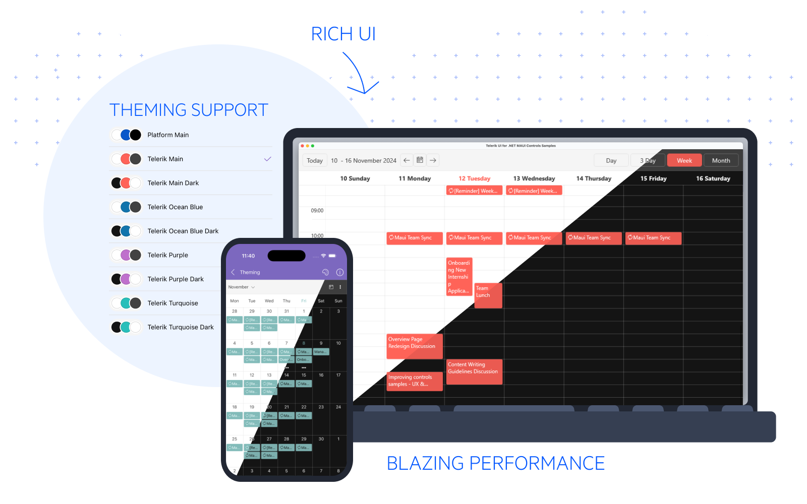

## Welcome to Telerik UI for MAUI

Thank you for choosing Telerik UI for .NET MAUI - Preview.

**Telerik UI for MAUI** features MAUI controls for building professional-looking modern applications targeting multiple mobile devices.

To learn more please visit the [Telerik UI for MAUI](http://www.telerik.com/maui-ui) product overview page.





### Telerik UI for MAUI Controls

Our suite features the following controls for cross-platform development with MAUI:

* [Border]()
* [Button]()
* [Chart]()
* [ItemsControl]()
* [SegmentedControl]()

## Getting Started with Telerik UI for MAUI

Information how to get started with .NET MAUI and Telerik UI for .NET MAUI can be found in our [Getting Started]() guide.

## Support Options

For any issues you might encounter while working with Telerik UI for MAUI, use any of the available support channels:

* [Our forum](https://www.telerik.com/forums/maui) is part of the free support you can get from the community and from the team on all kinds of general issues.
* [Our feedback portal](https://feedback.telerik.com/maui) provides information on the features/bugs in discussion and also the planned ones for release.
* You may still need a tailor-made solution for your project. In such cases, go straight to [Progress Services](https://www.progress.com/services).

