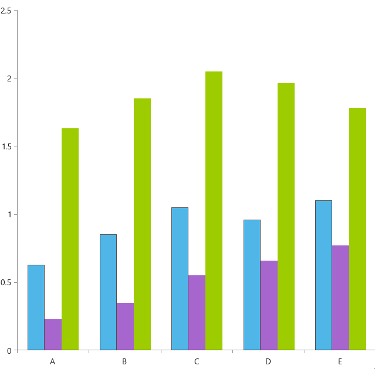

## Environment

| Version | Product | Author | 
| --- | --- | ---- | 
| 10.0.0 | Chart for .NET MAUI | [Dobrinka Yordanova](https://www.telerik.com/blogs/author/dobrinka-yordanova)| 


## Description

I want to change the default colors of the CartesianChart for bar series.

This knowledge base article also answers the following questions:
- How can I use custom colors in the Telerik UI for .NET MAUI CartesianChart?
- How can I change the color on the CartesianChart `BarSeries`?

## Solution

The Chart supports the following default set of colors for displaying its data points:

* `#0078D4`
* `#EA005E`
* `#60CCFE`
* `#0093F9`
* `#00B7C3`
* `#FFB900`
* `#C239B3`
* `#6B69D6`

To modify the default built-in colors, implement a custom palette, as demonstrated in the following scenario:

**1.** Create a sample `DataModel`:

<snippet id='categorical-data-model'/>

**2.** Define the `ViewModel` class:

```C#
public class ViewModel
{
    public ViewModel()
    {
        this.Data1 = GetCategoricalData1();
        this.Data2 = GetCategoricalData2();
        this.Data3 = GetCategoricalData3();
    }

    public ObservableCollection<CategoricalData> Data1 { get; set; }

    public ObservableCollection<CategoricalData> Data2 { get; set; }

    public ObservableCollection<CategoricalData> Data3 { get; set; }

    private static ObservableCollection<CategoricalData> GetCategoricalData1()
    {
        var data = new ObservableCollection<CategoricalData>  {
            new CategoricalData { Category = "A", Value = 0.63 },
            new CategoricalData { Category = "B", Value = 0.85 },
            new CategoricalData { Category = "C", Value = 1.05 },
            new CategoricalData { Category = "D", Value = 0.96 },
            new CategoricalData { Category = "E", Value = 1.1 },
        };
        return data;
    }

    private static ObservableCollection<CategoricalData> GetCategoricalData2()
    {
        var data = new ObservableCollection<CategoricalData>  {
            new CategoricalData { Category = "A", Value = 0.23 },
            new CategoricalData { Category = "B", Value = 0.35 },
            new CategoricalData { Category = "C", Value = 0.55 },
            new CategoricalData { Category = "D", Value = 0.66 },
            new CategoricalData { Category = "E", Value = 0.77 },
        };
        return data;
    }

    private static ObservableCollection<CategoricalData> GetCategoricalData3()
    {
        var data = new ObservableCollection<CategoricalData>  {
            new CategoricalData { Category = "A", Value = 1.63 },
            new CategoricalData { Category = "B", Value = 1.85 },
            new CategoricalData { Category = "C", Value = 2.05 },
            new CategoricalData { Category = "D", Value = 1.96 },
            new CategoricalData { Category = "E", Value = 1.78 },
        };
        return data;
    }
}
```

**3.** Define the `RadCartesianChart` in XAML:

```XAML
<telerik:RadCartesianChart>
    <telerik:RadCartesianChart.BindingContext>
        <local:ViewModel />
    </telerik:RadCartesianChart.BindingContext>
    <telerik:RadCartesianChart.ChartBehaviors>
        <telerik:ChartSelectionBehavior DataPointSelectionMode="None" 
                                    SeriesSelectionMode="Single" />
    </telerik:RadCartesianChart.ChartBehaviors>
    <telerik:RadCartesianChart.VerticalAxis>
        <telerik:NumericalAxis />
    </telerik:RadCartesianChart.VerticalAxis>
    <telerik:RadCartesianChart.HorizontalAxis>
        <telerik:CategoricalAxis LabelFitMode="MultiLine" />
    </telerik:RadCartesianChart.HorizontalAxis>
    <telerik:RadCartesianChart.Series>
        <telerik:BarSeries ValueBinding="Value"
                    CategoryBinding="Category"
                    CombineMode="Cluster"
                    ItemsSource="{Binding Data1}" />
        <telerik:BarSeries ValueBinding="Value"
                    CategoryBinding="Category"
                    CombineMode="Cluster"
                    ItemsSource="{Binding Data2}" />
        <telerik:BarSeries ValueBinding="Value"
                    CategoryBinding="Category"
                    CombineMode="Cluster"
                    ItemsSource="{Binding Data3}" />
    </telerik:RadCartesianChart.Series>
    <telerik:RadCartesianChart.Palette>
        <telerik:ChartPalette>
            <telerik:ChartPalette.Entries>
                <telerik:PaletteEntry FillColor="#4FB6E7" StrokeColor="#4FB6E7" />
                <telerik:PaletteEntry FillColor="#A666CE" StrokeColor="#A666CE" />
                <telerik:PaletteEntry FillColor="#9DCC00" StrokeColor="#9DCC00" />
            </telerik:ChartPalette.Entries>
        </telerik:ChartPalette>
    </telerik:RadCartesianChart.Palette>
    <telerik:RadCartesianChart.SelectionPalette>
        <telerik:ChartPalette>
            <telerik:ChartPalette.Entries>
                <telerik:PaletteEntry FillColor="#4FB6E7" StrokeColor="#4D4D4D" />
                <telerik:PaletteEntry FillColor="#A666CE" StrokeColor="#4D4D4D" />
                <telerik:PaletteEntry FillColor="#9DCC00" StrokeColor="#4D4D4D" />
            </telerik:ChartPalette.Entries>
        </telerik:ChartPalette>
    </telerik:RadCartesianChart.SelectionPalette>
</telerik:RadCartesianChart>
```

**4.** Add the `telerik` namespace: 

```XAML
xmlns:telerik="http://schemas.telerik.com/2022/xaml/maui"
```

The following image shows the end result of the suggested implementation.



