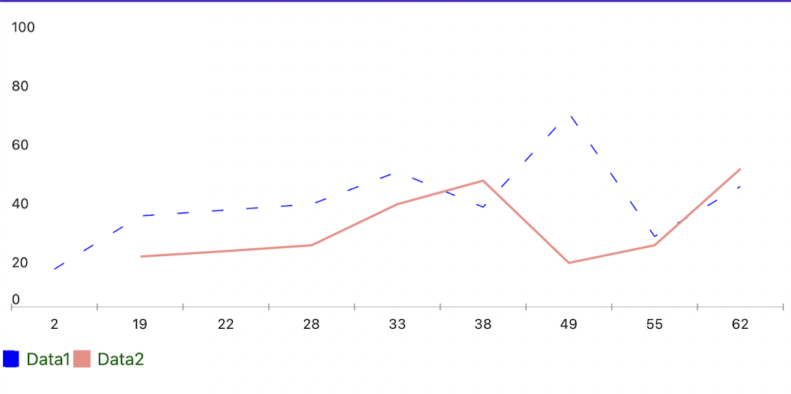

## Environment

<table>
	<tbody>
    <tr>
      <td>Product</td>
      <td>Telerik UI for .NET MAUI Chart</td>
    </tr>
  	<tr>
  		<td>Product Version</td>
  		<td>4.0.0</td>
  	</tr>
	</tbody>
</table>

## Description

How can I create a dashed line chart by using the Line Series of the Telerik UI for .NET MAUI Chart?

## Solution

For the purposes of this guide, the example uses the following prerequisites:

* Native iOS, Android, and WinUI Chart controls.
* The stroke approach to draw the lines of the Chart series.
* The `DashedArray` which is part of the Stroke tool.

To achieve the desired scenario:

**1.** Define the Business Model and the `ViewModel`.

```C#
public class NumericalData
{
	public double XData { get; set; }
	public double YData { get; set; }
}

internal class ViewModel : NotifyPropertyChangedBase
{
	public ObservableCollection<NumericalData> Data1 { get; set; }
	public ObservableCollection<NumericalData> Data2 { get; set; }

	public ViewModel()
	{
		this.Data1 = GetNumericData1();
		this.Data2 = GetNumericData2();
	}

	public static ObservableCollection<NumericalData> GetNumericData1()
	{
		var data = new ObservableCollection<NumericalData>
		{
			new NumericalData { XData = 2, YData = 13 },
			new NumericalData { XData = 19, YData = 31 },
			new NumericalData { XData = 22, YData = 33 },
			new NumericalData { XData = 28, YData = 35 },
			new NumericalData { XData = 33, YData = 46 },
			new NumericalData { XData = 38, YData = 34 },
			new NumericalData { XData = 49, YData = 66 },
			new NumericalData { XData = 55, YData = 24 },
			new NumericalData { XData = 62, YData = 41 },
		};
		return data;
	}
	public static ObservableCollection<NumericalData> GetNumericData2()
	{
		var data = new ObservableCollection<NumericalData>
		{
			new NumericalData { XData = 19, YData = 17 },
			new NumericalData { XData = 22, YData = 19 },
			new NumericalData { XData = 28, YData = 21 },
			new NumericalData { XData = 33, YData = 35 },
			new NumericalData { XData = 38, YData = 43 },
			new NumericalData { XData = 49, YData = 15 },
			new NumericalData { XData = 55, YData = 21 },
			new NumericalData { XData = 62, YData = 47 },
		};
		return data;
	}
}
```

**2.** Now, define the Chart in XAML:

```XAML
<telerik:RadCartesianChart x:Name="chart" HeightRequest="300">
            <telerik:RadCartesianChart.BindingContext>
                <local:ViewModel />
            </telerik:RadCartesianChart.BindingContext>
            <telerik:RadCartesianChart.HorizontalAxis>
                <telerik:CategoricalAxis />
            </telerik:RadCartesianChart.HorizontalAxis>
            <telerik:RadCartesianChart.VerticalAxis>
                <telerik:NumericalAxis />
            </telerik:RadCartesianChart.VerticalAxis>
            <telerik:RadCartesianChart.Series>
                <telerik:LineSeries CategoryBinding="XData"
                                    ValueBinding="YData"
                                    DisplayName=" Data1"
                                    ItemsSource="{Binding Data1}" />
                <telerik:LineSeries CategoryBinding="XData"
                                    ValueBinding="YData"
                                    DisplayName=" Data2"
                                    ItemsSource="{Binding Data2}" />
            </telerik:RadCartesianChart.Series>
        </telerik:RadCartesianChart>
        <telerik:RadLegend LegendProvider="{x:Reference Name=chart}"
                           LegendItemFontColor="DarkGreen"
                           Orientation="Horizontal"
                           HeightRequest="200"/>
```

**3.** Add the following code to your project to achieve dashed series:

```C#
public partial class MainPage : ContentPage
{
	public MainPage()
	{
		InitializeComponent();

		this.chart.HandlerChanged += this.Chart_HandlerChanged;
	}

	private void Chart_HandlerChanged(object sender, EventArgs e)
	{
		this.UpdateChart();
	}

	private void UpdateChart()
	{
        var platformView = this.chart.Handler.PlatformView;
#if ANDROID
        var platformChart = (Com.Telerik.Widget.Chart.Visualization.CartesianChart.RadCartesianChartView)platformView;
        var platformSeries = (Com.Telerik.Widget.Chart.Visualization.CartesianChart.Series.Categorical.LineSeries)platformChart.Series.Get(1);
        platformSeries.SetDashArray(new float[2] { 10, 20 });
#elif IOS || MACCATALYST
        var platformChart = (Telerik.Maui.Controls.Compatibility.ChartRenderer.iOS.TKExtendedChart)platformView;
		var platformSeries = (TelerikUI.TKChartLineSeries)platformChart.Series[1];
        var stroke = new TelerikUI.TKStroke(UIKit.UIColor.Blue);
        stroke.DashPattern = new Foundation.NSNumber[] { new Foundation.NSNumber(10), new Foundation.NSNumber(20) };
        platformSeries.Style.Stroke = stroke;
#elif WINDOWS
        var platformChart = (Telerik.UI.Xaml.Controls.Chart.RadCartesianChart)platformView;
        var platformSeries = (Telerik.UI.Xaml.Controls.Chart.LineSeries)platformChart.Series[1];
        platformSeries.StrokeDashArray = new Microsoft.UI.Xaml.Media.DoubleCollection { 10, 20 };
#endif
    }
}
```

The following image demonstrates the end result on MacCatalyst:


