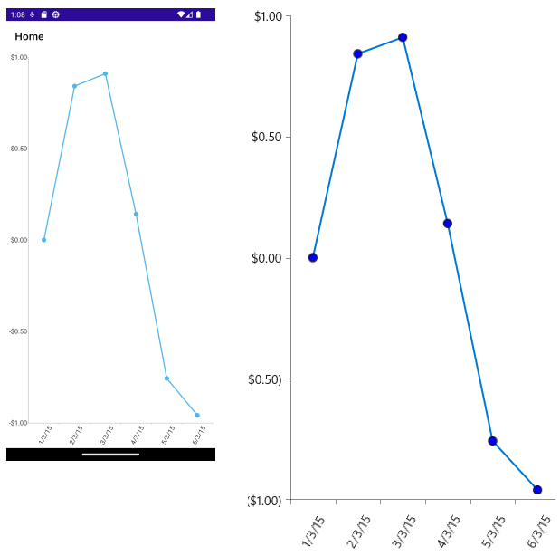

## Environment

| Version | Product | Author | 
| --- | --- | ---- | 
| 6.6.0 | Telerik UI for .NET MAUI Chart |[Dobrinka Yordanova](https://www.telerik.com/blogs/author/dobrinka-yordanova)| 


## Description

Is there a way to turn on Data Point Markers for the `RadCartesianChart` Line Series? I want to use this when there is only one result and the Chart doesn't show the value of this result.

## Solution

To display data point markers on the Line Series of the Cartesian Chart, use the native Chart for Android and iOS.

**1.** Define the Chart in XAML:

```XAML
<telerik:RadCartesianChart x:Name="chart" HandlerChanged="chart_HandlerChanged">
    <telerik:RadCartesianChart.BindingContext>
        <local:ViewModel />
    </telerik:RadCartesianChart.BindingContext>
    <telerik:RadCartesianChart.HorizontalAxis>
        <telerik:DateTimeContinuousAxis LabelFitMode="Rotate"
                                        MajorStepUnit="Day">
        </telerik:DateTimeContinuousAxis>
    </telerik:RadCartesianChart.HorizontalAxis>
    <telerik:RadCartesianChart.VerticalAxis>
        <telerik:NumericalAxis LabelFormat="C"
                                MajorStep="0.5"
                                Minimum="-1"
                                Maximum="1" />
    </telerik:RadCartesianChart.VerticalAxis>
    <telerik:RadCartesianChart.Series>
        <telerik:LineSeries ItemsSource="{Binding Data}"
                        CategoryBinding="Date"
                        ValueBinding="Value" />
    </telerik:RadCartesianChart.Series>
</telerik:RadCartesianChart>
```

**2.** Add the following namespace:

```XAML
xmlns:telerik="http://schemas.telerik.com/2022/xaml/maui"
```

**3.** Add sample model and view model:

```C#
public class TemporalData
{
    public DateTime Date { get; set; }
    public double Value { get; set; }
}

public class ViewModel
{
    public ObservableCollection<TemporalData> Data { get; set; }

    public ViewModel()
    {
        this.Data = GetDateTimeData(6);
    }

    private static ObservableCollection<TemporalData> GetDateTimeData(int itemsCount)
    {
        var startDate = new DateTime(2015, 03, 01);

        ObservableCollection<TemporalData> items = new ObservableCollection<TemporalData>();
        for (int i = 0; i < itemsCount; i++)
        {
            TemporalData data = new TemporalData();
            data.Date = startDate.AddDays(i);
            data.Value = Math.Sin(i);

            items.Add(data);
        }

        return items;
    }
}
```

**4.** Subscribe to the `HandlerChanged` event and use the native Chart to add point markers on Android and iOS:

```C#
public partial class MainPage : ContentPage
{
    public MainPage()
    {
        InitializeComponent();
        this.BindingContext = new ViewModel();
       
    }

    private void chart_HandlerChanged(System.Object sender, System.EventArgs e)
    {
        this.UpdateChart();
    }

    private void UpdateChart()
    {
        var platformView = this.chart.Handler.PlatformView;
#if ANDROID
        var platformChart = (Com.Telerik.Widget.Chart.Visualization.CartesianChart.RadCartesianChartView)platformView;
        if (platformChart != null)
        {
            for (int i = 0; i < platformChart.Series.Size(); i++)
            {
                Com.Telerik.Widget.Chart.Visualization.CartesianChart.Series.Categorical.LineSeries lineSeries = (Com.Telerik.Widget.Chart.Visualization.CartesianChart.Series.Categorical.LineSeries)platformChart.Series.Get(i) as Com.Telerik.Widget.Chart.Visualization.CartesianChart.Series.Categorical.LineSeries;
                lineSeries.DataPointRenderer = new Platforms.Android.PointRenderer(lineSeries);
            }

        }
# elif IOS
      var platformChart = (Telerik.Maui.Controls.Compatibility.ChartRenderer.iOS.TKExtendedChart)platformView;
        // align the labels on the left
        platformChart.YAxis.Style.LabelStyle.TextAlignment = TelerikUI.TKChartAxisLabelAlignment.Left;
        platformChart.YAxis.Style.LabelStyle.FirstLabelTextAlignment = TelerikUI.TKChartAxisLabelAlignment.Left;

        // set point marks to the data points
      var platformSeries = (TelerikUI.TKChartLineSeries)platformChart.Series[0];
        platformSeries.Style.PointShape = new TelerikUI.TKPredefinedShape(TelerikUI.TKShapeType.Circle, new System.Drawing.SizeF(10, 10));
        platformSeries.Style.ShapeMode = TelerikUI.TKChartSeriesStyleShapeMode.AlwaysShow;

#elif WINDOWS

		var platformChart = (Telerik.UI.Xaml.Controls.Chart.RadCartesianChart)platformView;
		var platformSeries = (Telerik.UI.Xaml.Controls.Chart.LineSeries)platformChart.Series[0];
		var nativeApp = MauiWinUIApplication.Current;
		platformSeries.PointTemplate = nativeApp.Resources["PointTemplate"] as Microsoft.UI.Xaml.DataTemplate;
#endif
    }
}
```

**5.** For Android, define a `PointRenderer` class inside the `Platforms/Android` folder:

```C#
public class PointRenderer : Java.Lang.Object, global::Com.Telerik.Widget.Chart.Visualization.CartesianChart.Series.Pointrenderers.IChartDataPointRenderer
{
    private global::Com.Telerik.Widget.Chart.Visualization.CartesianChart.Series.Categorical.LineSeries lineSeries;
    public PointRenderer(global::Com.Telerik.Widget.Chart.Visualization.CartesianChart.Series.Categorical.LineSeries lineSeries)
    {
        this.lineSeries = lineSeries;
    }
    public void RenderPoint(global::Android.Graphics.Canvas canvas, global::Com.Telerik.Widget.Chart.Engine.DataPoints.DataPoint dataPoint)
    {
        global::Com.Telerik.Widget.Palettes.PaletteEntry entry = this.lineSeries.Palette.GetEntry(this.lineSeries, this.lineSeries.CollectionIndex);
        using (global::Android.Graphics.Paint paint = new global::Android.Graphics.Paint())
        {
            paint.Color = new global::Android.Graphics.Color(entry.Fill);
            canvas.DrawCircle((float)dataPoint.CenterX, (float)dataPoint.CenterY, 12, paint);
        }
    }
}
```

**6.** For WinUI, add the `PointTemplate` inside the `Platforms/Windows/App.xaml` file:

```XAML
<maui:MauiWinUIApplication.Resources>
	<ResourceDictionary>
		<DataTemplate x:Key="PointTemplate">
			<Ellipse Width="20" Height="20" Fill="Blue" Stroke="Black" StrokeThickness="1"/>
		</DataTemplate>
	</ResourceDictionary>
</maui:MauiWinUIApplication.Resources>
```

And the result on Android:

