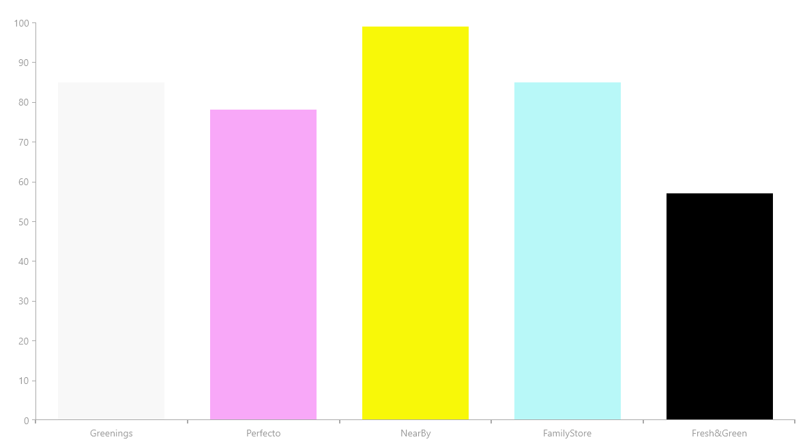

## Environment

<table>
	<tbody>
    <tr>
      <td>Product</td>
      <td>Telerik UI for .NET MAUI Chart</td>
    </tr>
  	<tr>
  		<td>Product Version</td>
  		<td>2.0.0</td>
  	</tr>
	</tbody>
</table>


## Description

How can I add a palette to the Telerik UI for .NET MAUI Bar Chart to show each bar in a different color?

## Solution

To implement a Chart palette, add a `Palette` entry in XAML. In general, you have to create a custom Chart palette in the `ViewModel`.

The suggested approach uses the [code from the Telerik UI for .NET MAUI documentation for the Chart Bar Series]() and adds the necessary components to achieve the desired result.

To achieve the desired scenario:

**1.** Add the `Color` property to the business model:

```C#
public class DataItem
    {
        public string Category { get; set; }
        public double? Value { get; set; }
        public Color barColor { get; set; }
    }
```

**2.** In the `Collection`, set values for the `barColor` property of type `Color`:

```C#
var seriesData = new ObservableCollection<DataItem>()
            {
                new DataItem(){Category = "Greenings", Value = 85, barColor = Color.FromRgba("#F8F8F8")},
                new DataItem(){Category = "Perfecto", Value = 78, barColor = Color.FromRgba("#F8A8F8")},
                new DataItem(){Category = "NearBy", Value = 99, barColor = Color.FromRgba("#F8F808")},
                new DataItem(){Category = "FamilyStore", Value = 85, barColor = Color.FromRgba("#B8F8F8")},
                new DataItem(){Category = "Fresh&Green", Value = 57, barColor = Color.FromRgba("#000000")}
            };
```

**3.** After creating the business model and the collection of data, create a class in the `ViewModel` that changes the values of the `Chart Palette`.

**4.** Create a `Bindable` property to store the `Colors`:

```C#
public static readonly BindableProperty ColorsSourceProperty = BindableProperty.CreateAttached("ColorsSource", typeof(IEnumerable), typeof(ChartUtils), null, propertyChanged: OnColorsSourceChanged);
```

**5.** Define the properties which get and set the values in the collection:

```C#
public static IEnumerable GetColorsSource(BindableObject bindableObject)
        {
            return (IEnumerable)bindableObject.GetValue(ColorsSourceProperty);
        }

public static void SetColorsSource(BindableObject bindableObject, IEnumerable value)
        {
            bindableObject.SetValue(ColorsSourceProperty, value);
        }
```

**6.** To get the desired color, add a method which changes the old palette to a new one:

```C#
private static void OnColorsSourceChanged(BindableObject bindable, object oldValue, object newValue)
        {
            IEnumerable newColorsSource = (IEnumerable)newValue;
            RadCartesianChart chart = (RadCartesianChart)bindable;
            chart.Palette = ToChartPalette(newColorsSource);
        }
```

**7.** After having the `OnColorsSourceChanged` method, you need another one which will create the new palette entries based on the data from `SeriesData` collection:

```C#
private static ChartPalette ToChartPalette(IEnumerable colorsSource)
        {
            ChartPalette chartPalette = new ChartPalette();

            if (colorsSource != null)
            {
                foreach (var item in colorsSource)
                {
                    if (item is DataItem dataItem)
                    {
                        PaletteEntry entry = new PaletteEntry();
                        entry.FillColor = dataItem.barColor;
                        entry.StrokeColor = dataItem.barColor;
                        chartPalette.Entries.Add(entry);
                    }
                }
            }

            return chartPalette;
        }
```

**8.** Add the following code.   

```C#
public static class ChartUtils
    {
        public static readonly BindableProperty ColorsSourceProperty = BindableProperty.CreateAttached("ColorsSource", typeof(IEnumerable), typeof(ChartUtils), null,
            propertyChanged: OnColorsSourceChanged);

        public static IEnumerable GetColorsSource(BindableObject bindableObject)
        {
            return (IEnumerable)bindableObject.GetValue(ColorsSourceProperty);
        }

        public static void SetColorsSource(BindableObject bindableObject, IEnumerable value)
        {
            bindableObject.SetValue(ColorsSourceProperty, value);
        }

        private static void OnColorsSourceChanged(BindableObject bindable, object oldValue, object newValue)
        {
            IEnumerable newColorsSource = (IEnumerable)newValue;
            RadCartesianChart chart = (RadCartesianChart)bindable;
            chart.Palette = ToChartPalette(newColorsSource);
        }

        private static ChartPalette ToChartPalette(IEnumerable colorsSource)
        {
            ChartPalette chartPalette = new ChartPalette();

            if (colorsSource != null)
            {
                foreach (var item in colorsSource)
                {
                    if (item is DataItem dataItem)
                    {
                        PaletteEntry entry = new PaletteEntry();
                        entry.FillColor = dataItem.barColor;
                        entry.StrokeColor = dataItem.barColor;
                        chartPalette.Entries.Add(entry);
                    }
                }
            }

            return chartPalette;
        }
    }
```

**9.** Attach the `ChartUtils` class to the Chart in XAML.

>tip Set the `PaletteMode` to `DataPoint` properties. Otherwise, the palettes will fail to apply to the Chart.


```XAML
<telerik:RadCartesianChart chartPalettes:ChartUtils.ColorsSource="{Binding SeriesData}">
                    <telerik:RadCartesianChart.ChartBehaviors>
                        <telerik:ChartSelectionBehavior DataPointSelectionMode="Single"
                                                             SeriesSelectionMode="None" />
                    </telerik:RadCartesianChart.ChartBehaviors>
                    <telerik:RadCartesianChart.HorizontalAxis>
                        <telerik:CategoricalAxis LineColor="#A9A9A9"
                                                      MajorTickThickness="2"
                                                      PlotMode="BetweenTicks"
                                                      LabelFitMode="MultiLine"
                                                      ShowLabels="True"
                                                      MajorTickBackgroundColor="#A9A9A9" />
                    </telerik:RadCartesianChart.HorizontalAxis>
                    <telerik:RadCartesianChart.VerticalAxis>
                        <telerik:NumericalAxis LineColor="#A9A9A9"
                                                    MajorTickBackgroundColor="#A9A9A9"
                                                    Minimum="0" />
                    </telerik:RadCartesianChart.VerticalAxis>
                    <telerik:RadCartesianChart.Grid>
                        <telerik:CartesianChartGrid MajorLinesVisibility="Y"
                                                         MajorLineThickness="1" />
                    </telerik:RadCartesianChart.Grid>
                    <telerik:RadCartesianChart.Series>
                        <telerik:BarSeries CategoryBinding="Category"
                                           ValueBinding="Value"
                                           PaletteMode="DataPoint"
                                           ItemsSource="{Binding SeriesData}" />
                    </telerik:RadCartesianChart.Series>
                </telerik:RadCartesianChart>
```


The following image shows the end result of the suggested implementation.


